<!-- 
IMPORTANT NOTE FOR CONTRIBUTORS
-------------------------------
Contributors: This file is generated from comments in javascript source files src/main/js/*
If you would like to make changes, change the comments in the src/main/js/* files instead.
-->
# ScriptCraft API Reference

Walter Higgins

[walter.higgins@gmail.com][email]

[email]: mailto:walter.higgins@gmail.com?subject=ScriptCraft_API_Reference

## Table of Contents
 * [Modules in Scriptcraft](#modules-in-scriptcraft)
 * [Module Loading](#module-loading)
   * [The plugins directory](#the-plugins-directory)
   * [The modules directory](#the-modules-directory)
   * [The lib directory](#the-lib-directory)
   * [plugins sub-directories](#plugins-sub-directories)
 * [Global variables](#global-variables)
   * [__plugin variable](#__plugin-variable)
   * [server variable](#server-variable)
   * [self variable](#self-variable)
   * [config variable](#config-variable)
   * [events variable](#events-variable)
 * [Module variables](#module-variables)
   * [&#95;&#95;filename variable](#__filename-variable)
   * [&#95;&#95;dirname variable](#__dirname-variable)
 * [Global functions](#global-functions)
   * [echo function](#echo-function)
   * [require() function](#require-function)
   * [scload() function](#scload-function)
   * [scsave() function](#scsave-function)
   * [plugin() function](#plugin-function)
   * [command() function](#command-function)
   * [setTimeout() function](#settimeout-function)
   * [clearTimeout() function](#cleartimeout-function)
   * [setInterval() function](#setinterval-function)
   * [clearInterval() function](#clearinterval-function)
   * [refresh() function](#refresh-function)
   * [addUnloadHandler() function](#addunloadhandler-function)
   * [isOp() function](#isop-function)
 * [require - Node.js-style module loading in ScriptCraft](#require---nodejs-style-module-loading-in-scriptcraft)
   * [math.js](#mathjs)
   * [inc.js](#incjs)
   * [program.js](#programjs)
   * [Important](#important)
   * [module name resolution](#module-name-resolution)
 * [events Module](#events-module)
   * [events.on() static method](#eventson-static-method)
 * [Events Helper Module (canary version)](#events-helper-module-canary-version)
   * [Usage](#usage)
   * [events.minecartActivate()](#eventsminecartactivate)
   * [events.villagerTradeUnlock()](#eventsvillagertradeunlock)
   * [events.mobTarget()](#eventsmobtarget)
   * [events.chickenLayEgg()](#eventschickenlayegg)
   * [events.potionEffectFinish()](#eventspotioneffectfinish)
   * [events.entityMove()](#eventsentitymove)
   * [events.hangingEntityDestroy()](#eventshangingentitydestroy)
   * [events.vehicleCollision()](#eventsvehiclecollision)
   * [events.potionEffectApplied()](#eventspotioneffectapplied)
   * [events.vehicleDestroy()](#eventsvehicledestroy)
   * [events.vehicleEnter()](#eventsvehicleenter)
   * [events.damage()](#eventsdamage)
   * [events.entityMount()](#eventsentitymount)
   * [events.slimeSplit()](#eventsslimesplit)
   * [events.endermanDropBlock()](#eventsendermandropblock)
   * [events.itemTouchGround()](#eventsitemtouchground)
   * [events.entitySpawn()](#eventsentityspawn)
   * [events.endermanPickupBlock()](#eventsendermanpickupblock)
   * [events.vehicleDamage()](#eventsvehicledamage)
   * [events.entityLightningStruck()](#eventsentitylightningstruck)
   * [events.entityDespawn()](#eventsentitydespawn)
   * [events.vehicleMove()](#eventsvehiclemove)
   * [events.projectileHit()](#eventsprojectilehit)
   * [events.entityDeath()](#eventsentitydeath)
   * [events.entityTame()](#eventsentitytame)
   * [events.vehicleExit()](#eventsvehicleexit)
   * [events.dimensionSwitch()](#eventsdimensionswitch)
   * [events.foodLevel()](#eventsfoodlevel)
   * [events.bookEdit()](#eventsbookedit)
   * [events.eat()](#eventseat)
   * [events.playerList()](#eventsplayerlist)
   * [events.playerIdle()](#eventsplayeridle)
   * [events.enchant()](#eventsenchant)
   * [events.playerArmSwing()](#eventsplayerarmswing)
   * [events.teleport()](#eventsteleport)
   * [events.anvilUse()](#eventsanviluse)
   * [events.portalUse()](#eventsportaluse)
   * [events.foodSaturation()](#eventsfoodsaturation)
   * [events.connection()](#eventsconnection)
   * [events.playerRespawned()](#eventsplayerrespawned)
   * [events.armorBroken()](#eventsarmorbroken)
   * [events.levelUp()](#eventslevelup)
   * [events.blockRightClick()](#eventsblockrightclick)
   * [events.itemDrop()](#eventsitemdrop)
   * [events.itemFrameRotate()](#eventsitemframerotate)
   * [events.playerRespawning()](#eventsplayerrespawning)
   * [events.craft()](#eventscraft)
   * [events.experience()](#eventsexperience)
   * [events.signChange()](#eventssignchange)
   * [events.healthChange()](#eventshealthchange)
   * [events.disconnection()](#eventsdisconnection)
   * [events.gameModeChange()](#eventsgamemodechange)
   * [events.preConnection()](#eventspreconnection)
   * [events.villagerTrade()](#eventsvillagertrade)
   * [events.returnFromIdle()](#eventsreturnfromidle)
   * [events.armorStandModify()](#eventsarmorstandmodify)
   * [events.slotClick()](#eventsslotclick)
   * [events.itemFrameSetItem()](#eventsitemframesetitem)
   * [events.entityRightClick()](#eventsentityrightclick)
   * [events.foodExhaustion()](#eventsfoodexhaustion)
   * [events.chat()](#eventschat)
   * [events.itemPickup()](#eventsitempickup)
   * [events.bedExit()](#eventsbedexit)
   * [events.blockPlace()](#eventsblockplace)
   * [events.heldItemChange()](#eventshelditemchange)
   * [events.toolBroken()](#eventstoolbroken)
   * [events.kick()](#eventskick)
   * [events.playerDeath()](#eventsplayerdeath)
   * [events.blockLeftClick()](#eventsblockleftclick)
   * [events.blockDestroy()](#eventsblockdestroy)
   * [events.bedEnter()](#eventsbedenter)
   * [events.signShow()](#eventssignshow)
   * [events.inventory()](#eventsinventory)
   * [events.playerMove()](#eventsplayermove)
   * [events.itemUse()](#eventsitemuse)
   * [events.ban()](#eventsban)
   * [events.statGained()](#eventsstatgained)
   * [events.smeltBegin()](#eventssmeltbegin)
   * [events.treeGrow()](#eventstreegrow)
   * [events.chunkCreated()](#eventschunkcreated)
   * [events.liquidDestroy()](#eventsliquiddestroy)
   * [events.chunkLoaded()](#eventschunkloaded)
   * [events.pistonRetract()](#eventspistonretract)
   * [events.smelt()](#eventssmelt)
   * [events.blockUpdate()](#eventsblockupdate)
   * [events.portalDestroy()](#eventsportaldestroy)
   * [events.ignition()](#eventsignition)
   * [events.redstoneChange()](#eventsredstonechange)
   * [events.weatherChange()](#eventsweatherchange)
   * [events.chunkCreation()](#eventschunkcreation)
   * [events.hopperTransfer()](#eventshoppertransfer)
   * [events.chunkUnload()](#eventschunkunload)
   * [events.blockGrow()](#eventsblockgrow)
   * [events.dispense()](#eventsdispense)
   * [events.blockDropXp()](#eventsblockdropxp)
   * [events.fireworkExplode()](#eventsfireworkexplode)
   * [events.leafDecay()](#eventsleafdecay)
   * [events.pistonExtend()](#eventspistonextend)
   * [events.noteBlockPlay()](#eventsnoteblockplay)
   * [events.lightningStrike()](#eventslightningstrike)
   * [events.decorate()](#eventsdecorate)
   * [events.explosion()](#eventsexplosion)
   * [events.tNTActivate()](#eventstntactivate)
   * [events.timeChange()](#eventstimechange)
   * [events.flow()](#eventsflow)
   * [events.portalCreate()](#eventsportalcreate)
   * [events.blockPhysics()](#eventsblockphysics)
   * [events.playerCommand()](#eventsplayercommand)
   * [events.consoleCommand()](#eventsconsolecommand)
   * [events.commandBlockCommand()](#eventscommandblockcommand)
   * [events.loadWorld()](#eventsloadworld)
   * [events.permissionCheck()](#eventspermissioncheck)
   * [events.serverGuiStart()](#eventsserverguistart)
   * [events.unloadWorld()](#eventsunloadworld)
   * [events.pluginDisable()](#eventsplugindisable)
   * [events.pluginEnable()](#eventspluginenable)
   * [events.serverTick()](#eventsservertick)
   * [events.serverListPing()](#eventsserverlistping)
   * [events.serverShutdown()](#eventsservershutdown)
 * [Events Helper Module (bukkit version)](#events-helper-module-bukkit-version)
   * [Usage](#usage-1)
   * [events.weatherChange()](#eventsweatherchange-1)
   * [events.lightningStrike()](#eventslightningstrike-1)
   * [events.thunderChange()](#eventsthunderchange)
   * [events.vehicleMove()](#eventsvehiclemove-1)
   * [events.vehicleDestroy()](#eventsvehicledestroy-1)
   * [events.vehicleExit()](#eventsvehicleexit-1)
   * [events.vehicleEntityCollision()](#eventsvehicleentitycollision)
   * [events.vehicleBlockCollision()](#eventsvehicleblockcollision)
   * [events.vehicleEnter()](#eventsvehicleenter-1)
   * [events.vehicleDamage()](#eventsvehicledamage-1)
   * [events.vehicleUpdate()](#eventsvehicleupdate)
   * [events.vehicleCreate()](#eventsvehiclecreate)
   * [events.paintingBreak()](#eventspaintingbreak)
   * [events.paintingBreakByEntity()](#eventspaintingbreakbyentity)
   * [events.paintingPlace()](#eventspaintingplace)
   * [events.enchantItem()](#eventsenchantitem)
   * [events.prepareItemEnchant()](#eventsprepareitemenchant)
   * [events.playerInteractEntity()](#eventsplayerinteractentity)
   * [events.playerEggThrow()](#eventsplayereggthrow)
   * [events.playerUnleashEntity()](#eventsplayerunleashentity)
   * [events.playerInventory()](#eventsplayerinventory)
   * [events.playerLevelChange()](#eventsplayerlevelchange)
   * [events.playerPortal()](#eventsplayerportal)
   * [events.playerItemConsume()](#eventsplayeritemconsume)
   * [events.playerTeleport()](#eventsplayerteleport)
   * [events.playerBedEnter()](#eventsplayerbedenter)
   * [events.playerUnregisterChannel()](#eventsplayerunregisterchannel)
   * [events.playerChat()](#eventsplayerchat)
   * [events.playerShearEntity()](#eventsplayershearentity)
   * [events.asyncPlayerChat()](#eventsasyncplayerchat)
   * [events.playerDropItem()](#eventsplayerdropitem)
   * [events.playerRegisterChannel()](#eventsplayerregisterchannel)
   * [events.playerMove()](#eventsplayermove-1)
   * [events.playerItemBreak()](#eventsplayeritembreak)
   * [events.playerBucketEmpty()](#eventsplayerbucketempty)
   * [events.playerStatisticIncrement()](#eventsplayerstatisticincrement)
   * [events.playerToggleFlight()](#eventsplayertoggleflight)
   * [events.playerItemHeld()](#eventsplayeritemheld)
   * [events.playerAchievementAwarded()](#eventsplayerachievementawarded)
   * [events.playerToggleSneak()](#eventsplayertogglesneak)
   * [events.playerExpChange()](#eventsplayerexpchange)
   * [events.playerPreLogin()](#eventsplayerprelogin)
   * [events.playerJoin()](#eventsplayerjoin)
   * [events.playerAnimation()](#eventsplayeranimation)
   * [events.playerEditBook()](#eventsplayereditbook)
   * [events.playerPickupItem()](#eventsplayerpickupitem)
   * [events.playerChangedWorld()](#eventsplayerchangedworld)
   * [events.playerFish()](#eventsplayerfish)
   * [events.playerChatTabComplete()](#eventsplayerchattabcomplete)
   * [events.playerRespawn()](#eventsplayerrespawn)
   * [events.playerBedLeave()](#eventsplayerbedleave)
   * [events.asyncPlayerPreLogin()](#eventsasyncplayerprelogin)
   * [events.playerInteract()](#eventsplayerinteract)
   * [events.playerBucketFill()](#eventsplayerbucketfill)
   * [events.playerVelocity()](#eventsplayervelocity)
   * [events.playerQuit()](#eventsplayerquit)
   * [events.playerLogin()](#eventsplayerlogin)
   * [events.playerKick()](#eventsplayerkick)
   * [events.playerToggleSprint()](#eventsplayertogglesprint)
   * [events.playerCommandPreprocess()](#eventsplayercommandpreprocess)
   * [events.playerGameModeChange()](#eventsplayergamemodechange)
   * [events.furnaceSmelt()](#eventsfurnacesmelt)
   * [events.inventoryDrag()](#eventsinventorydrag)
   * [events.craftItem()](#eventscraftitem)
   * [events.furnaceBurn()](#eventsfurnaceburn)
   * [events.inventoryOpen()](#eventsinventoryopen)
   * [events.inventoryPickupItem()](#eventsinventorypickupitem)
   * [events.inventoryMoveItem()](#eventsinventorymoveitem)
   * [events.inventoryClick()](#eventsinventoryclick)
   * [events.inventoryClose()](#eventsinventoryclose)
   * [events.inventoryCreative()](#eventsinventorycreative)
   * [events.inventory()](#eventsinventory-1)
   * [events.prepareItemCraft()](#eventsprepareitemcraft)
   * [events.furnaceExtract()](#eventsfurnaceextract)
   * [events.brew()](#eventsbrew)
   * [events.serverCommand()](#eventsservercommand)
   * [events.serverListPing()](#eventsserverlistping-1)
   * [events.serviceRegister()](#eventsserviceregister)
   * [events.pluginDisable()](#eventsplugindisable-1)
   * [events.remoteServerCommand()](#eventsremoteservercommand)
   * [events.mapInitialize()](#eventsmapinitialize)
   * [events.serviceUnregister()](#eventsserviceunregister)
   * [events.pluginEnable()](#eventspluginenable-1)
   * [events.playerDeath()](#eventsplayerdeath-1)
   * [events.entityCreatePortal()](#eventsentitycreateportal)
   * [events.entityCombust()](#eventsentitycombust)
   * [events.sheepDyeWool()](#eventssheepdyewool)
   * [events.expBottle()](#eventsexpbottle)
   * [events.entityTame()](#eventsentitytame-1)
   * [events.projectileLaunch()](#eventsprojectilelaunch)
   * [events.entityDamage()](#eventsentitydamage)
   * [events.itemSpawn()](#eventsitemspawn)
   * [events.projectileHit()](#eventsprojectilehit-1)
   * [events.foodLevelChange()](#eventsfoodlevelchange)
   * [events.itemDespawn()](#eventsitemdespawn)
   * [events.entityPortalEnter()](#eventsentityportalenter)
   * [events.entityPortal()](#eventsentityportal)
   * [events.entityTarget()](#eventsentitytarget)
   * [events.entityDeath()](#eventsentitydeath-1)
   * [events.sheepRegrowWool()](#eventssheepregrowwool)
   * [events.entityShootBow()](#eventsentityshootbow)
   * [events.creeperPower()](#eventscreeperpower)
   * [events.entityCombustByBlock()](#eventsentitycombustbyblock)
   * [events.entityBreakDoor()](#eventsentitybreakdoor)
   * [events.entityDamageByEntity()](#eventsentitydamagebyentity)
   * [events.entityUnleash()](#eventsentityunleash)
   * [events.entityExplode()](#eventsentityexplode)
   * [events.entityInteract()](#eventsentityinteract)
   * [events.explosionPrime()](#eventsexplosionprime)
   * [events.horseJump()](#eventshorsejump)
   * [events.creatureSpawn()](#eventscreaturespawn)
   * [events.entityCombustByEntity()](#eventsentitycombustbyentity)
   * [events.entityDamageByBlock()](#eventsentitydamagebyblock)
   * [events.entityTargetLivingEntity()](#eventsentitytargetlivingentity)
   * [events.entityTeleport()](#eventsentityteleport)
   * [events.playerLeashEntity()](#eventsplayerleashentity)
   * [events.slimeSplit()](#eventsslimesplit-1)
   * [events.pigZap()](#eventspigzap)
   * [events.potionSplash()](#eventspotionsplash)
   * [events.entityChangeBlock()](#eventsentitychangeblock)
   * [events.entityPortalExit()](#eventsentityportalexit)
   * [events.entityRegainHealth()](#eventsentityregainhealth)
   * [events.entityBlockForm()](#eventsentityblockform)
   * [events.blockSpread()](#eventsblockspread)
   * [events.blockMultiPlace()](#eventsblockmultiplace)
   * [events.notePlay()](#eventsnoteplay)
   * [events.blockFade()](#eventsblockfade)
   * [events.blockPlace()](#eventsblockplace-1)
   * [events.blockPhysics()](#eventsblockphysics-1)
   * [events.blockIgnite()](#eventsblockignite)
   * [events.blockBreak()](#eventsblockbreak)
   * [events.blockBurn()](#eventsblockburn)
   * [events.blockFromTo()](#eventsblockfromto)
   * [events.blockRedstone()](#eventsblockredstone)
   * [events.blockPistonRetract()](#eventsblockpistonretract)
   * [events.blockDispense()](#eventsblockdispense)
   * [events.signChange()](#eventssignchange-1)
   * [events.blockPistonExtend()](#eventsblockpistonextend)
   * [events.blockCanBuild()](#eventsblockcanbuild)
   * [events.blockGrow()](#eventsblockgrow-1)
   * [events.leavesDecay()](#eventsleavesdecay)
   * [events.blockExp()](#eventsblockexp)
   * [events.blockForm()](#eventsblockform)
   * [events.blockDamage()](#eventsblockdamage)
   * [events.hangingPlace()](#eventshangingplace)
   * [events.hangingBreakByEntity()](#eventshangingbreakbyentity)
   * [events.hangingBreak()](#eventshangingbreak)
   * [events.structureGrow()](#eventsstructuregrow)
   * [events.spawnChange()](#eventsspawnchange)
   * [events.worldLoad()](#eventsworldload)
   * [events.worldInit()](#eventsworldinit)
   * [events.worldUnload()](#eventsworldunload)
   * [events.worldSave()](#eventsworldsave)
   * [events.chunkUnload()](#eventschunkunload-1)
   * [events.chunkPopulate()](#eventschunkpopulate)
   * [events.portalCreate()](#eventsportalcreate-1)
   * [events.chunkLoad()](#eventschunkload)
 * [console global variable](#console-global-variable)
   * [Example](#example)
   * [Using string substitutions](#using-string-substitutions)
 * [Drone Plugin](#drone-plugin)
   * [Constructing a Drone Object](#constructing-a-drone-object)
   * [Drone.box() method](#dronebox-method)
   * [Drone.box0() method](#dronebox0-method)
   * [Drone.boxa() method](#droneboxa-method)
   * [Chaining](#chaining)
   * [Drone Properties](#drone-properties)
   * [Extending Drone](#extending-drone)
   * [Drone.extend() static method](#droneextend-static-method)
   * [Drone Constants](#drone-constants)
   * [Drone.times() Method](#dronetimes-method)
   * [Drone.arc() method](#dronearc-method)
   * [Drone.bed() method](#dronebed-method)
   * [Drone.blocktype() method](#droneblocktype-method)
   * [Copy & Paste using Drone](#copy--paste-using-drone)
   * [Drone.copy() method](#dronecopy-method)
   * [Drone.paste() method](#dronepaste-method)
   * [Drone.cylinder() method](#dronecylinder-method)
   * [Drone.cylinder0() method](#dronecylinder0-method)
   * [Drone.door() method](#dronedoor-method)
   * [Drone.door_iron() method](#dronedoor_iron-method)
   * [Drone.door2() method](#dronedoor2-method)
   * [Drone.door2_iron() method](#dronedoor2_iron-method)
   * [Drone.firework() method](#dronefirework-method)
   * [Drone.garden() method](#dronegarden-method)
   * [Drone.ladder() method](#droneladder-method)
   * [Drone Movement](#drone-movement)
   * [Drone Positional Info](#drone-positional-info)
   * [Drone Markers](#drone-markers)
   * [Drone.prism() method](#droneprism-method)
   * [Drone.prism0() method](#droneprism0-method)
   * [Drone.rand() method](#dronerand-method)
   * [Drone.wallsign() method](#dronewallsign-method)
   * [Drone.signpost() method](#dronesignpost-method)
   * [Drone.sign() method](#dronesign-method)
   * [Drone.sphere() method](#dronesphere-method)
   * [Drone.sphere0() method](#dronesphere0-method)
   * [Drone.hemisphere() method](#dronehemisphere-method)
   * [Drone.hemisphere0() method](#dronehemisphere0-method)
   * [Drone.stairs() function](#dronestairs-function)
   * [Drone Trees methods](#drone-trees-methods)
   * [Drone.castle() method](#dronecastle-method)
   * [Drone.chessboard() method](#dronechessboard-method)
   * [Drone.cottage() method](#dronecottage-method)
   * [Drone.cottage_road() method](#dronecottage_road-method)
   * [Drone.dancefloor() method](#dronedancefloor-method)
   * [Drone.fort() method](#dronefort-method)
   * [Drone.hangtorch() method](#dronehangtorch-method)
   * [Drone.lcdclock() method.](#dronelcdclock-method)
   * [Drone.logojs() method](#dronelogojs-method)
   * [Drone.maze() method](#dronemaze-method)
   * [Drone.rainbow() method](#dronerainbow-method)
   * [Drone.spiral_stairs() method](#dronespiral_stairs-method)
   * [Drone.temple() method](#dronetemple-method)
 * [The at Module](#the-at-module)
   * [at() function](#at-function)
 * [Blocks Module](#blocks-module)
   * [Examples](#examples)
 * [Fireworks Module](#fireworks-module)
   * [Examples](#examples-1)
 * [Inventory Module](#inventory-module)
   * [Usage](#usage-2)
 * [Classroom Plugin](#classroom-plugin)
   * [jsp classroom command](#jsp-classroom-command)
   * [classroom.allowScripting() function](#classroomallowscripting-function)
 * [Asynchronous Input Module](#asynchronous-input-module)
 * [The recipes module](#the-recipes-module)
   * [Example](#example-1)
 * [Http Module](#http-module)
   * [http.request() function](#httprequest-function)
 * [sc-mqtt module](#sc-mqtt-module)
   * [Usage](#usage-3)
 * [Signs Module](#signs-module)
   * [signs.menu() function](#signsmenu-function)
   * [signs.getTargetedBy() function](#signsgettargetedby-function)
 * [The slash Module](#the-slash-module)
   * [The slash() function](#the-slash-function)
 * [Sounds Module](#sounds-module)
   * [Usage (Bukkit) :](#usage-bukkit-)
 * [Teleport Module](#teleport-module)
   * [Parameters](#parameters)
   * [Example](#example-2)
 * [Utilities Module](#utilities-module)
   * [utils.player() function](#utilsplayer-function)
   * [utils.world( worldName ) function](#utilsworld-worldname--function)
   * [utils.blockAt( Location ) function](#utilsblockat-location--function)
   * [utils.locationToJSON() function](#utilslocationtojson-function)
   * [utils.locationToString() function](#utilslocationtostring-function)
   * [utils.locationFromJSON() function](#utilslocationfromjson-function)
   * [utils.getPlayerPos() function](#utilsgetplayerpos-function)
   * [utils.getMousePos() function](#utilsgetmousepos-function)
   * [utils.foreach() function](#utilsforeach-function)
   * [utils.nicely() function](#utilsnicely-function)
   * [utils.time( world ) function](#utilstime-world--function)
   * [utils.time24( world ) function](#utilstime24-world--function)
   * [utils.find() function](#utilsfind-function)
   * [utils.serverAddress() function](#utilsserveraddress-function)
   * [utils.array() function](#utilsarray-function)
   * [utils.players() function](#utilsplayers-function)
   * [utils.playerNames() function](#utilsplayernames-function)
   * [utils.stat() function](#utilsstat-function)
 * [The watcher Module](#the-watcher-module)
   * [watcher.watchFile() function](#watcherwatchfile-function)
   * [watcher.watchDir() function](#watcherwatchdir-function)
   * [watcher.unwatchFile() function](#watcherunwatchfile-function)
   * [watcher.unwatchDir() function](#watcherunwatchdir-function)
 * [Example Plugin #1 - A simple extension to Minecraft.](#example-plugin-1---a-simple-extension-to-minecraft)
   * [Usage:](#usage-4)
 * [Example Plugin #2 - Making extensions available for all players.](#example-plugin-2---making-extensions-available-for-all-players)
   * [Usage:](#usage-5)
 * [Example Plugin #3 - Limiting use of commands to operators only.](#example-plugin-3---limiting-use-of-commands-to-operators-only)
   * [Usage:](#usage-6)
 * [Example Plugin #4 - Using parameters in commands.](#example-plugin-4---using-parameters-in-commands)
   * [Usage:](#usage-7)
 * [Example Plugin #5 - Re-use - Using your own and others modules.](#example-plugin-5---re-use---using-your-own-and-others-modules)
   * [Usage:](#usage-8)
 * [Example Plugin #6 - Re-use - Using 'utils' to get Player objects.](#example-plugin-6---re-use---using-utils-to-get-player-objects)
   * [Usage:](#usage-9)
 * [Example Plugin #7 - Listening for events, Greet players when they join the game.](#example-plugin-7---listening-for-events-greet-players-when-they-join-the-game)
 * [Arrows Plugin](#arrows-plugin)
   * [Usage:](#usage-10)
 * [Spawn Plugin](#spawn-plugin)
   * [Usage](#usage-11)
 * [alias Plugin](#alias-plugin)
   * [Examples](#examples-2)
 * [Commando Plugin](#commando-plugin)
   * [Description](#description)
   * [Example hi-command.js](#example-hi-commandjs)
   * [Example - timeofday-command.js](#example---timeofday-commandjs)
   * [Caveats](#caveats)
 * [homes Plugin](#homes-plugin)
   * [Basic options](#basic-options)
   * [Social options](#social-options)
   * [Administration options](#administration-options)
 * [NumberGuess mini-game:](#numberguess-mini-game)
   * [Description](#description-1)
   * [Example](#example-3)
 * [Cow Clicker Mini-Game](#cow-clicker-mini-game)
   * [How to Play](#how-to-play)
   * [Rules](#rules)
   * [Gameplay Mechanics](#gameplay-mechanics)
 * [Items module](#items-module)
   * [Usage](#usage-12)

## Modules in Scriptcraft

ScriptCraft has a simple module loading system. In ScriptCraft, files
and modules are in one-to-one correspondence. As an example, foo.js
loads the module circle.js in the same directory. 
*ScriptCraft now uses the same module system as Node.js - see [Node.js Modules][njsmod] for more details.*

[njsmod]: http://nodejs.org/api/modules.html

The contents of foo.js:

```javascript
var circle = require('./circle.js');
console.log( 'The area of a circle of radius 4 is '
             + circle.area(4));
```

The contents of circle.js:

```javascript
var PI = Math.PI;
exports.area = function (r) {
    return PI * r * r;
};
exports.circumference = function (r) {
    return 2 * PI * r;
};
```

The module circle.js has exported the functions area() and
circumference(). To add functions and objects to the root of your
module, you can add them to the special exports object.

Variables local to the module will be private, as though the module
was wrapped in a function. In this example the variable PI is private
to circle.js.

If you want the root of your module's export to be a function (such as
a constructor) or if you want to export a complete object in one
assignment instead of building it one property at a time, assign it to
module.exports instead of exports.

## Module Loading

When the ScriptCraft Java plugin is first installed, a new
`scriptcraft` subdirectory is created. If your minecraft server
directory is called 'mcserver' then the new subdirectories will be ...

 * mcserver/scriptcraft/
 * mcserver/scriptcraft/plugins
 * mcserver/scriptcraft/modules
 * mcserver/scriptcraft/lib

... The `plugins`, `modules` and `lib` directories each serve a different purpose.

### The plugins directory

At server startup the ScriptCraft Java plugin is loaded and begins
automatically loading and executing all of the modules (javascript
files with the extension `.js`) it finds in the `scriptcraft/plugins`
directory. All modules in the plugins directory are automatically
loaded into the `global` namespace. What this means is that anything a
module in the `plugins` directory exports becomes a global
variable. For example, if you have a module greeting.js in the plugins
directory....

```javascript
exports.greet = function(player) {
    echo(player, 'Hello ' + player.name);
};
```

... then `greet` becomes a global function and can be used at the
in-game (or server) command prompt like so...

    /js greet(self)

... This differs from how modules (in NodeJS and commonJS
environments) normally work. If you want your module to be exported
globally, put it in the `plugins` directory. If you don't want your
module to be exported globally but only want it to be used by other
modules, then put it in the `modules` directory instead. If you've
used previous versions of ScriptCraft and have put your custom
javascript modules in the `js-plugins` directory, then put them in the
`scriptcraft/plugins` directory. To summarise, modules in this directory are ...

 * Automatically loaded and run at server startup.
 * Anything exported by modules becomes a global variable.

### The modules directory

The module directory is where you should place your modules if you
don't want to export globally. In javascript, it's considered best
practice not to have too many global variables, so if you want to
develop modules for others to use, or want to develop more complex
mods then your modules should be placed in the `modules` directory.
*Modules in the `modules` directory are not automatically loaded at
startup*, instead, they are loaded and used by other modules/plugins
using the standard `require()` function.  This is the key difference
between modules in the `plugins` directory and modules in the
`modules` directory. Modules in the `plugins` directory are
automatically loaded and exported in to the global namespace at server
startup, modules in the `modules` directory are not.

### The lib directory

Modules in the `lib` directory are for use by ScriptCraft and some
core functions for use by module and plugin developers are also
provided. The `lib` directory is for internal use by ScriptCraft.
Modules in this directory are not automatically loaded nor are they
globally exported.

### plugins sub-directories

As of December 24 2013, the `scriptcraft/plugins` directory has the following sub-directories...

 * drone - Contains the drone module and drone extensions. Drone was the first scriptcraft module.
 * mini-games - Contains mini-games 
 * arrows - The arrows module - Changes the behaviour of Arrows: Explosive, Fireworks, Teleportation etc.
 * signs - The signs module (includes example signs) - create interactive signs.
 * chat - The chat plugin/module 
 * alias - The alias plugin/module - for creating custom aliases for commonly-used commands.
 * home - The home module - for setting homes and visiting other homes.

## Global variables

There are a couple of special javascript variables available in ScriptCraft...
 
### __plugin variable
The ScriptCraft JavaPlugin object.

### server variable
The Minecraft Server object

### self variable
The current player. (Note - this value should not be used in multi-threaded scripts or event-handling code - it's not thread-safe). This variable is only safe to use at the in-game prompt and should *never* be used in modules. For example you can use it here...

    /js console.log(self.name)

... but not in any javascript module you create yourself or in any
event handling code. `self` is a temporary short-lived variable which
only exists in the context of the in-game or server command prompts.

### config variable
ScriptCraft configuration - this object is loaded and saved at startup/shutdown.

### events variable
The events object is used to add new event handlers to Minecraft.

## Module variables
The following variables are available only within the context of Modules. (not available at in-game prompt).

### &#95;&#95;filename variable
The current file - this variable is only relevant from within the context of a Javascript module.

### &#95;&#95;dirname variable
The current directory - this variable is only relevant from within the context of a Javascript module.

## Global functions

ScripCraft provides some global functions which can be used by all plugins/modules...

### echo function

The `echo()` function displays a message on the in-game screen. 

#### Example

    /js echo( self, 'Hello World')

For programmers familiar with Javascript web programming, an `alert`
function is also provided.  `alert` works exactly the same as `echo`
e.g. `alert( self, 'Hello World')`.

### require() function

ScriptCraft's `require()` function is used to load modules. The `require()` function takes a module name as a parameter and will try to load the named module.

#### Parameters

 * modulename - The name of the module to be loaded. Can be one of the following...

   - A relative file path (with or without `.js` suffix)
   - An absolute file path (with or without `.js` suffix)
   - A relative directory path (uses node.js rules for directories)
   - An absolute directory path (uses node.js rules for directories)
   - A name of the form `'events'` - in which case the `lib` directory and `modules` directories are searched for the module.

#### Return

require() will return the loaded module's exports.

### scload() function 

#### No longer recommended for use by Plugin/Module developers (deprecated)

scload() should only be used to load .json data.

#### Parameters

 * filename - The name of the file to load.
 * warnOnFileNotFound (optional - default: false) - warn if the file was not found.

#### Returns

scload() will return the result of the last statement evaluated in the file.

#### Example

    scload("myFile.js"); // loads a javascript file and evaluates it.

    var myData = scload("myData.json"); // loads a javascript file and evaluates it - eval'd contents are returned.

##### myData.json contents...

    { players: {
        walterh: {
          h: ["jsp home {1}"],
          sunny:["time set 0",
                 "weather clear"]
        }
      }
    }

### scsave() function

The scsave() function saves an in-memory javascript object to a
specified file. Under the hood, scsave() uses JSON (specifically
json2.js) to save the object. There will usually be no need to call
this function directly - If you want to have a javascript object
automatically loaded at startup and saved on shutdown then use the
`persist()` module. The `persist()` module uses scsave and scload
under the hood.  Any in-memory object saved using the `scsave()`
function can later be restored using the `scload()` function.

#### Parameters

 * objectToSave : The object you want to save.
 * filename : The name of the file you want to save it to.

#### Example

```javascript
var myObject = { name: 'John Doe',
                 aliases: ['John Ray', 'John Mee'],
                 date_of_birth: '1982/01/31' };
scsave(myObject, 'johndoe.json');
```

##### johndoe.json contents...

    { "name": "John Doe", 
      "aliases": ["John Ray", "John Mee"], 
      "date_of_birth": "1982/01/31" 
    };

### plugin() function

#### Update April 2015 
The `plugin()` function is deprecated. Please refer to [Anatomy of a
ScriptCraft Plugin][anatomy] for an up-to-date step-by-step guide to
creating a plugin which uses persistence (loading and saving data).

#### Deprecated
The `plugin()` function should be used to declare a javascript module
whose state you want to have managed by ScriptCraft - that is - a
Module whose state will be loaded at start up and saved at shut down.
A plugin is just a regular javascript object whose state is managed by
ScriptCraft.  The only member of the plugin which whose persistence is
managed by Scriptcraft is `store` - this special member will be
automatically saved at shutdown and loaded at startup by
ScriptCraft. This makes it easier to write plugins which need to
persist data.

#### Parameters
 
 * pluginName (String) : The name of the plugin - this becomes a global variable.
 * pluginDefinition (Object) : The various functions and members of the plugin object.
 * isPersistent (boolean - optional) : Specifies whether or not the
   plugin/object state should be loaded and saved by ScriptCraft.

#### Example

See chat/color.js for an example of a simple plugin - one which lets
players choose a default chat color. See also [Anatomy of a
ScriptCraft Plugin][anatomy].
 
[anatomy]: ./Anatomy-of-a-Plugin.md

### command() function

The `command()` function is used to expose javascript functions for use by non-operators (regular players). Only operators should be allowed use raw javascript using the `/js ` command because it is too powerful for use by regular players and can be easily abused. However, the `/jsp ` command lets you (the operator / server administrator / plugin author) safely expose javascript functions for use by players.

#### Parameters
 
 * commandFunction: The named javascript function which will be invoked when the command is invoked by a player. The name of the function will be used as the command name so name this function accordingly. The callback function in turn takes 2 parameters...

   * params : An Array of type String - the list of parameters passed to the command.
   * sender : The [CommandSender][bukcs] object that invoked the command (this is usually a Player object but can be a Block ([BlockCommandSender][bukbcs]).

 * options (Array|Function - optional) : An array of command options/parameters which the player can supply (It's useful to supply an array so that Tab-Completion works for the `/jsp ` commands. If a function is supplied instead of an array then the function will be invoked at TAB-completion time and should return an array of strings.
 * intercepts (boolean - optional) : Indicates whether this command can intercept Tab-Completion of the `/jsp ` command - advanced usage - see alias/alias.js for example.

#### Example

    // javascript code
    function boo( params, sender) {
        echo( sender, params[0] );
    }
    command( boo );
    
    # in-game execution
    /jsp boo Hi!
    > Hi!

To use a callback for options (TAB-Completion) ...

    var utils = require('utils');
    function boo( params, sender ) {
       var receiver = server.getPlayer( params[0] );
       if ( receiver ){
          echo( receiver, sender.name + ' says boo!');
       }
    }
    command( boo, utils.playerNames );

See chat/colors.js or alias/alias.js or homes/homes.js for more examples of how to use the `command()` function.

### setTimeout() function

This function mimics the setTimeout() function used in browser-based javascript. However, the function will only accept a function reference, not a string of javascript code.  Where setTimeout() in the browser returns a numeric value which can be subsequently passed to clearTimeout(), This implementation returns an object which can be subsequently passed to ScriptCraft's own clearTimeout() implementation.

If Node.js supports setTimeout() then it's probably good for ScriptCraft to support it too.

#### Example

```javascript
//
// start a storm in 5 seconds
//    
setTimeout( function() {
    var world = server.worlds.get(0);
    world.setStorm(true);
}, 5000);
```

### clearTimeout() function

A scriptcraft implementation of clearTimeout().

### setInterval() function

This function mimics the setInterval() function used in browser-based javascript. However, the function will only accept a function reference, not a string of javascript code.  Where setInterval() in the browser returns a numeric value which can be subsequently passed to clearInterval(), This implementation returns an object which can be subsequently passed to ScriptCraft's own clearInterval() implementation.

### clearInterval() function

A scriptcraft implementation of clearInterval().

### refresh() function

The refresh() function can be used to only reload the ScriptCraft plugin (it's like the `reload` command except it only reloads ScriptCraft). The refresh() function will ...

1. Disable the ScriptCraft plugin.
2. Unload all event listeners associated with the ScriptCraft plugin.
3. Enable the ScriptCraft plugin.

... refresh() can be used during development to reload only scriptcraft javascript files.
See [issue #69][issue69] for more information.

[issue69]: https://github.com/walterhiggins/ScriptCraft/issues/69

### addUnloadHandler() function

The addUnloadHandler() function takes a callback function as a parameter. The callback will be called when the ScriptCraft plugin is unloaded (usually as a result of a a `reload` command or server shutdown).

This function provides a way for ScriptCraft modules to do any required cleanup/housekeeping just prior to the ScriptCraft Plugin unloading.

### isOp() function

This function takes a single parameter and returns true if it's an operator or has operator-level privileges. 

## require - Node.js-style module loading in ScriptCraft

Node.js is a server-side javascript environment with an excellent
module loading system based on CommonJS. Modules in Node.js are really
simple. Each module is in its own javascript file and all variables
and functions within the file are private to that file/module only.
There is a very concise explanation of CommonJS modules at...

[http://wiki.commonjs.org/wiki/Modules/1.1.1.][cjsmodules]

Node.js also has good documentation on [Modules][njsmod].

If you want to export a variable or function you use the module.export
property.

For example imagine you have 3 files program.js, inc.js  and math.js ...

### math.js

```javascript
exports.add = function(a,b){
    return a + b;
}
```

### inc.js

```javascript
var math = require('./math');
exports.increment = function(n){
    return math.add(n, 1);
}
```

### program.js

```javascript
var inc = require('./inc').increment;
var a = 7;
a = inc(a);
print(a);
```

You can see from the above sample code that programs can use modules
and modules themeselves can use other modules. Modules have full
control over what functions and properties they want to provide to
others.

### Important

Although ScriptCraft now supports Node.js style modules, it does not
support node modules. Node.js and Rhino are two very different
Javascript environments. ScriptCraft uses Rhino Javascript, not
Node.js. Standard Node.js modules such as `'fs'` are not available in ScriptCraft.

Modules can be loaded using relative or absolute paths. Per the CommonJS
module specification, the '.js' suffix is optional.

[cjsmodules]: http://wiki.commonjs.org/wiki/Modules/1.1.1.

### module name resolution

When resolving module names to file paths, ScriptCraft uses the following rules...

 1. if the module does not begin with './' or '/' then ...

    1.1 Look in the 'scriptcraft/lib' directory. If it's not there then...
    1.2 Look in the 'scriptcraft/modules' directory. If it's not there then 
        Throw an Error.

 2. If the module begins with './' or '/' then ...
    
    2.1 if the module begins with './' then it's treated as a file path. File paths are 
        always relative to the module from which the require() call is being made.

    2.2 If the module begins with '/' then it's treated as an absolute path.

    If the module does not have a '.js' suffix, and a file with the same name and a .js sufix exists, 
    then the file will be loaded.

 3. If the module name resolves to a directory then...
    
    3.1 look for a package.json file in the directory and load the `main` property e.g.
    
    // package.json located in './some-library/'
    {
      "main": './some-lib.js',
      "name": 'some-library'
    }
    
    3.2 if no package.json file exists then look for an index.js file in the directory

## events Module

The Events module provides a thin wrapper around CanaryMod's or
Bukkit's Event-handling API.  The Java-based CanaryMod and Bukkit
Events APIs make use of Java Annotations which are not available in
Javascript, so this module provides a simple way to listen to
minecraft events in javascript.

### events.on() static method

This method is used to register event listeners. This method is called by all of the Event Helper methods. 
The `events` object has functions for registering listeners for each type of event. For example, you can register a block-break listener using events.on:

```javascript
events.on( Packages.net.canarymod.hook.player.BlockDestroyHook, function( evt, cancel ) { 
  echo(evt.player, evt.player.name + ' broke a block!');
} );
```

or you can (and probably should) use the more succinct:

```javascript
events.blockDestroy( function( evt, cancel ) { 
  echo(evt.player, evt.player.name + ' broke a block!');
} );
```

The events.on method can be used to register standard CanaryMod/Bukkit
events and can also be used to register non-standard events - that is
- events provided by plugins.

#### Parameters

 * eventType - A Java class. See the [CanaryMod Hook API][cmEvtApi] or [Bukkit Event API][buk] for details of the many event types.  

 * callback - A function which will be called whenever the event
   fires. The callback in turn takes 2 parameters: 
   
   - event : the event  fired
   - cancel : a function which if invoked will cancel the  event - not all event types are cancelable; this function only cancels cancelable events).

 * priority (optional - default: "CRITICAL" for CanaryMod or "HIGHEST" for Bukkit) - 
   The priority the listener/callback takes over other listeners to the same event. 
   Possible values for CanaryMod are "CRITICAL", "HIGH", "LOW", "NORMAL" and "PASSIVE".
   For an explanation of what the different CanaryMod Hook priorities 
   mean, refer to CanaryMod's [Hook Priority class][cmPriority]. 
   Possible values for Bukkit are "HIGH", "HIGHEST", "LOW", "LOWEST", "NORMAL", "MONITOR". 
   For an explanation of what the different Bukkit Event priorities 
   mean, refer to bukkit's [Event API Reference][buk2]. 

#### Returns

An object which can be used to unregister the listener. 

#### Example:

The following code will print a message on screen every time a block is broken in the game

```javascript
events.on( Packages.net.canarymod.hook.player.BlockDestroyHook, function( evt, cancel ) { 
  echo(evt.player, evt.player.name + ' broke a block!');
} );
```

To handle an event only once and unregister from further events...

```javascript    
events.on( Packages.net.canarymod.hook.player.BlockDestroyHook, function( evt, cancel ) { 
  echo( evt.player, evt.player.name + ' broke a block!');
  this.unregister();
} );
```

The `this` keyword when used inside the callback function refers to
the Listener object created by ScriptCraft. It has 2 methods
`unregister()` which can be used to stop listening and `cancel()`
which can be used to cancel the current event. The object returned by
`events.on()` only has the `unregister()` method, the `cancel()`
method is only available from within the event handling function.

To unregister a listener *outside* of the listener function...

```javascript    
var myBlockBreakListener = events.on( Packages.net.canarymod.hook.player.BlockDestroyHook, function( evt ) { ... } );
...
myBlockBreakListener.unregister();
```

[buk2]: http://wiki.bukkit.org/Event_API_Reference
[buk]: http://jd.bukkit.org/dev/apidocs/index.html?org/bukkit/event/Event.html
[cmEvtApi]: https://ci.visualillusionsent.net/job/CanaryLib/javadoc/net/canarymod/hook/Hook.html
[cmPriority]: https://ci.visualillusionsent.net/job/CanaryLib/javadoc/net/canarymod/plugin/Priority.html

## Events Helper Module (canary version)
The Events helper module provides a suite of functions - one for each possible event.
For example, the events.blockDestroy() function is just a wrapper function which calls events.on(net.canarymod.hook.player.BlockDestroyHook, callback, priority)
This module is a convenience wrapper for easily adding new event handling functions in Javascript. 
At the in-game or server-console prompt, players/admins can type `events.` and use TAB completion 
to choose from any of the approx. 160 different event types to listen to.

### Usage

    events.blockDestroy( function( event ) { 
      echo( event.player, 'You broke a block!'); 
    });

The crucial difference is that the events module now has functions for each of the built-in events. The functions are accessible via TAB-completion so will help beginning programmers to explore the events at the server console window.

### events.minecartActivate()

#### Parameters 

 * callback - A function which is called whenever the [entity.MinecartActivateHook event](https://ci.visualillusionsent.net/job/CanaryLib/javadoc/net/canarymod/hook/entity/MinecartActivateHook.html) is fired

 * priority - optional - see events.on() for more information.

### events.villagerTradeUnlock()

#### Parameters 

 * callback - A function which is called whenever the [entity.VillagerTradeUnlockHook event](https://ci.visualillusionsent.net/job/CanaryLib/javadoc/net/canarymod/hook/entity/VillagerTradeUnlockHook.html) is fired

 * priority - optional - see events.on() for more information.

### events.mobTarget()

#### Parameters 

 * callback - A function which is called whenever the [entity.MobTargetHook event](https://ci.visualillusionsent.net/job/CanaryLib/javadoc/net/canarymod/hook/entity/MobTargetHook.html) is fired

 * priority - optional - see events.on() for more information.

### events.chickenLayEgg()

#### Parameters 

 * callback - A function which is called whenever the [entity.ChickenLayEggHook event](https://ci.visualillusionsent.net/job/CanaryLib/javadoc/net/canarymod/hook/entity/ChickenLayEggHook.html) is fired

 * priority - optional - see events.on() for more information.

### events.potionEffectFinish()

#### Parameters 

 * callback - A function which is called whenever the [entity.PotionEffectFinishHook event](https://ci.visualillusionsent.net/job/CanaryLib/javadoc/net/canarymod/hook/entity/PotionEffectFinishHook.html) is fired

 * priority - optional - see events.on() for more information.

### events.entityMove()

#### Parameters 

 * callback - A function which is called whenever the [entity.EntityMoveHook event](https://ci.visualillusionsent.net/job/CanaryLib/javadoc/net/canarymod/hook/entity/EntityMoveHook.html) is fired

 * priority - optional - see events.on() for more information.

### events.hangingEntityDestroy()

#### Parameters 

 * callback - A function which is called whenever the [entity.HangingEntityDestroyHook event](https://ci.visualillusionsent.net/job/CanaryLib/javadoc/net/canarymod/hook/entity/HangingEntityDestroyHook.html) is fired

 * priority - optional - see events.on() for more information.

### events.vehicleCollision()

#### Parameters 

 * callback - A function which is called whenever the [entity.VehicleCollisionHook event](https://ci.visualillusionsent.net/job/CanaryLib/javadoc/net/canarymod/hook/entity/VehicleCollisionHook.html) is fired

 * priority - optional - see events.on() for more information.

### events.potionEffectApplied()

#### Parameters 

 * callback - A function which is called whenever the [entity.PotionEffectAppliedHook event](https://ci.visualillusionsent.net/job/CanaryLib/javadoc/net/canarymod/hook/entity/PotionEffectAppliedHook.html) is fired

 * priority - optional - see events.on() for more information.

### events.vehicleDestroy()

#### Parameters 

 * callback - A function which is called whenever the [entity.VehicleDestroyHook event](https://ci.visualillusionsent.net/job/CanaryLib/javadoc/net/canarymod/hook/entity/VehicleDestroyHook.html) is fired

 * priority - optional - see events.on() for more information.

### events.vehicleEnter()

#### Parameters 

 * callback - A function which is called whenever the [entity.VehicleEnterHook event](https://ci.visualillusionsent.net/job/CanaryLib/javadoc/net/canarymod/hook/entity/VehicleEnterHook.html) is fired

 * priority - optional - see events.on() for more information.

### events.damage()

#### Parameters 

 * callback - A function which is called whenever the [entity.DamageHook event](https://ci.visualillusionsent.net/job/CanaryLib/javadoc/net/canarymod/hook/entity/DamageHook.html) is fired

 * priority - optional - see events.on() for more information.

### events.entityMount()

#### Parameters 

 * callback - A function which is called whenever the [entity.EntityMountHook event](https://ci.visualillusionsent.net/job/CanaryLib/javadoc/net/canarymod/hook/entity/EntityMountHook.html) is fired

 * priority - optional - see events.on() for more information.

### events.slimeSplit()

#### Parameters 

 * callback - A function which is called whenever the [entity.SlimeSplitHook event](https://ci.visualillusionsent.net/job/CanaryLib/javadoc/net/canarymod/hook/entity/SlimeSplitHook.html) is fired

 * priority - optional - see events.on() for more information.

### events.endermanDropBlock()

#### Parameters 

 * callback - A function which is called whenever the [entity.EndermanDropBlockHook event](https://ci.visualillusionsent.net/job/CanaryLib/javadoc/net/canarymod/hook/entity/EndermanDropBlockHook.html) is fired

 * priority - optional - see events.on() for more information.

### events.itemTouchGround()

#### Parameters 

 * callback - A function which is called whenever the [entity.ItemTouchGroundHook event](https://ci.visualillusionsent.net/job/CanaryLib/javadoc/net/canarymod/hook/entity/ItemTouchGroundHook.html) is fired

 * priority - optional - see events.on() for more information.

### events.entitySpawn()

#### Parameters 

 * callback - A function which is called whenever the [entity.EntitySpawnHook event](https://ci.visualillusionsent.net/job/CanaryLib/javadoc/net/canarymod/hook/entity/EntitySpawnHook.html) is fired

 * priority - optional - see events.on() for more information.

### events.endermanPickupBlock()

#### Parameters 

 * callback - A function which is called whenever the [entity.EndermanPickupBlockHook event](https://ci.visualillusionsent.net/job/CanaryLib/javadoc/net/canarymod/hook/entity/EndermanPickupBlockHook.html) is fired

 * priority - optional - see events.on() for more information.

### events.vehicleDamage()

#### Parameters 

 * callback - A function which is called whenever the [entity.VehicleDamageHook event](https://ci.visualillusionsent.net/job/CanaryLib/javadoc/net/canarymod/hook/entity/VehicleDamageHook.html) is fired

 * priority - optional - see events.on() for more information.

### events.entityLightningStruck()

#### Parameters 

 * callback - A function which is called whenever the [entity.EntityLightningStruckHook event](https://ci.visualillusionsent.net/job/CanaryLib/javadoc/net/canarymod/hook/entity/EntityLightningStruckHook.html) is fired

 * priority - optional - see events.on() for more information.

### events.entityDespawn()

#### Parameters 

 * callback - A function which is called whenever the [entity.EntityDespawnHook event](https://ci.visualillusionsent.net/job/CanaryLib/javadoc/net/canarymod/hook/entity/EntityDespawnHook.html) is fired

 * priority - optional - see events.on() for more information.

### events.vehicleMove()

#### Parameters 

 * callback - A function which is called whenever the [entity.VehicleMoveHook event](https://ci.visualillusionsent.net/job/CanaryLib/javadoc/net/canarymod/hook/entity/VehicleMoveHook.html) is fired

 * priority - optional - see events.on() for more information.

### events.projectileHit()

#### Parameters 

 * callback - A function which is called whenever the [entity.ProjectileHitHook event](https://ci.visualillusionsent.net/job/CanaryLib/javadoc/net/canarymod/hook/entity/ProjectileHitHook.html) is fired

 * priority - optional - see events.on() for more information.

### events.entityDeath()

#### Parameters 

 * callback - A function which is called whenever the [entity.EntityDeathHook event](https://ci.visualillusionsent.net/job/CanaryLib/javadoc/net/canarymod/hook/entity/EntityDeathHook.html) is fired

 * priority - optional - see events.on() for more information.

### events.entityTame()

#### Parameters 

 * callback - A function which is called whenever the [entity.EntityTameHook event](https://ci.visualillusionsent.net/job/CanaryLib/javadoc/net/canarymod/hook/entity/EntityTameHook.html) is fired

 * priority - optional - see events.on() for more information.

### events.vehicleExit()

#### Parameters 

 * callback - A function which is called whenever the [entity.VehicleExitHook event](https://ci.visualillusionsent.net/job/CanaryLib/javadoc/net/canarymod/hook/entity/VehicleExitHook.html) is fired

 * priority - optional - see events.on() for more information.

### events.dimensionSwitch()

#### Parameters 

 * callback - A function which is called whenever the [entity.DimensionSwitchHook event](https://ci.visualillusionsent.net/job/CanaryLib/javadoc/net/canarymod/hook/entity/DimensionSwitchHook.html) is fired

 * priority - optional - see events.on() for more information.

### events.foodLevel()

#### Parameters 

 * callback - A function which is called whenever the [player.FoodLevelHook event](https://ci.visualillusionsent.net/job/CanaryLib/javadoc/net/canarymod/hook/player/FoodLevelHook.html) is fired

 * priority - optional - see events.on() for more information.

### events.bookEdit()

#### Parameters 

 * callback - A function which is called whenever the [player.BookEditHook event](https://ci.visualillusionsent.net/job/CanaryLib/javadoc/net/canarymod/hook/player/BookEditHook.html) is fired

 * priority - optional - see events.on() for more information.

### events.eat()

#### Parameters 

 * callback - A function which is called whenever the [player.EatHook event](https://ci.visualillusionsent.net/job/CanaryLib/javadoc/net/canarymod/hook/player/EatHook.html) is fired

 * priority - optional - see events.on() for more information.

### events.playerList()

#### Parameters 

 * callback - A function which is called whenever the [player.PlayerListHook event](https://ci.visualillusionsent.net/job/CanaryLib/javadoc/net/canarymod/hook/player/PlayerListHook.html) is fired

 * priority - optional - see events.on() for more information.

### events.playerIdle()

#### Parameters 

 * callback - A function which is called whenever the [player.PlayerIdleHook event](https://ci.visualillusionsent.net/job/CanaryLib/javadoc/net/canarymod/hook/player/PlayerIdleHook.html) is fired

 * priority - optional - see events.on() for more information.

### events.enchant()

#### Parameters 

 * callback - A function which is called whenever the [player.EnchantHook event](https://ci.visualillusionsent.net/job/CanaryLib/javadoc/net/canarymod/hook/player/EnchantHook.html) is fired

 * priority - optional - see events.on() for more information.

### events.playerArmSwing()

#### Parameters 

 * callback - A function which is called whenever the [player.PlayerArmSwingHook event](https://ci.visualillusionsent.net/job/CanaryLib/javadoc/net/canarymod/hook/player/PlayerArmSwingHook.html) is fired

 * priority - optional - see events.on() for more information.

### events.teleport()

#### Parameters 

 * callback - A function which is called whenever the [player.TeleportHook event](https://ci.visualillusionsent.net/job/CanaryLib/javadoc/net/canarymod/hook/player/TeleportHook.html) is fired

 * priority - optional - see events.on() for more information.

### events.anvilUse()

#### Parameters 

 * callback - A function which is called whenever the [player.AnvilUseHook event](https://ci.visualillusionsent.net/job/CanaryLib/javadoc/net/canarymod/hook/player/AnvilUseHook.html) is fired

 * priority - optional - see events.on() for more information.

### events.portalUse()

#### Parameters 

 * callback - A function which is called whenever the [player.PortalUseHook event](https://ci.visualillusionsent.net/job/CanaryLib/javadoc/net/canarymod/hook/player/PortalUseHook.html) is fired

 * priority - optional - see events.on() for more information.

### events.foodSaturation()

#### Parameters 

 * callback - A function which is called whenever the [player.FoodSaturationHook event](https://ci.visualillusionsent.net/job/CanaryLib/javadoc/net/canarymod/hook/player/FoodSaturationHook.html) is fired

 * priority - optional - see events.on() for more information.

### events.connection()

#### Parameters 

 * callback - A function which is called whenever the [player.ConnectionHook event](https://ci.visualillusionsent.net/job/CanaryLib/javadoc/net/canarymod/hook/player/ConnectionHook.html) is fired

 * priority - optional - see events.on() for more information.

### events.playerRespawned()

#### Parameters 

 * callback - A function which is called whenever the [player.PlayerRespawnedHook event](https://ci.visualillusionsent.net/job/CanaryLib/javadoc/net/canarymod/hook/player/PlayerRespawnedHook.html) is fired

 * priority - optional - see events.on() for more information.

### events.armorBroken()

#### Parameters 

 * callback - A function which is called whenever the [player.ArmorBrokenHook event](https://ci.visualillusionsent.net/job/CanaryLib/javadoc/net/canarymod/hook/player/ArmorBrokenHook.html) is fired

 * priority - optional - see events.on() for more information.

### events.levelUp()

#### Parameters 

 * callback - A function which is called whenever the [player.LevelUpHook event](https://ci.visualillusionsent.net/job/CanaryLib/javadoc/net/canarymod/hook/player/LevelUpHook.html) is fired

 * priority - optional - see events.on() for more information.

### events.blockRightClick()

#### Parameters 

 * callback - A function which is called whenever the [player.BlockRightClickHook event](https://ci.visualillusionsent.net/job/CanaryLib/javadoc/net/canarymod/hook/player/BlockRightClickHook.html) is fired

 * priority - optional - see events.on() for more information.

### events.itemDrop()

#### Parameters 

 * callback - A function which is called whenever the [player.ItemDropHook event](https://ci.visualillusionsent.net/job/CanaryLib/javadoc/net/canarymod/hook/player/ItemDropHook.html) is fired

 * priority - optional - see events.on() for more information.

### events.itemFrameRotate()

#### Parameters 

 * callback - A function which is called whenever the [player.ItemFrameRotateHook event](https://ci.visualillusionsent.net/job/CanaryLib/javadoc/net/canarymod/hook/player/ItemFrameRotateHook.html) is fired

 * priority - optional - see events.on() for more information.

### events.playerRespawning()

#### Parameters 

 * callback - A function which is called whenever the [player.PlayerRespawningHook event](https://ci.visualillusionsent.net/job/CanaryLib/javadoc/net/canarymod/hook/player/PlayerRespawningHook.html) is fired

 * priority - optional - see events.on() for more information.

### events.craft()

#### Parameters 

 * callback - A function which is called whenever the [player.CraftHook event](https://ci.visualillusionsent.net/job/CanaryLib/javadoc/net/canarymod/hook/player/CraftHook.html) is fired

 * priority - optional - see events.on() for more information.

### events.experience()

#### Parameters 

 * callback - A function which is called whenever the [player.ExperienceHook event](https://ci.visualillusionsent.net/job/CanaryLib/javadoc/net/canarymod/hook/player/ExperienceHook.html) is fired

 * priority - optional - see events.on() for more information.

### events.signChange()

#### Parameters 

 * callback - A function which is called whenever the [player.SignChangeHook event](https://ci.visualillusionsent.net/job/CanaryLib/javadoc/net/canarymod/hook/player/SignChangeHook.html) is fired

 * priority - optional - see events.on() for more information.

### events.healthChange()

#### Parameters 

 * callback - A function which is called whenever the [player.HealthChangeHook event](https://ci.visualillusionsent.net/job/CanaryLib/javadoc/net/canarymod/hook/player/HealthChangeHook.html) is fired

 * priority - optional - see events.on() for more information.

### events.disconnection()

#### Parameters 

 * callback - A function which is called whenever the [player.DisconnectionHook event](https://ci.visualillusionsent.net/job/CanaryLib/javadoc/net/canarymod/hook/player/DisconnectionHook.html) is fired

 * priority - optional - see events.on() for more information.

### events.gameModeChange()

#### Parameters 

 * callback - A function which is called whenever the [player.GameModeChangeHook event](https://ci.visualillusionsent.net/job/CanaryLib/javadoc/net/canarymod/hook/player/GameModeChangeHook.html) is fired

 * priority - optional - see events.on() for more information.

### events.preConnection()

#### Parameters 

 * callback - A function which is called whenever the [player.PreConnectionHook event](https://ci.visualillusionsent.net/job/CanaryLib/javadoc/net/canarymod/hook/player/PreConnectionHook.html) is fired

 * priority - optional - see events.on() for more information.

### events.villagerTrade()

#### Parameters 

 * callback - A function which is called whenever the [player.VillagerTradeHook event](https://ci.visualillusionsent.net/job/CanaryLib/javadoc/net/canarymod/hook/player/VillagerTradeHook.html) is fired

 * priority - optional - see events.on() for more information.

### events.returnFromIdle()

#### Parameters 

 * callback - A function which is called whenever the [player.ReturnFromIdleHook event](https://ci.visualillusionsent.net/job/CanaryLib/javadoc/net/canarymod/hook/player/ReturnFromIdleHook.html) is fired

 * priority - optional - see events.on() for more information.

### events.armorStandModify()

#### Parameters 

 * callback - A function which is called whenever the [player.ArmorStandModifyHook event](https://ci.visualillusionsent.net/job/CanaryLib/javadoc/net/canarymod/hook/player/ArmorStandModifyHook.html) is fired

 * priority - optional - see events.on() for more information.

### events.slotClick()

#### Parameters 

 * callback - A function which is called whenever the [player.SlotClickHook event](https://ci.visualillusionsent.net/job/CanaryLib/javadoc/net/canarymod/hook/player/SlotClickHook.html) is fired

 * priority - optional - see events.on() for more information.

### events.itemFrameSetItem()

#### Parameters 

 * callback - A function which is called whenever the [player.ItemFrameSetItemHook event](https://ci.visualillusionsent.net/job/CanaryLib/javadoc/net/canarymod/hook/player/ItemFrameSetItemHook.html) is fired

 * priority - optional - see events.on() for more information.

### events.entityRightClick()

#### Parameters 

 * callback - A function which is called whenever the [player.EntityRightClickHook event](https://ci.visualillusionsent.net/job/CanaryLib/javadoc/net/canarymod/hook/player/EntityRightClickHook.html) is fired

 * priority - optional - see events.on() for more information.

### events.foodExhaustion()

#### Parameters 

 * callback - A function which is called whenever the [player.FoodExhaustionHook event](https://ci.visualillusionsent.net/job/CanaryLib/javadoc/net/canarymod/hook/player/FoodExhaustionHook.html) is fired

 * priority - optional - see events.on() for more information.

### events.chat()

#### Parameters 

 * callback - A function which is called whenever the [player.ChatHook event](https://ci.visualillusionsent.net/job/CanaryLib/javadoc/net/canarymod/hook/player/ChatHook.html) is fired

 * priority - optional - see events.on() for more information.

### events.itemPickup()

#### Parameters 

 * callback - A function which is called whenever the [player.ItemPickupHook event](https://ci.visualillusionsent.net/job/CanaryLib/javadoc/net/canarymod/hook/player/ItemPickupHook.html) is fired

 * priority - optional - see events.on() for more information.

### events.bedExit()

#### Parameters 

 * callback - A function which is called whenever the [player.BedExitHook event](https://ci.visualillusionsent.net/job/CanaryLib/javadoc/net/canarymod/hook/player/BedExitHook.html) is fired

 * priority - optional - see events.on() for more information.

### events.blockPlace()

#### Parameters 

 * callback - A function which is called whenever the [player.BlockPlaceHook event](https://ci.visualillusionsent.net/job/CanaryLib/javadoc/net/canarymod/hook/player/BlockPlaceHook.html) is fired

 * priority - optional - see events.on() for more information.

### events.heldItemChange()

#### Parameters 

 * callback - A function which is called whenever the [player.HeldItemChangeHook event](https://ci.visualillusionsent.net/job/CanaryLib/javadoc/net/canarymod/hook/player/HeldItemChangeHook.html) is fired

 * priority - optional - see events.on() for more information.

### events.toolBroken()

#### Parameters 

 * callback - A function which is called whenever the [player.ToolBrokenHook event](https://ci.visualillusionsent.net/job/CanaryLib/javadoc/net/canarymod/hook/player/ToolBrokenHook.html) is fired

 * priority - optional - see events.on() for more information.

### events.kick()

#### Parameters 

 * callback - A function which is called whenever the [player.KickHook event](https://ci.visualillusionsent.net/job/CanaryLib/javadoc/net/canarymod/hook/player/KickHook.html) is fired

 * priority - optional - see events.on() for more information.

### events.playerDeath()

#### Parameters 

 * callback - A function which is called whenever the [player.PlayerDeathHook event](https://ci.visualillusionsent.net/job/CanaryLib/javadoc/net/canarymod/hook/player/PlayerDeathHook.html) is fired

 * priority - optional - see events.on() for more information.

### events.blockLeftClick()

#### Parameters 

 * callback - A function which is called whenever the [player.BlockLeftClickHook event](https://ci.visualillusionsent.net/job/CanaryLib/javadoc/net/canarymod/hook/player/BlockLeftClickHook.html) is fired

 * priority - optional - see events.on() for more information.

### events.blockDestroy()

#### Parameters 

 * callback - A function which is called whenever the [player.BlockDestroyHook event](https://ci.visualillusionsent.net/job/CanaryLib/javadoc/net/canarymod/hook/player/BlockDestroyHook.html) is fired

 * priority - optional - see events.on() for more information.

### events.bedEnter()

#### Parameters 

 * callback - A function which is called whenever the [player.BedEnterHook event](https://ci.visualillusionsent.net/job/CanaryLib/javadoc/net/canarymod/hook/player/BedEnterHook.html) is fired

 * priority - optional - see events.on() for more information.

### events.signShow()

#### Parameters 

 * callback - A function which is called whenever the [player.SignShowHook event](https://ci.visualillusionsent.net/job/CanaryLib/javadoc/net/canarymod/hook/player/SignShowHook.html) is fired

 * priority - optional - see events.on() for more information.

### events.inventory()

#### Parameters 

 * callback - A function which is called whenever the [player.InventoryHook event](https://ci.visualillusionsent.net/job/CanaryLib/javadoc/net/canarymod/hook/player/InventoryHook.html) is fired

 * priority - optional - see events.on() for more information.

### events.playerMove()

#### Parameters 

 * callback - A function which is called whenever the [player.PlayerMoveHook event](https://ci.visualillusionsent.net/job/CanaryLib/javadoc/net/canarymod/hook/player/PlayerMoveHook.html) is fired

 * priority - optional - see events.on() for more information.

### events.itemUse()

#### Parameters 

 * callback - A function which is called whenever the [player.ItemUseHook event](https://ci.visualillusionsent.net/job/CanaryLib/javadoc/net/canarymod/hook/player/ItemUseHook.html) is fired

 * priority - optional - see events.on() for more information.

### events.ban()

#### Parameters 

 * callback - A function which is called whenever the [player.BanHook event](https://ci.visualillusionsent.net/job/CanaryLib/javadoc/net/canarymod/hook/player/BanHook.html) is fired

 * priority - optional - see events.on() for more information.

### events.statGained()

#### Parameters 

 * callback - A function which is called whenever the [player.StatGainedHook event](https://ci.visualillusionsent.net/job/CanaryLib/javadoc/net/canarymod/hook/player/StatGainedHook.html) is fired

 * priority - optional - see events.on() for more information.

### events.smeltBegin()

#### Parameters 

 * callback - A function which is called whenever the [world.SmeltBeginHook event](https://ci.visualillusionsent.net/job/CanaryLib/javadoc/net/canarymod/hook/world/SmeltBeginHook.html) is fired

 * priority - optional - see events.on() for more information.

### events.treeGrow()

#### Parameters 

 * callback - A function which is called whenever the [world.TreeGrowHook event](https://ci.visualillusionsent.net/job/CanaryLib/javadoc/net/canarymod/hook/world/TreeGrowHook.html) is fired

 * priority - optional - see events.on() for more information.

### events.chunkCreated()

#### Parameters 

 * callback - A function which is called whenever the [world.ChunkCreatedHook event](https://ci.visualillusionsent.net/job/CanaryLib/javadoc/net/canarymod/hook/world/ChunkCreatedHook.html) is fired

 * priority - optional - see events.on() for more information.

### events.liquidDestroy()

#### Parameters 

 * callback - A function which is called whenever the [world.LiquidDestroyHook event](https://ci.visualillusionsent.net/job/CanaryLib/javadoc/net/canarymod/hook/world/LiquidDestroyHook.html) is fired

 * priority - optional - see events.on() for more information.

### events.chunkLoaded()

#### Parameters 

 * callback - A function which is called whenever the [world.ChunkLoadedHook event](https://ci.visualillusionsent.net/job/CanaryLib/javadoc/net/canarymod/hook/world/ChunkLoadedHook.html) is fired

 * priority - optional - see events.on() for more information.

### events.pistonRetract()

#### Parameters 

 * callback - A function which is called whenever the [world.PistonRetractHook event](https://ci.visualillusionsent.net/job/CanaryLib/javadoc/net/canarymod/hook/world/PistonRetractHook.html) is fired

 * priority - optional - see events.on() for more information.

### events.smelt()

#### Parameters 

 * callback - A function which is called whenever the [world.SmeltHook event](https://ci.visualillusionsent.net/job/CanaryLib/javadoc/net/canarymod/hook/world/SmeltHook.html) is fired

 * priority - optional - see events.on() for more information.

### events.blockUpdate()

#### Parameters 

 * callback - A function which is called whenever the [world.BlockUpdateHook event](https://ci.visualillusionsent.net/job/CanaryLib/javadoc/net/canarymod/hook/world/BlockUpdateHook.html) is fired

 * priority - optional - see events.on() for more information.

### events.portalDestroy()

#### Parameters 

 * callback - A function which is called whenever the [world.PortalDestroyHook event](https://ci.visualillusionsent.net/job/CanaryLib/javadoc/net/canarymod/hook/world/PortalDestroyHook.html) is fired

 * priority - optional - see events.on() for more information.

### events.ignition()

#### Parameters 

 * callback - A function which is called whenever the [world.IgnitionHook event](https://ci.visualillusionsent.net/job/CanaryLib/javadoc/net/canarymod/hook/world/IgnitionHook.html) is fired

 * priority - optional - see events.on() for more information.

### events.redstoneChange()

#### Parameters 

 * callback - A function which is called whenever the [world.RedstoneChangeHook event](https://ci.visualillusionsent.net/job/CanaryLib/javadoc/net/canarymod/hook/world/RedstoneChangeHook.html) is fired

 * priority - optional - see events.on() for more information.

### events.weatherChange()

#### Parameters 

 * callback - A function which is called whenever the [world.WeatherChangeHook event](https://ci.visualillusionsent.net/job/CanaryLib/javadoc/net/canarymod/hook/world/WeatherChangeHook.html) is fired

 * priority - optional - see events.on() for more information.

### events.chunkCreation()

#### Parameters 

 * callback - A function which is called whenever the [world.ChunkCreationHook event](https://ci.visualillusionsent.net/job/CanaryLib/javadoc/net/canarymod/hook/world/ChunkCreationHook.html) is fired

 * priority - optional - see events.on() for more information.

### events.hopperTransfer()

#### Parameters 

 * callback - A function which is called whenever the [world.HopperTransferHook event](https://ci.visualillusionsent.net/job/CanaryLib/javadoc/net/canarymod/hook/world/HopperTransferHook.html) is fired

 * priority - optional - see events.on() for more information.

### events.chunkUnload()

#### Parameters 

 * callback - A function which is called whenever the [world.ChunkUnloadHook event](https://ci.visualillusionsent.net/job/CanaryLib/javadoc/net/canarymod/hook/world/ChunkUnloadHook.html) is fired

 * priority - optional - see events.on() for more information.

### events.blockGrow()

#### Parameters 

 * callback - A function which is called whenever the [world.BlockGrowHook event](https://ci.visualillusionsent.net/job/CanaryLib/javadoc/net/canarymod/hook/world/BlockGrowHook.html) is fired

 * priority - optional - see events.on() for more information.

### events.dispense()

#### Parameters 

 * callback - A function which is called whenever the [world.DispenseHook event](https://ci.visualillusionsent.net/job/CanaryLib/javadoc/net/canarymod/hook/world/DispenseHook.html) is fired

 * priority - optional - see events.on() for more information.

### events.blockDropXp()

#### Parameters 

 * callback - A function which is called whenever the [world.BlockDropXpHook event](https://ci.visualillusionsent.net/job/CanaryLib/javadoc/net/canarymod/hook/world/BlockDropXpHook.html) is fired

 * priority - optional - see events.on() for more information.

### events.fireworkExplode()

#### Parameters 

 * callback - A function which is called whenever the [world.FireworkExplodeHook event](https://ci.visualillusionsent.net/job/CanaryLib/javadoc/net/canarymod/hook/world/FireworkExplodeHook.html) is fired

 * priority - optional - see events.on() for more information.

### events.leafDecay()

#### Parameters 

 * callback - A function which is called whenever the [world.LeafDecayHook event](https://ci.visualillusionsent.net/job/CanaryLib/javadoc/net/canarymod/hook/world/LeafDecayHook.html) is fired

 * priority - optional - see events.on() for more information.

### events.pistonExtend()

#### Parameters 

 * callback - A function which is called whenever the [world.PistonExtendHook event](https://ci.visualillusionsent.net/job/CanaryLib/javadoc/net/canarymod/hook/world/PistonExtendHook.html) is fired

 * priority - optional - see events.on() for more information.

### events.noteBlockPlay()

#### Parameters 

 * callback - A function which is called whenever the [world.NoteBlockPlayHook event](https://ci.visualillusionsent.net/job/CanaryLib/javadoc/net/canarymod/hook/world/NoteBlockPlayHook.html) is fired

 * priority - optional - see events.on() for more information.

### events.lightningStrike()

#### Parameters 

 * callback - A function which is called whenever the [world.LightningStrikeHook event](https://ci.visualillusionsent.net/job/CanaryLib/javadoc/net/canarymod/hook/world/LightningStrikeHook.html) is fired

 * priority - optional - see events.on() for more information.

### events.decorate()

#### Parameters 

 * callback - A function which is called whenever the [world.DecorateHook event](https://ci.visualillusionsent.net/job/CanaryLib/javadoc/net/canarymod/hook/world/DecorateHook.html) is fired

 * priority - optional - see events.on() for more information.

### events.explosion()

#### Parameters 

 * callback - A function which is called whenever the [world.ExplosionHook event](https://ci.visualillusionsent.net/job/CanaryLib/javadoc/net/canarymod/hook/world/ExplosionHook.html) is fired

 * priority - optional - see events.on() for more information.

### events.tNTActivate()

#### Parameters 

 * callback - A function which is called whenever the [world.TNTActivateHook event](https://ci.visualillusionsent.net/job/CanaryLib/javadoc/net/canarymod/hook/world/TNTActivateHook.html) is fired

 * priority - optional - see events.on() for more information.

### events.timeChange()

#### Parameters 

 * callback - A function which is called whenever the [world.TimeChangeHook event](https://ci.visualillusionsent.net/job/CanaryLib/javadoc/net/canarymod/hook/world/TimeChangeHook.html) is fired

 * priority - optional - see events.on() for more information.

### events.flow()

#### Parameters 

 * callback - A function which is called whenever the [world.FlowHook event](https://ci.visualillusionsent.net/job/CanaryLib/javadoc/net/canarymod/hook/world/FlowHook.html) is fired

 * priority - optional - see events.on() for more information.

### events.portalCreate()

#### Parameters 

 * callback - A function which is called whenever the [world.PortalCreateHook event](https://ci.visualillusionsent.net/job/CanaryLib/javadoc/net/canarymod/hook/world/PortalCreateHook.html) is fired

 * priority - optional - see events.on() for more information.

### events.blockPhysics()

#### Parameters 

 * callback - A function which is called whenever the [world.BlockPhysicsHook event](https://ci.visualillusionsent.net/job/CanaryLib/javadoc/net/canarymod/hook/world/BlockPhysicsHook.html) is fired

 * priority - optional - see events.on() for more information.

### events.playerCommand()

#### Parameters 

 * callback - A function which is called whenever the [command.PlayerCommandHook event](https://ci.visualillusionsent.net/job/CanaryLib/javadoc/net/canarymod/hook/command/PlayerCommandHook.html) is fired

 * priority - optional - see events.on() for more information.

### events.consoleCommand()

#### Parameters 

 * callback - A function which is called whenever the [command.ConsoleCommandHook event](https://ci.visualillusionsent.net/job/CanaryLib/javadoc/net/canarymod/hook/command/ConsoleCommandHook.html) is fired

 * priority - optional - see events.on() for more information.

### events.commandBlockCommand()

#### Parameters 

 * callback - A function which is called whenever the [command.CommandBlockCommandHook event](https://ci.visualillusionsent.net/job/CanaryLib/javadoc/net/canarymod/hook/command/CommandBlockCommandHook.html) is fired

 * priority - optional - see events.on() for more information.

### events.loadWorld()

#### Parameters 

 * callback - A function which is called whenever the [system.LoadWorldHook event](https://ci.visualillusionsent.net/job/CanaryLib/javadoc/net/canarymod/hook/system/LoadWorldHook.html) is fired

 * priority - optional - see events.on() for more information.

### events.permissionCheck()

#### Parameters 

 * callback - A function which is called whenever the [system.PermissionCheckHook event](https://ci.visualillusionsent.net/job/CanaryLib/javadoc/net/canarymod/hook/system/PermissionCheckHook.html) is fired

 * priority - optional - see events.on() for more information.

### events.serverGuiStart()

#### Parameters 

 * callback - A function which is called whenever the [system.ServerGuiStartHook event](https://ci.visualillusionsent.net/job/CanaryLib/javadoc/net/canarymod/hook/system/ServerGuiStartHook.html) is fired

 * priority - optional - see events.on() for more information.

### events.unloadWorld()

#### Parameters 

 * callback - A function which is called whenever the [system.UnloadWorldHook event](https://ci.visualillusionsent.net/job/CanaryLib/javadoc/net/canarymod/hook/system/UnloadWorldHook.html) is fired

 * priority - optional - see events.on() for more information.

### events.pluginDisable()

#### Parameters 

 * callback - A function which is called whenever the [system.PluginDisableHook event](https://ci.visualillusionsent.net/job/CanaryLib/javadoc/net/canarymod/hook/system/PluginDisableHook.html) is fired

 * priority - optional - see events.on() for more information.

### events.pluginEnable()

#### Parameters 

 * callback - A function which is called whenever the [system.PluginEnableHook event](https://ci.visualillusionsent.net/job/CanaryLib/javadoc/net/canarymod/hook/system/PluginEnableHook.html) is fired

 * priority - optional - see events.on() for more information.

### events.serverTick()

#### Parameters 

 * callback - A function which is called whenever the [system.ServerTickHook event](https://ci.visualillusionsent.net/job/CanaryLib/javadoc/net/canarymod/hook/system/ServerTickHook.html) is fired

 * priority - optional - see events.on() for more information.

### events.serverListPing()

#### Parameters 

 * callback - A function which is called whenever the [system.ServerListPingHook event](https://ci.visualillusionsent.net/job/CanaryLib/javadoc/net/canarymod/hook/system/ServerListPingHook.html) is fired

 * priority - optional - see events.on() for more information.

### events.serverShutdown()

#### Parameters 

 * callback - A function which is called whenever the [system.ServerShutdownHook event](https://ci.visualillusionsent.net/job/CanaryLib/javadoc/net/canarymod/hook/system/ServerShutdownHook.html) is fired

 * priority - optional - see events.on() for more information.

## Events Helper Module (bukkit version)
The Events helper module provides a suite of functions - one for each possible event.
For example, the events.blockBreak() function is just a wrapper function which calls events.on(org.bukkit.event.block.BlockBreakEvent, callback, priority)
This module is a convenience wrapper for easily adding new event handling functions in Javascript. 
At the in-game or server-console prompt, players/admins can type `events.` and use TAB completion 
to choose from any of the approx. 160 different event types to listen to.

### Usage

    events.blockBreak( function( event ) { 
      echo( event.player, 'You broke a block!'); 
    });

The crucial difference is that the events module now has functions for each of the built-in events. The functions are accessible via TAB-completion so will help beginning programmers to explore the events at the server console window.

### events.weatherChange()

#### Parameters 

 * callback - A function which is called whenever the [weather.WeatherChangeEvent event](http://jd.bukkit.org/rb/apidocs/org/bukkit/event/weather/WeatherChangeEvent.html) is fired

 * priority - optional - see events.on() for more information.

### events.lightningStrike()

#### Parameters 

 * callback - A function which is called whenever the [weather.LightningStrikeEvent event](http://jd.bukkit.org/rb/apidocs/org/bukkit/event/weather/LightningStrikeEvent.html) is fired

 * priority - optional - see events.on() for more information.

### events.thunderChange()

#### Parameters 

 * callback - A function which is called whenever the [weather.ThunderChangeEvent event](http://jd.bukkit.org/rb/apidocs/org/bukkit/event/weather/ThunderChangeEvent.html) is fired

 * priority - optional - see events.on() for more information.

### events.vehicleMove()

#### Parameters 

 * callback - A function which is called whenever the [vehicle.VehicleMoveEvent event](http://jd.bukkit.org/rb/apidocs/org/bukkit/event/vehicle/VehicleMoveEvent.html) is fired

 * priority - optional - see events.on() for more information.

### events.vehicleDestroy()

#### Parameters 

 * callback - A function which is called whenever the [vehicle.VehicleDestroyEvent event](http://jd.bukkit.org/rb/apidocs/org/bukkit/event/vehicle/VehicleDestroyEvent.html) is fired

 * priority - optional - see events.on() for more information.

### events.vehicleExit()

#### Parameters 

 * callback - A function which is called whenever the [vehicle.VehicleExitEvent event](http://jd.bukkit.org/rb/apidocs/org/bukkit/event/vehicle/VehicleExitEvent.html) is fired

 * priority - optional - see events.on() for more information.

### events.vehicleEntityCollision()

#### Parameters 

 * callback - A function which is called whenever the [vehicle.VehicleEntityCollisionEvent event](http://jd.bukkit.org/rb/apidocs/org/bukkit/event/vehicle/VehicleEntityCollisionEvent.html) is fired

 * priority - optional - see events.on() for more information.

### events.vehicleBlockCollision()

#### Parameters 

 * callback - A function which is called whenever the [vehicle.VehicleBlockCollisionEvent event](http://jd.bukkit.org/rb/apidocs/org/bukkit/event/vehicle/VehicleBlockCollisionEvent.html) is fired

 * priority - optional - see events.on() for more information.

### events.vehicleEnter()

#### Parameters 

 * callback - A function which is called whenever the [vehicle.VehicleEnterEvent event](http://jd.bukkit.org/rb/apidocs/org/bukkit/event/vehicle/VehicleEnterEvent.html) is fired

 * priority - optional - see events.on() for more information.

### events.vehicleDamage()

#### Parameters 

 * callback - A function which is called whenever the [vehicle.VehicleDamageEvent event](http://jd.bukkit.org/rb/apidocs/org/bukkit/event/vehicle/VehicleDamageEvent.html) is fired

 * priority - optional - see events.on() for more information.

### events.vehicleUpdate()

#### Parameters 

 * callback - A function which is called whenever the [vehicle.VehicleUpdateEvent event](http://jd.bukkit.org/rb/apidocs/org/bukkit/event/vehicle/VehicleUpdateEvent.html) is fired

 * priority - optional - see events.on() for more information.

### events.vehicleCreate()

#### Parameters 

 * callback - A function which is called whenever the [vehicle.VehicleCreateEvent event](http://jd.bukkit.org/rb/apidocs/org/bukkit/event/vehicle/VehicleCreateEvent.html) is fired

 * priority - optional - see events.on() for more information.

### events.paintingBreak()

#### Parameters 

 * callback - A function which is called whenever the [painting.PaintingBreakEvent event](http://jd.bukkit.org/rb/apidocs/org/bukkit/event/painting/PaintingBreakEvent.html) is fired

 * priority - optional - see events.on() for more information.

### events.paintingBreakByEntity()

#### Parameters 

 * callback - A function which is called whenever the [painting.PaintingBreakByEntityEvent event](http://jd.bukkit.org/rb/apidocs/org/bukkit/event/painting/PaintingBreakByEntityEvent.html) is fired

 * priority - optional - see events.on() for more information.

### events.paintingPlace()

#### Parameters 

 * callback - A function which is called whenever the [painting.PaintingPlaceEvent event](http://jd.bukkit.org/rb/apidocs/org/bukkit/event/painting/PaintingPlaceEvent.html) is fired

 * priority - optional - see events.on() for more information.

### events.enchantItem()

#### Parameters 

 * callback - A function which is called whenever the [enchantment.EnchantItemEvent event](http://jd.bukkit.org/rb/apidocs/org/bukkit/event/enchantment/EnchantItemEvent.html) is fired

 * priority - optional - see events.on() for more information.

### events.prepareItemEnchant()

#### Parameters 

 * callback - A function which is called whenever the [enchantment.PrepareItemEnchantEvent event](http://jd.bukkit.org/rb/apidocs/org/bukkit/event/enchantment/PrepareItemEnchantEvent.html) is fired

 * priority - optional - see events.on() for more information.

### events.playerInteractEntity()

#### Parameters 

 * callback - A function which is called whenever the [player.PlayerInteractEntityEvent event](http://jd.bukkit.org/rb/apidocs/org/bukkit/event/player/PlayerInteractEntityEvent.html) is fired

 * priority - optional - see events.on() for more information.

### events.playerEggThrow()

#### Parameters 

 * callback - A function which is called whenever the [player.PlayerEggThrowEvent event](http://jd.bukkit.org/rb/apidocs/org/bukkit/event/player/PlayerEggThrowEvent.html) is fired

 * priority - optional - see events.on() for more information.

### events.playerUnleashEntity()

#### Parameters 

 * callback - A function which is called whenever the [player.PlayerUnleashEntityEvent event](http://jd.bukkit.org/rb/apidocs/org/bukkit/event/player/PlayerUnleashEntityEvent.html) is fired

 * priority - optional - see events.on() for more information.

### events.playerInventory()

#### Parameters 

 * callback - A function which is called whenever the [player.PlayerInventoryEvent event](http://jd.bukkit.org/rb/apidocs/org/bukkit/event/player/PlayerInventoryEvent.html) is fired

 * priority - optional - see events.on() for more information.

### events.playerLevelChange()

#### Parameters 

 * callback - A function which is called whenever the [player.PlayerLevelChangeEvent event](http://jd.bukkit.org/rb/apidocs/org/bukkit/event/player/PlayerLevelChangeEvent.html) is fired

 * priority - optional - see events.on() for more information.

### events.playerPortal()

#### Parameters 

 * callback - A function which is called whenever the [player.PlayerPortalEvent event](http://jd.bukkit.org/rb/apidocs/org/bukkit/event/player/PlayerPortalEvent.html) is fired

 * priority - optional - see events.on() for more information.

### events.playerItemConsume()

#### Parameters 

 * callback - A function which is called whenever the [player.PlayerItemConsumeEvent event](http://jd.bukkit.org/rb/apidocs/org/bukkit/event/player/PlayerItemConsumeEvent.html) is fired

 * priority - optional - see events.on() for more information.

### events.playerTeleport()

#### Parameters 

 * callback - A function which is called whenever the [player.PlayerTeleportEvent event](http://jd.bukkit.org/rb/apidocs/org/bukkit/event/player/PlayerTeleportEvent.html) is fired

 * priority - optional - see events.on() for more information.

### events.playerBedEnter()

#### Parameters 

 * callback - A function which is called whenever the [player.PlayerBedEnterEvent event](http://jd.bukkit.org/rb/apidocs/org/bukkit/event/player/PlayerBedEnterEvent.html) is fired

 * priority - optional - see events.on() for more information.

### events.playerUnregisterChannel()

#### Parameters 

 * callback - A function which is called whenever the [player.PlayerUnregisterChannelEvent event](http://jd.bukkit.org/rb/apidocs/org/bukkit/event/player/PlayerUnregisterChannelEvent.html) is fired

 * priority - optional - see events.on() for more information.

### events.playerChat()

#### Parameters 

 * callback - A function which is called whenever the [player.PlayerChatEvent event](http://jd.bukkit.org/rb/apidocs/org/bukkit/event/player/PlayerChatEvent.html) is fired

 * priority - optional - see events.on() for more information.

### events.playerShearEntity()

#### Parameters 

 * callback - A function which is called whenever the [player.PlayerShearEntityEvent event](http://jd.bukkit.org/rb/apidocs/org/bukkit/event/player/PlayerShearEntityEvent.html) is fired

 * priority - optional - see events.on() for more information.

### events.asyncPlayerChat()

#### Parameters 

 * callback - A function which is called whenever the [player.AsyncPlayerChatEvent event](http://jd.bukkit.org/rb/apidocs/org/bukkit/event/player/AsyncPlayerChatEvent.html) is fired

 * priority - optional - see events.on() for more information.

### events.playerDropItem()

#### Parameters 

 * callback - A function which is called whenever the [player.PlayerDropItemEvent event](http://jd.bukkit.org/rb/apidocs/org/bukkit/event/player/PlayerDropItemEvent.html) is fired

 * priority - optional - see events.on() for more information.

### events.playerRegisterChannel()

#### Parameters 

 * callback - A function which is called whenever the [player.PlayerRegisterChannelEvent event](http://jd.bukkit.org/rb/apidocs/org/bukkit/event/player/PlayerRegisterChannelEvent.html) is fired

 * priority - optional - see events.on() for more information.

### events.playerMove()

#### Parameters 

 * callback - A function which is called whenever the [player.PlayerMoveEvent event](http://jd.bukkit.org/rb/apidocs/org/bukkit/event/player/PlayerMoveEvent.html) is fired

 * priority - optional - see events.on() for more information.

### events.playerItemBreak()

#### Parameters 

 * callback - A function which is called whenever the [player.PlayerItemBreakEvent event](http://jd.bukkit.org/rb/apidocs/org/bukkit/event/player/PlayerItemBreakEvent.html) is fired

 * priority - optional - see events.on() for more information.

### events.playerBucketEmpty()

#### Parameters 

 * callback - A function which is called whenever the [player.PlayerBucketEmptyEvent event](http://jd.bukkit.org/rb/apidocs/org/bukkit/event/player/PlayerBucketEmptyEvent.html) is fired

 * priority - optional - see events.on() for more information.

### events.playerStatisticIncrement()

#### Parameters 

 * callback - A function which is called whenever the [player.PlayerStatisticIncrementEvent event](http://jd.bukkit.org/rb/apidocs/org/bukkit/event/player/PlayerStatisticIncrementEvent.html) is fired

 * priority - optional - see events.on() for more information.

### events.playerToggleFlight()

#### Parameters 

 * callback - A function which is called whenever the [player.PlayerToggleFlightEvent event](http://jd.bukkit.org/rb/apidocs/org/bukkit/event/player/PlayerToggleFlightEvent.html) is fired

 * priority - optional - see events.on() for more information.

### events.playerItemHeld()

#### Parameters 

 * callback - A function which is called whenever the [player.PlayerItemHeldEvent event](http://jd.bukkit.org/rb/apidocs/org/bukkit/event/player/PlayerItemHeldEvent.html) is fired

 * priority - optional - see events.on() for more information.

### events.playerAchievementAwarded()

#### Parameters 

 * callback - A function which is called whenever the [player.PlayerAchievementAwardedEvent event](http://jd.bukkit.org/rb/apidocs/org/bukkit/event/player/PlayerAchievementAwardedEvent.html) is fired

 * priority - optional - see events.on() for more information.

### events.playerToggleSneak()

#### Parameters 

 * callback - A function which is called whenever the [player.PlayerToggleSneakEvent event](http://jd.bukkit.org/rb/apidocs/org/bukkit/event/player/PlayerToggleSneakEvent.html) is fired

 * priority - optional - see events.on() for more information.

### events.playerExpChange()

#### Parameters 

 * callback - A function which is called whenever the [player.PlayerExpChangeEvent event](http://jd.bukkit.org/rb/apidocs/org/bukkit/event/player/PlayerExpChangeEvent.html) is fired

 * priority - optional - see events.on() for more information.

### events.playerPreLogin()

#### Parameters 

 * callback - A function which is called whenever the [player.PlayerPreLoginEvent event](http://jd.bukkit.org/rb/apidocs/org/bukkit/event/player/PlayerPreLoginEvent.html) is fired

 * priority - optional - see events.on() for more information.

### events.playerJoin()

#### Parameters 

 * callback - A function which is called whenever the [player.PlayerJoinEvent event](http://jd.bukkit.org/rb/apidocs/org/bukkit/event/player/PlayerJoinEvent.html) is fired

 * priority - optional - see events.on() for more information.

### events.playerAnimation()

#### Parameters 

 * callback - A function which is called whenever the [player.PlayerAnimationEvent event](http://jd.bukkit.org/rb/apidocs/org/bukkit/event/player/PlayerAnimationEvent.html) is fired

 * priority - optional - see events.on() for more information.

### events.playerEditBook()

#### Parameters 

 * callback - A function which is called whenever the [player.PlayerEditBookEvent event](http://jd.bukkit.org/rb/apidocs/org/bukkit/event/player/PlayerEditBookEvent.html) is fired

 * priority - optional - see events.on() for more information.

### events.playerPickupItem()

#### Parameters 

 * callback - A function which is called whenever the [player.PlayerPickupItemEvent event](http://jd.bukkit.org/rb/apidocs/org/bukkit/event/player/PlayerPickupItemEvent.html) is fired

 * priority - optional - see events.on() for more information.

### events.playerChangedWorld()

#### Parameters 

 * callback - A function which is called whenever the [player.PlayerChangedWorldEvent event](http://jd.bukkit.org/rb/apidocs/org/bukkit/event/player/PlayerChangedWorldEvent.html) is fired

 * priority - optional - see events.on() for more information.

### events.playerFish()

#### Parameters 

 * callback - A function which is called whenever the [player.PlayerFishEvent event](http://jd.bukkit.org/rb/apidocs/org/bukkit/event/player/PlayerFishEvent.html) is fired

 * priority - optional - see events.on() for more information.

### events.playerChatTabComplete()

#### Parameters 

 * callback - A function which is called whenever the [player.PlayerChatTabCompleteEvent event](http://jd.bukkit.org/rb/apidocs/org/bukkit/event/player/PlayerChatTabCompleteEvent.html) is fired

 * priority - optional - see events.on() for more information.

### events.playerRespawn()

#### Parameters 

 * callback - A function which is called whenever the [player.PlayerRespawnEvent event](http://jd.bukkit.org/rb/apidocs/org/bukkit/event/player/PlayerRespawnEvent.html) is fired

 * priority - optional - see events.on() for more information.

### events.playerBedLeave()

#### Parameters 

 * callback - A function which is called whenever the [player.PlayerBedLeaveEvent event](http://jd.bukkit.org/rb/apidocs/org/bukkit/event/player/PlayerBedLeaveEvent.html) is fired

 * priority - optional - see events.on() for more information.

### events.asyncPlayerPreLogin()

#### Parameters 

 * callback - A function which is called whenever the [player.AsyncPlayerPreLoginEvent event](http://jd.bukkit.org/rb/apidocs/org/bukkit/event/player/AsyncPlayerPreLoginEvent.html) is fired

 * priority - optional - see events.on() for more information.

### events.playerInteract()

#### Parameters 

 * callback - A function which is called whenever the [player.PlayerInteractEvent event](http://jd.bukkit.org/rb/apidocs/org/bukkit/event/player/PlayerInteractEvent.html) is fired

 * priority - optional - see events.on() for more information.

### events.playerBucketFill()

#### Parameters 

 * callback - A function which is called whenever the [player.PlayerBucketFillEvent event](http://jd.bukkit.org/rb/apidocs/org/bukkit/event/player/PlayerBucketFillEvent.html) is fired

 * priority - optional - see events.on() for more information.

### events.playerVelocity()

#### Parameters 

 * callback - A function which is called whenever the [player.PlayerVelocityEvent event](http://jd.bukkit.org/rb/apidocs/org/bukkit/event/player/PlayerVelocityEvent.html) is fired

 * priority - optional - see events.on() for more information.

### events.playerQuit()

#### Parameters 

 * callback - A function which is called whenever the [player.PlayerQuitEvent event](http://jd.bukkit.org/rb/apidocs/org/bukkit/event/player/PlayerQuitEvent.html) is fired

 * priority - optional - see events.on() for more information.

### events.playerLogin()

#### Parameters 

 * callback - A function which is called whenever the [player.PlayerLoginEvent event](http://jd.bukkit.org/rb/apidocs/org/bukkit/event/player/PlayerLoginEvent.html) is fired

 * priority - optional - see events.on() for more information.

### events.playerKick()

#### Parameters 

 * callback - A function which is called whenever the [player.PlayerKickEvent event](http://jd.bukkit.org/rb/apidocs/org/bukkit/event/player/PlayerKickEvent.html) is fired

 * priority - optional - see events.on() for more information.

### events.playerToggleSprint()

#### Parameters 

 * callback - A function which is called whenever the [player.PlayerToggleSprintEvent event](http://jd.bukkit.org/rb/apidocs/org/bukkit/event/player/PlayerToggleSprintEvent.html) is fired

 * priority - optional - see events.on() for more information.

### events.playerCommandPreprocess()

#### Parameters 

 * callback - A function which is called whenever the [player.PlayerCommandPreprocessEvent event](http://jd.bukkit.org/rb/apidocs/org/bukkit/event/player/PlayerCommandPreprocessEvent.html) is fired

 * priority - optional - see events.on() for more information.

### events.playerGameModeChange()

#### Parameters 

 * callback - A function which is called whenever the [player.PlayerGameModeChangeEvent event](http://jd.bukkit.org/rb/apidocs/org/bukkit/event/player/PlayerGameModeChangeEvent.html) is fired

 * priority - optional - see events.on() for more information.

### events.furnaceSmelt()

#### Parameters 

 * callback - A function which is called whenever the [inventory.FurnaceSmeltEvent event](http://jd.bukkit.org/rb/apidocs/org/bukkit/event/inventory/FurnaceSmeltEvent.html) is fired

 * priority - optional - see events.on() for more information.

### events.inventoryDrag()

#### Parameters 

 * callback - A function which is called whenever the [inventory.InventoryDragEvent event](http://jd.bukkit.org/rb/apidocs/org/bukkit/event/inventory/InventoryDragEvent.html) is fired

 * priority - optional - see events.on() for more information.

### events.craftItem()

#### Parameters 

 * callback - A function which is called whenever the [inventory.CraftItemEvent event](http://jd.bukkit.org/rb/apidocs/org/bukkit/event/inventory/CraftItemEvent.html) is fired

 * priority - optional - see events.on() for more information.

### events.furnaceBurn()

#### Parameters 

 * callback - A function which is called whenever the [inventory.FurnaceBurnEvent event](http://jd.bukkit.org/rb/apidocs/org/bukkit/event/inventory/FurnaceBurnEvent.html) is fired

 * priority - optional - see events.on() for more information.

### events.inventoryOpen()

#### Parameters 

 * callback - A function which is called whenever the [inventory.InventoryOpenEvent event](http://jd.bukkit.org/rb/apidocs/org/bukkit/event/inventory/InventoryOpenEvent.html) is fired

 * priority - optional - see events.on() for more information.

### events.inventoryPickupItem()

#### Parameters 

 * callback - A function which is called whenever the [inventory.InventoryPickupItemEvent event](http://jd.bukkit.org/rb/apidocs/org/bukkit/event/inventory/InventoryPickupItemEvent.html) is fired

 * priority - optional - see events.on() for more information.

### events.inventoryMoveItem()

#### Parameters 

 * callback - A function which is called whenever the [inventory.InventoryMoveItemEvent event](http://jd.bukkit.org/rb/apidocs/org/bukkit/event/inventory/InventoryMoveItemEvent.html) is fired

 * priority - optional - see events.on() for more information.

### events.inventoryClick()

#### Parameters 

 * callback - A function which is called whenever the [inventory.InventoryClickEvent event](http://jd.bukkit.org/rb/apidocs/org/bukkit/event/inventory/InventoryClickEvent.html) is fired

 * priority - optional - see events.on() for more information.

### events.inventoryClose()

#### Parameters 

 * callback - A function which is called whenever the [inventory.InventoryCloseEvent event](http://jd.bukkit.org/rb/apidocs/org/bukkit/event/inventory/InventoryCloseEvent.html) is fired

 * priority - optional - see events.on() for more information.

### events.inventoryCreative()

#### Parameters 

 * callback - A function which is called whenever the [inventory.InventoryCreativeEvent event](http://jd.bukkit.org/rb/apidocs/org/bukkit/event/inventory/InventoryCreativeEvent.html) is fired

 * priority - optional - see events.on() for more information.

### events.inventory()

#### Parameters 

 * callback - A function which is called whenever the [inventory.InventoryEvent event](http://jd.bukkit.org/rb/apidocs/org/bukkit/event/inventory/InventoryEvent.html) is fired

 * priority - optional - see events.on() for more information.

### events.prepareItemCraft()

#### Parameters 

 * callback - A function which is called whenever the [inventory.PrepareItemCraftEvent event](http://jd.bukkit.org/rb/apidocs/org/bukkit/event/inventory/PrepareItemCraftEvent.html) is fired

 * priority - optional - see events.on() for more information.

### events.furnaceExtract()

#### Parameters 

 * callback - A function which is called whenever the [inventory.FurnaceExtractEvent event](http://jd.bukkit.org/rb/apidocs/org/bukkit/event/inventory/FurnaceExtractEvent.html) is fired

 * priority - optional - see events.on() for more information.

### events.brew()

#### Parameters 

 * callback - A function which is called whenever the [inventory.BrewEvent event](http://jd.bukkit.org/rb/apidocs/org/bukkit/event/inventory/BrewEvent.html) is fired

 * priority - optional - see events.on() for more information.

### events.serverCommand()

#### Parameters 

 * callback - A function which is called whenever the [server.ServerCommandEvent event](http://jd.bukkit.org/rb/apidocs/org/bukkit/event/server/ServerCommandEvent.html) is fired

 * priority - optional - see events.on() for more information.

### events.serverListPing()

#### Parameters 

 * callback - A function which is called whenever the [server.ServerListPingEvent event](http://jd.bukkit.org/rb/apidocs/org/bukkit/event/server/ServerListPingEvent.html) is fired

 * priority - optional - see events.on() for more information.

### events.serviceRegister()

#### Parameters 

 * callback - A function which is called whenever the [server.ServiceRegisterEvent event](http://jd.bukkit.org/rb/apidocs/org/bukkit/event/server/ServiceRegisterEvent.html) is fired

 * priority - optional - see events.on() for more information.

### events.pluginDisable()

#### Parameters 

 * callback - A function which is called whenever the [server.PluginDisableEvent event](http://jd.bukkit.org/rb/apidocs/org/bukkit/event/server/PluginDisableEvent.html) is fired

 * priority - optional - see events.on() for more information.

### events.remoteServerCommand()

#### Parameters 

 * callback - A function which is called whenever the [server.RemoteServerCommandEvent event](http://jd.bukkit.org/rb/apidocs/org/bukkit/event/server/RemoteServerCommandEvent.html) is fired

 * priority - optional - see events.on() for more information.

### events.mapInitialize()

#### Parameters 

 * callback - A function which is called whenever the [server.MapInitializeEvent event](http://jd.bukkit.org/rb/apidocs/org/bukkit/event/server/MapInitializeEvent.html) is fired

 * priority - optional - see events.on() for more information.

### events.serviceUnregister()

#### Parameters 

 * callback - A function which is called whenever the [server.ServiceUnregisterEvent event](http://jd.bukkit.org/rb/apidocs/org/bukkit/event/server/ServiceUnregisterEvent.html) is fired

 * priority - optional - see events.on() for more information.

### events.pluginEnable()

#### Parameters 

 * callback - A function which is called whenever the [server.PluginEnableEvent event](http://jd.bukkit.org/rb/apidocs/org/bukkit/event/server/PluginEnableEvent.html) is fired

 * priority - optional - see events.on() for more information.

### events.playerDeath()

#### Parameters 

 * callback - A function which is called whenever the [entity.PlayerDeathEvent event](http://jd.bukkit.org/rb/apidocs/org/bukkit/event/entity/PlayerDeathEvent.html) is fired

 * priority - optional - see events.on() for more information.

### events.entityCreatePortal()

#### Parameters 

 * callback - A function which is called whenever the [entity.EntityCreatePortalEvent event](http://jd.bukkit.org/rb/apidocs/org/bukkit/event/entity/EntityCreatePortalEvent.html) is fired

 * priority - optional - see events.on() for more information.

### events.entityCombust()

#### Parameters 

 * callback - A function which is called whenever the [entity.EntityCombustEvent event](http://jd.bukkit.org/rb/apidocs/org/bukkit/event/entity/EntityCombustEvent.html) is fired

 * priority - optional - see events.on() for more information.

### events.sheepDyeWool()

#### Parameters 

 * callback - A function which is called whenever the [entity.SheepDyeWoolEvent event](http://jd.bukkit.org/rb/apidocs/org/bukkit/event/entity/SheepDyeWoolEvent.html) is fired

 * priority - optional - see events.on() for more information.

### events.expBottle()

#### Parameters 

 * callback - A function which is called whenever the [entity.ExpBottleEvent event](http://jd.bukkit.org/rb/apidocs/org/bukkit/event/entity/ExpBottleEvent.html) is fired

 * priority - optional - see events.on() for more information.

### events.entityTame()

#### Parameters 

 * callback - A function which is called whenever the [entity.EntityTameEvent event](http://jd.bukkit.org/rb/apidocs/org/bukkit/event/entity/EntityTameEvent.html) is fired

 * priority - optional - see events.on() for more information.

### events.projectileLaunch()

#### Parameters 

 * callback - A function which is called whenever the [entity.ProjectileLaunchEvent event](http://jd.bukkit.org/rb/apidocs/org/bukkit/event/entity/ProjectileLaunchEvent.html) is fired

 * priority - optional - see events.on() for more information.

### events.entityDamage()

#### Parameters 

 * callback - A function which is called whenever the [entity.EntityDamageEvent event](http://jd.bukkit.org/rb/apidocs/org/bukkit/event/entity/EntityDamageEvent.html) is fired

 * priority - optional - see events.on() for more information.

### events.itemSpawn()

#### Parameters 

 * callback - A function which is called whenever the [entity.ItemSpawnEvent event](http://jd.bukkit.org/rb/apidocs/org/bukkit/event/entity/ItemSpawnEvent.html) is fired

 * priority - optional - see events.on() for more information.

### events.projectileHit()

#### Parameters 

 * callback - A function which is called whenever the [entity.ProjectileHitEvent event](http://jd.bukkit.org/rb/apidocs/org/bukkit/event/entity/ProjectileHitEvent.html) is fired

 * priority - optional - see events.on() for more information.

### events.foodLevelChange()

#### Parameters 

 * callback - A function which is called whenever the [entity.FoodLevelChangeEvent event](http://jd.bukkit.org/rb/apidocs/org/bukkit/event/entity/FoodLevelChangeEvent.html) is fired

 * priority - optional - see events.on() for more information.

### events.itemDespawn()

#### Parameters 

 * callback - A function which is called whenever the [entity.ItemDespawnEvent event](http://jd.bukkit.org/rb/apidocs/org/bukkit/event/entity/ItemDespawnEvent.html) is fired

 * priority - optional - see events.on() for more information.

### events.entityPortalEnter()

#### Parameters 

 * callback - A function which is called whenever the [entity.EntityPortalEnterEvent event](http://jd.bukkit.org/rb/apidocs/org/bukkit/event/entity/EntityPortalEnterEvent.html) is fired

 * priority - optional - see events.on() for more information.

### events.entityPortal()

#### Parameters 

 * callback - A function which is called whenever the [entity.EntityPortalEvent event](http://jd.bukkit.org/rb/apidocs/org/bukkit/event/entity/EntityPortalEvent.html) is fired

 * priority - optional - see events.on() for more information.

### events.entityTarget()

#### Parameters 

 * callback - A function which is called whenever the [entity.EntityTargetEvent event](http://jd.bukkit.org/rb/apidocs/org/bukkit/event/entity/EntityTargetEvent.html) is fired

 * priority - optional - see events.on() for more information.

### events.entityDeath()

#### Parameters 

 * callback - A function which is called whenever the [entity.EntityDeathEvent event](http://jd.bukkit.org/rb/apidocs/org/bukkit/event/entity/EntityDeathEvent.html) is fired

 * priority - optional - see events.on() for more information.

### events.sheepRegrowWool()

#### Parameters 

 * callback - A function which is called whenever the [entity.SheepRegrowWoolEvent event](http://jd.bukkit.org/rb/apidocs/org/bukkit/event/entity/SheepRegrowWoolEvent.html) is fired

 * priority - optional - see events.on() for more information.

### events.entityShootBow()

#### Parameters 

 * callback - A function which is called whenever the [entity.EntityShootBowEvent event](http://jd.bukkit.org/rb/apidocs/org/bukkit/event/entity/EntityShootBowEvent.html) is fired

 * priority - optional - see events.on() for more information.

### events.creeperPower()

#### Parameters 

 * callback - A function which is called whenever the [entity.CreeperPowerEvent event](http://jd.bukkit.org/rb/apidocs/org/bukkit/event/entity/CreeperPowerEvent.html) is fired

 * priority - optional - see events.on() for more information.

### events.entityCombustByBlock()

#### Parameters 

 * callback - A function which is called whenever the [entity.EntityCombustByBlockEvent event](http://jd.bukkit.org/rb/apidocs/org/bukkit/event/entity/EntityCombustByBlockEvent.html) is fired

 * priority - optional - see events.on() for more information.

### events.entityBreakDoor()

#### Parameters 

 * callback - A function which is called whenever the [entity.EntityBreakDoorEvent event](http://jd.bukkit.org/rb/apidocs/org/bukkit/event/entity/EntityBreakDoorEvent.html) is fired

 * priority - optional - see events.on() for more information.

### events.entityDamageByEntity()

#### Parameters 

 * callback - A function which is called whenever the [entity.EntityDamageByEntityEvent event](http://jd.bukkit.org/rb/apidocs/org/bukkit/event/entity/EntityDamageByEntityEvent.html) is fired

 * priority - optional - see events.on() for more information.

### events.entityUnleash()

#### Parameters 

 * callback - A function which is called whenever the [entity.EntityUnleashEvent event](http://jd.bukkit.org/rb/apidocs/org/bukkit/event/entity/EntityUnleashEvent.html) is fired

 * priority - optional - see events.on() for more information.

### events.entityExplode()

#### Parameters 

 * callback - A function which is called whenever the [entity.EntityExplodeEvent event](http://jd.bukkit.org/rb/apidocs/org/bukkit/event/entity/EntityExplodeEvent.html) is fired

 * priority - optional - see events.on() for more information.

### events.entityInteract()

#### Parameters 

 * callback - A function which is called whenever the [entity.EntityInteractEvent event](http://jd.bukkit.org/rb/apidocs/org/bukkit/event/entity/EntityInteractEvent.html) is fired

 * priority - optional - see events.on() for more information.

### events.explosionPrime()

#### Parameters 

 * callback - A function which is called whenever the [entity.ExplosionPrimeEvent event](http://jd.bukkit.org/rb/apidocs/org/bukkit/event/entity/ExplosionPrimeEvent.html) is fired

 * priority - optional - see events.on() for more information.

### events.horseJump()

#### Parameters 

 * callback - A function which is called whenever the [entity.HorseJumpEvent event](http://jd.bukkit.org/rb/apidocs/org/bukkit/event/entity/HorseJumpEvent.html) is fired

 * priority - optional - see events.on() for more information.

### events.creatureSpawn()

#### Parameters 

 * callback - A function which is called whenever the [entity.CreatureSpawnEvent event](http://jd.bukkit.org/rb/apidocs/org/bukkit/event/entity/CreatureSpawnEvent.html) is fired

 * priority - optional - see events.on() for more information.

### events.entityCombustByEntity()

#### Parameters 

 * callback - A function which is called whenever the [entity.EntityCombustByEntityEvent event](http://jd.bukkit.org/rb/apidocs/org/bukkit/event/entity/EntityCombustByEntityEvent.html) is fired

 * priority - optional - see events.on() for more information.

### events.entityDamageByBlock()

#### Parameters 

 * callback - A function which is called whenever the [entity.EntityDamageByBlockEvent event](http://jd.bukkit.org/rb/apidocs/org/bukkit/event/entity/EntityDamageByBlockEvent.html) is fired

 * priority - optional - see events.on() for more information.

### events.entityTargetLivingEntity()

#### Parameters 

 * callback - A function which is called whenever the [entity.EntityTargetLivingEntityEvent event](http://jd.bukkit.org/rb/apidocs/org/bukkit/event/entity/EntityTargetLivingEntityEvent.html) is fired

 * priority - optional - see events.on() for more information.

### events.entityTeleport()

#### Parameters 

 * callback - A function which is called whenever the [entity.EntityTeleportEvent event](http://jd.bukkit.org/rb/apidocs/org/bukkit/event/entity/EntityTeleportEvent.html) is fired

 * priority - optional - see events.on() for more information.

### events.playerLeashEntity()

#### Parameters 

 * callback - A function which is called whenever the [entity.PlayerLeashEntityEvent event](http://jd.bukkit.org/rb/apidocs/org/bukkit/event/entity/PlayerLeashEntityEvent.html) is fired

 * priority - optional - see events.on() for more information.

### events.slimeSplit()

#### Parameters 

 * callback - A function which is called whenever the [entity.SlimeSplitEvent event](http://jd.bukkit.org/rb/apidocs/org/bukkit/event/entity/SlimeSplitEvent.html) is fired

 * priority - optional - see events.on() for more information.

### events.pigZap()

#### Parameters 

 * callback - A function which is called whenever the [entity.PigZapEvent event](http://jd.bukkit.org/rb/apidocs/org/bukkit/event/entity/PigZapEvent.html) is fired

 * priority - optional - see events.on() for more information.

### events.potionSplash()

#### Parameters 

 * callback - A function which is called whenever the [entity.PotionSplashEvent event](http://jd.bukkit.org/rb/apidocs/org/bukkit/event/entity/PotionSplashEvent.html) is fired

 * priority - optional - see events.on() for more information.

### events.entityChangeBlock()

#### Parameters 

 * callback - A function which is called whenever the [entity.EntityChangeBlockEvent event](http://jd.bukkit.org/rb/apidocs/org/bukkit/event/entity/EntityChangeBlockEvent.html) is fired

 * priority - optional - see events.on() for more information.

### events.entityPortalExit()

#### Parameters 

 * callback - A function which is called whenever the [entity.EntityPortalExitEvent event](http://jd.bukkit.org/rb/apidocs/org/bukkit/event/entity/EntityPortalExitEvent.html) is fired

 * priority - optional - see events.on() for more information.

### events.entityRegainHealth()

#### Parameters 

 * callback - A function which is called whenever the [entity.EntityRegainHealthEvent event](http://jd.bukkit.org/rb/apidocs/org/bukkit/event/entity/EntityRegainHealthEvent.html) is fired

 * priority - optional - see events.on() for more information.

### events.entityBlockForm()

#### Parameters 

 * callback - A function which is called whenever the [block.EntityBlockFormEvent event](http://jd.bukkit.org/rb/apidocs/org/bukkit/event/block/EntityBlockFormEvent.html) is fired

 * priority - optional - see events.on() for more information.

### events.blockSpread()

#### Parameters 

 * callback - A function which is called whenever the [block.BlockSpreadEvent event](http://jd.bukkit.org/rb/apidocs/org/bukkit/event/block/BlockSpreadEvent.html) is fired

 * priority - optional - see events.on() for more information.

### events.blockMultiPlace()

#### Parameters 

 * callback - A function which is called whenever the [block.BlockMultiPlaceEvent event](http://jd.bukkit.org/rb/apidocs/org/bukkit/event/block/BlockMultiPlaceEvent.html) is fired

 * priority - optional - see events.on() for more information.

### events.notePlay()

#### Parameters 

 * callback - A function which is called whenever the [block.NotePlayEvent event](http://jd.bukkit.org/rb/apidocs/org/bukkit/event/block/NotePlayEvent.html) is fired

 * priority - optional - see events.on() for more information.

### events.blockFade()

#### Parameters 

 * callback - A function which is called whenever the [block.BlockFadeEvent event](http://jd.bukkit.org/rb/apidocs/org/bukkit/event/block/BlockFadeEvent.html) is fired

 * priority - optional - see events.on() for more information.

### events.blockPlace()

#### Parameters 

 * callback - A function which is called whenever the [block.BlockPlaceEvent event](http://jd.bukkit.org/rb/apidocs/org/bukkit/event/block/BlockPlaceEvent.html) is fired

 * priority - optional - see events.on() for more information.

### events.blockPhysics()

#### Parameters 

 * callback - A function which is called whenever the [block.BlockPhysicsEvent event](http://jd.bukkit.org/rb/apidocs/org/bukkit/event/block/BlockPhysicsEvent.html) is fired

 * priority - optional - see events.on() for more information.

### events.blockIgnite()

#### Parameters 

 * callback - A function which is called whenever the [block.BlockIgniteEvent event](http://jd.bukkit.org/rb/apidocs/org/bukkit/event/block/BlockIgniteEvent.html) is fired

 * priority - optional - see events.on() for more information.

### events.blockBreak()

#### Parameters 

 * callback - A function which is called whenever the [block.BlockBreakEvent event](http://jd.bukkit.org/rb/apidocs/org/bukkit/event/block/BlockBreakEvent.html) is fired

 * priority - optional - see events.on() for more information.

### events.blockBurn()

#### Parameters 

 * callback - A function which is called whenever the [block.BlockBurnEvent event](http://jd.bukkit.org/rb/apidocs/org/bukkit/event/block/BlockBurnEvent.html) is fired

 * priority - optional - see events.on() for more information.

### events.blockFromTo()

#### Parameters 

 * callback - A function which is called whenever the [block.BlockFromToEvent event](http://jd.bukkit.org/rb/apidocs/org/bukkit/event/block/BlockFromToEvent.html) is fired

 * priority - optional - see events.on() for more information.

### events.blockRedstone()

#### Parameters 

 * callback - A function which is called whenever the [block.BlockRedstoneEvent event](http://jd.bukkit.org/rb/apidocs/org/bukkit/event/block/BlockRedstoneEvent.html) is fired

 * priority - optional - see events.on() for more information.

### events.blockPistonRetract()

#### Parameters 

 * callback - A function which is called whenever the [block.BlockPistonRetractEvent event](http://jd.bukkit.org/rb/apidocs/org/bukkit/event/block/BlockPistonRetractEvent.html) is fired

 * priority - optional - see events.on() for more information.

### events.blockDispense()

#### Parameters 

 * callback - A function which is called whenever the [block.BlockDispenseEvent event](http://jd.bukkit.org/rb/apidocs/org/bukkit/event/block/BlockDispenseEvent.html) is fired

 * priority - optional - see events.on() for more information.

### events.signChange()

#### Parameters 

 * callback - A function which is called whenever the [block.SignChangeEvent event](http://jd.bukkit.org/rb/apidocs/org/bukkit/event/block/SignChangeEvent.html) is fired

 * priority - optional - see events.on() for more information.

### events.blockPistonExtend()

#### Parameters 

 * callback - A function which is called whenever the [block.BlockPistonExtendEvent event](http://jd.bukkit.org/rb/apidocs/org/bukkit/event/block/BlockPistonExtendEvent.html) is fired

 * priority - optional - see events.on() for more information.

### events.blockCanBuild()

#### Parameters 

 * callback - A function which is called whenever the [block.BlockCanBuildEvent event](http://jd.bukkit.org/rb/apidocs/org/bukkit/event/block/BlockCanBuildEvent.html) is fired

 * priority - optional - see events.on() for more information.

### events.blockGrow()

#### Parameters 

 * callback - A function which is called whenever the [block.BlockGrowEvent event](http://jd.bukkit.org/rb/apidocs/org/bukkit/event/block/BlockGrowEvent.html) is fired

 * priority - optional - see events.on() for more information.

### events.leavesDecay()

#### Parameters 

 * callback - A function which is called whenever the [block.LeavesDecayEvent event](http://jd.bukkit.org/rb/apidocs/org/bukkit/event/block/LeavesDecayEvent.html) is fired

 * priority - optional - see events.on() for more information.

### events.blockExp()

#### Parameters 

 * callback - A function which is called whenever the [block.BlockExpEvent event](http://jd.bukkit.org/rb/apidocs/org/bukkit/event/block/BlockExpEvent.html) is fired

 * priority - optional - see events.on() for more information.

### events.blockForm()

#### Parameters 

 * callback - A function which is called whenever the [block.BlockFormEvent event](http://jd.bukkit.org/rb/apidocs/org/bukkit/event/block/BlockFormEvent.html) is fired

 * priority - optional - see events.on() for more information.

### events.blockDamage()

#### Parameters 

 * callback - A function which is called whenever the [block.BlockDamageEvent event](http://jd.bukkit.org/rb/apidocs/org/bukkit/event/block/BlockDamageEvent.html) is fired

 * priority - optional - see events.on() for more information.

### events.hangingPlace()

#### Parameters 

 * callback - A function which is called whenever the [hanging.HangingPlaceEvent event](http://jd.bukkit.org/rb/apidocs/org/bukkit/event/hanging/HangingPlaceEvent.html) is fired

 * priority - optional - see events.on() for more information.

### events.hangingBreakByEntity()

#### Parameters 

 * callback - A function which is called whenever the [hanging.HangingBreakByEntityEvent event](http://jd.bukkit.org/rb/apidocs/org/bukkit/event/hanging/HangingBreakByEntityEvent.html) is fired

 * priority - optional - see events.on() for more information.

### events.hangingBreak()

#### Parameters 

 * callback - A function which is called whenever the [hanging.HangingBreakEvent event](http://jd.bukkit.org/rb/apidocs/org/bukkit/event/hanging/HangingBreakEvent.html) is fired

 * priority - optional - see events.on() for more information.

### events.structureGrow()

#### Parameters 

 * callback - A function which is called whenever the [world.StructureGrowEvent event](http://jd.bukkit.org/rb/apidocs/org/bukkit/event/world/StructureGrowEvent.html) is fired

 * priority - optional - see events.on() for more information.

### events.spawnChange()

#### Parameters 

 * callback - A function which is called whenever the [world.SpawnChangeEvent event](http://jd.bukkit.org/rb/apidocs/org/bukkit/event/world/SpawnChangeEvent.html) is fired

 * priority - optional - see events.on() for more information.

### events.worldLoad()

#### Parameters 

 * callback - A function which is called whenever the [world.WorldLoadEvent event](http://jd.bukkit.org/rb/apidocs/org/bukkit/event/world/WorldLoadEvent.html) is fired

 * priority - optional - see events.on() for more information.

### events.worldInit()

#### Parameters 

 * callback - A function which is called whenever the [world.WorldInitEvent event](http://jd.bukkit.org/rb/apidocs/org/bukkit/event/world/WorldInitEvent.html) is fired

 * priority - optional - see events.on() for more information.

### events.worldUnload()

#### Parameters 

 * callback - A function which is called whenever the [world.WorldUnloadEvent event](http://jd.bukkit.org/rb/apidocs/org/bukkit/event/world/WorldUnloadEvent.html) is fired

 * priority - optional - see events.on() for more information.

### events.worldSave()

#### Parameters 

 * callback - A function which is called whenever the [world.WorldSaveEvent event](http://jd.bukkit.org/rb/apidocs/org/bukkit/event/world/WorldSaveEvent.html) is fired

 * priority - optional - see events.on() for more information.

### events.chunkUnload()

#### Parameters 

 * callback - A function which is called whenever the [world.ChunkUnloadEvent event](http://jd.bukkit.org/rb/apidocs/org/bukkit/event/world/ChunkUnloadEvent.html) is fired

 * priority - optional - see events.on() for more information.

### events.chunkPopulate()

#### Parameters 

 * callback - A function which is called whenever the [world.ChunkPopulateEvent event](http://jd.bukkit.org/rb/apidocs/org/bukkit/event/world/ChunkPopulateEvent.html) is fired

 * priority - optional - see events.on() for more information.

### events.portalCreate()

#### Parameters 

 * callback - A function which is called whenever the [world.PortalCreateEvent event](http://jd.bukkit.org/rb/apidocs/org/bukkit/event/world/PortalCreateEvent.html) is fired

 * priority - optional - see events.on() for more information.

### events.chunkLoad()

#### Parameters 

 * callback - A function which is called whenever the [world.ChunkLoadEvent event](http://jd.bukkit.org/rb/apidocs/org/bukkit/event/world/ChunkLoadEvent.html) is fired

 * priority - optional - see events.on() for more information.

## console global variable

ScriptCraft provides a `console` global variable with the followng methods...

 * log()  
 * info() 
 * warn()
 * error()

The ScriptCraft console methods work like the [Web API implementation][webcons].

### Example 

    console.log('Hello %s', 'world');

Basic variable substitution is supported (ScriptCraft's implementation
of console uses the Bukkit Plugin [Logger][lgr] or Canary Plugin [Logman][cmlgr] under the hood and
uses [java.lang.String.format()][strfmt] for variable
substitution. All output will be sent to the server console (not
in-game).

### Using string substitutions

ScriptCraft uses Java's [String.format()][strfmt] so any string substitution identifiers supported by 
`java.lang.String.format()` are supported (e.g. %s , %d etc).

    for (var i=0; i<5; i++) {
      console.log("Hello, %s. You've called me %d times.", "Bob", i+1);
    }

[lgr]: http://jd.bukkit.org/beta/apidocs/org/bukkit/plugin/PluginLogger.html
[cmlgr]: https://ci.visualillusionsent.net/job/CanaryLib/javadoc/net/canarymod/logger/Logman.html
[strfmt]: http://docs.oracle.com/javase/6/docs/api/java/lang/String.html#format(java.lang.String, java.lang.Object...)
[webcons]: https://developer.mozilla.org/en-US/docs/Web/API/console

## Drone Plugin

The Drone is a convenience class for building.

It uses a fluent interface which means all of the Drone's methods return `this` and can be chained together like so...

    var theDrone = new Drone(self);
    theDrone.up().left().box(blocks.oak).down().fwd(3).cylinder0(blocks.lava,8); 

### Constructing a Drone Object

Drones can be created in any of the following ways...
    
 1. Calling any one of the methods listed below will return a Drone object. For example...
         
        var d = box( blocks.oak )

   ... creates a 1x1x1 wooden block at the cross-hairs or player's location and returns a Drone object. This might look odd (if you're familiar with Java's Object-dot-method syntax) but all of the Drone class's methods are also global functions that return new Drone objects. This is short-hand for creating drones and is useful for playing around with Drones at the in-game command prompt. It's shorter than typing ...
    
        var d = new Drone(self).box( blocks.oak ) 
        
   ... All of the Drone's methods return `this` so you can chain operations together like this...
        
        var d = box( blocks.oak )
                  .up()
                  .box( blocks.oak ,3,1,3)
                  .down()
                  .fwd(2)
                  .box( blocks.oak )
                  .turn()
                  .fwd(2)
                  .box( blocks.oak )
                  .turn()
                  .fwd(2)
                  .box( blocks.oak );
    
 2. Using the following form...

        d = new Drone(self)
    
    ...will create a new Drone taking the current player as the parameter. If the player's cross-hairs are pointing at a block at the time then, that block's location becomes the drone's starting point.  If the cross-hairs are _not_ pointing at a block, then the drone's starting location will be 2 blocks directly in front of the player.  TIP: Building always happens right and front of the drone's position...
    
    Plan View:

        ^
        |
        |
        D---->
      
    For convenience you can use a _corner stone_ to begin building. The corner stone should be located just above ground level. If the cross-hair is point at or into ground level when you create a new Drone() with either a player or location given as a parameter, then building begins at the location the player was looking at or at the location. You can get around this by pointing at a 'corner stone' just above ground level or alternatively use the following statement...
    
        d = new Drone(self).up();
          
    ... which will move the drone up one block as soon as it's created.

    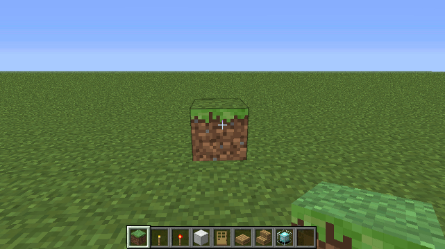

 3. Or by using the following form...
    
        d = new Drone(x,y,z,direction,world);

    This will create a new Drone at the location you specified using x, y, z In minecraft, the X axis runs west to east and the Z axis runs north to south.  The direction parameter says what direction you want the drone to face: 0 = east, 1 = south, 2 = west, 3 = north.  If the direction parameter is omitted, the player's direction is used instead. Both the `direction` and `world` parameters are optional.

 4. Create a new Drone based on a Location object...

        d = new Drone(location);

    This is useful when you want to create a drone at a given `org.bukkit.Location` . The `Location` class is used throughout the bukkit API. For example, if you want to create a drone when a block is broken at the block's location you would do so like this...

        events.blockBreak( function( event ) { 
            var location = event.block.location;
            var drone = new Drone(location);
            // do more stuff with the drone here...
        });

#### Parameters

 * Player : If a player reference is given as the sole parameter then the block the player was looking at will be used as the starting point for the drone. If the player was not looking at a block then the player's location will be used as the starting point. If a `Player` object is provided as a paramter then it should be the only parameter.
 * location  : *NB* If a `Location` object is provided as a parameter, then it should be the only parameter.
 * x : The x coordinate of the Drone (x,y,z,direction and world are not needed if either a player or location parameter is provided)
 * y : The y coordinate of the Drone 
 * z : The z coordinate of the Drone 
 * direction : The direction in which the Drone is facing. Possible values are 0 (east), 1 (south), 2 (west) or 3 (north) 
 * world : The world in which the drone is created. 
  
### Drone.box() method

the box() method is a convenience method for building things. (For the more performance-oriented method - see cuboid)

#### parameters

 * b - the block id - e.g. 6 for an oak sapling or '6:2' for a birch sapling. Alternatively you can use any one of the `blocks` values e.g. `blocks.sapling.birch`
 * w (optional - default 1) - the width of the structure 
 * h (optional - default 1) - the height of the structure 
 * d (optional - default 1) - the depth of the structure - NB this is not how deep underground the structure lies - this is how far away (depth of field) from the drone the structure will extend.

#### Example

To create a black structure 4 blocks wide, 9 blocks tall and 1 block long...
    
    box(blocks.wool.black, 4, 9, 1);

... or the following code does the same but creates a variable that can be used for further methods...

    var drone = new Drone(self);
    drone.box(blocks.wool.black, 4, 9, 1);


    
### Drone.box0() method

Another convenience method - this one creates 4 walls with no floor or ceiling.

#### Parameters

 * block - the block id - e.g. 6 for an oak sapling or '6:2' for a birch sapling. Alternatively you can use any one of the `blocks` values e.g. `blocks.sapling.birch`
 * width (optional - default 1) - the width of the structure 
 * height (optional - default 1) - the height of the structure 
 * length (optional - default 1) - the length of the structure - how far
   away (depth of field) from the drone the structure will extend.

#### Example

To create a stone building with the insided hollowed out 7 wide by 3 tall by 6 long...

    box0( blocks.stone, 7, 3, 6);

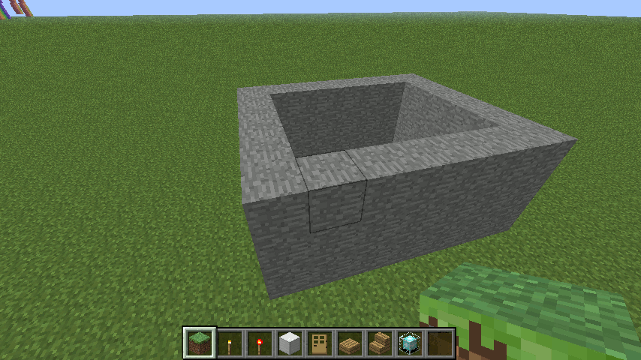
   
### Drone.boxa() method

Construct a cuboid using an array of blocks. As the drone moves first along the width axis, then the height (y axis) then the length, each block is picked from the array and placed.

#### Parameters

 * blocks - An array of blocks - each block in the array will be placed in turn.
 * width
 * height
 * length

#### Example

Construct a rainbow-colored road 100 blocks long...

    var rainbowColors = [blocks.wool.red, blocks.wool.orange, blocks.wool.yellow, blocks.wool.lime,
                         blocks.wool.lightblue, blocks.wool.blue, blocks.wool.purple];
    
    boxa(rainbowColors,7,1,30);

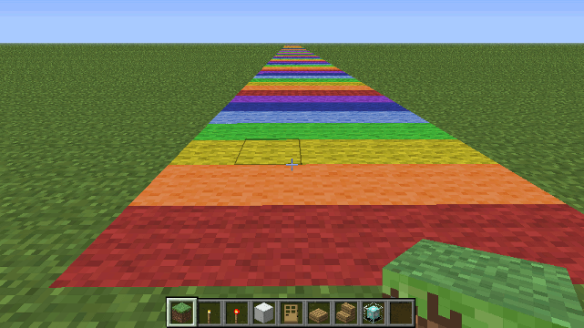

### Chaining

All of the Drone methods return a Drone object, which means methods can be 'chained' together so instead of writing this...

    drone = new Drone( self ); 
    drone.fwd( 3 );
    drone.left( 2 );
    drone.box( blocks.grass ); // create a grass block 
    drone.up();
    drone.box( blocks.grass ); // create another grass block
    drone.down();

...you could simply write ...
    
    var drone = new Drone(self).fwd(3).left(2).box(blocks.grass).up().box(blocks.grass).down();

... since each Drone method is also a global function that constructs a drone if none is supplied, you can shorten even further to just...
    
    fwd(3).left(2).box(blocks.grass).up().box(blocks.grass).down()

The Drone object uses a [Fluent Interface][fl] to make ScriptCraft scripts more concise and easier to write and read.  Minecraft's in-game command prompt is limited to about 80 characters so chaining drone commands together means more can be done before hitting the command prompt limit. For complex building you should save your commands in a new script file and load it using /js load()

[fl]: http://en.wikipedia.org/wiki/Fluent_interface

### Drone Properties

 * x - The Drone's position along the west-east axis (x increases as you move east)
 * y - The Drone's position along the vertical axis (y increses as you move up)
 * z - The Drone's position along the north-south axis (z increases as you move south)
 * dir - The Drone's direction 0 is east, 1 is south , 2 is west and 3 is north.

### Extending Drone

The Drone object can be easily extended - new buidling recipes/blueprints can be added and can become part of a Drone's chain using the *static* method `Drone.extend`. 

### Drone.extend() static method

Use this method to add new methods (which also become chainable global functions) to the Drone object.

#### Parameters

 * name - The name of the new method e.g. 'pyramid'. 
 * function - The method body.

Alternatively if you provide just a function as a parameter, then the function name will be used as the new method name. For example the following two approaches are both valid.

#### Example 1 Using name and function as parameters

    // submitted by [edonaldson][edonaldson]
    var Drone = require('drone'); 
    Drone.extend('pyramid', function( block,height) { 
        this.chkpt('pyramid');
        for ( var i = height; i > 0; i -= 2) {
            this.box(block, i, 1, i).up().right().fwd();
        }
        return this.move('pyramid');      
    });

#### Example 2 Using just a named function as a parameter

    var Drone = require('drone'); 
    function pyramid( block,height) { 
        this.chkpt('pyramid');
        for ( var i = height; i > 0; i -= 2) {
            this.box(block, i, 1, i).up().right().fwd();
        }
        return this.move('pyramid');      
    }
    Drone.extend( pyramid );

Once the method is defined (it can be defined in a new pyramid.js file) it can be used like so...

    var d = new Drone(self);
    d.pyramid(blocks.brick.stone, 12);

... or simply ...

    pyramid(blocks.brick.stone, 12);

[edonaldson]: https://github.com/edonaldson

### Drone Constants

#### Drone.PLAYER_STAIRS_FACING

An array which can be used when constructing stairs facing in the Drone's direction...

    var d = new Drone(self);
    d.box(blocks.stairs.oak + ':' + Drone.PLAYER_STAIRS_FACING[d.dir]);

... will construct a single oak stair block facing the drone.

#### Drone.PLAYER_SIGN_FACING

An array which can be used when placing signs so they face in a given direction. This is used internally by the Drone.sign() method. It should also be used for placing any of the following blocks...

 * chest 
 * ladder
 * furnace
 * dispenser

By default, chests, dispensers, signs, ladders and furnaces are placed facing towards the drone so to place a chest facing the Drone just use:

    drone.box( blocks.chest );

To place a chest facing _away_ from the Drone:

    drone.box( blocks.chest + ':' + Drone.PLAYER_SIGN_FACING[(drone.dir + 2) % 4]);

#### Drone.PLAYER_TORCH_FACING

Used when placing torches. By default torches will be placed facing up. If you want to place a torch so that it faces towards the drone:

    drone.box( blocks.torch + ':' + Drone.PLAYER_TORCH_FACING[drone.dir]);

If you want to place a torch so it faces _away_ from the drone:

    drone.box( blocks.torch + ':' + Drone.PLAYER_TORCH_FACING[(drone.dir + 2) % 4]);

### Drone.times() Method

The `times()` method makes building multiple copies of buildings
easy. It's possible to create rows or grids of buildings without
resorting to `for` or `while` loops.

#### Parameters

 * numTimes : The number of times you want to repeat the preceding statements.

#### Limitation

For now, don't use `times()` inside a Drone method implementation &ndash; only use it at the in-game prompt as a short-hand workaround for loops.

#### Example

Say you want to do the same thing over and over. You have a couple of options:

 * You can use a `for` loop &hellip;

    d = new Drone(); for ( var i = 0; i < 4; i++ ) {  d.cottage().right(8); }

While this will fit on the in-game prompt, it's awkward. You need to
declare a new Drone object first, then write a `for` loop to create the
4 cottages. It's also error prone &ndash; even the `for` loop is too much
syntax for what should really be simple.

 * You can use a `while` loop &hellip;
   
    d = new Drone(); var i=4; while (i--) { d.cottage().right(8); }

&hellip; which is slightly shorter but still too much syntax. Each of the
above statements is fine for creating a 1-dimensional array of
structures. But what if you want to create a 2-dimensional or
3-dimensional array of structures? Enter the `times()` method.

The `times()` method lets you repeat commands in a chain any number of
times. So to create 4 cottages in a row you would use the following
statement:

    cottage().right(8).times(4);

&hellip; which will build a cottage, then move right 8 blocks, then do it
again 4 times over so that at the end you will have 4 cottages in a
row. What's more, the `times()` method can be called more than once in
a chain. So if you wanted to create a *grid* of 20 houses ( 4 x 5 ),
you would do so using the following statement:

    cottage().right(8).times(4).fwd(8).left(32).times(5);

&hellip; breaking it down &hellip;

 1. The first 3 calls in the chain ( `cottage()`, `right(8)`, `times(4)` ) build a single row of 4 cottages.

 2. The last 3 calls in the chain ( `fwd(8)`, `left(32)`, `times(5)` ) move the drone forward 8 then left 32 blocks (4 x 8) to return to the original X coordinate, then everything in the chain is repeated again 5 times so that in the end, we have a grid of 20 cottages, 4 x 5.  Normally this would require a nested loop but the `times()` method does away with the need for loops when repeating builds.

Another example: This statement creates a row of trees 2 by 3:

    oak().right(10).times(2).left(20).fwd(10).times(3)

&hellip; You can see the results below.

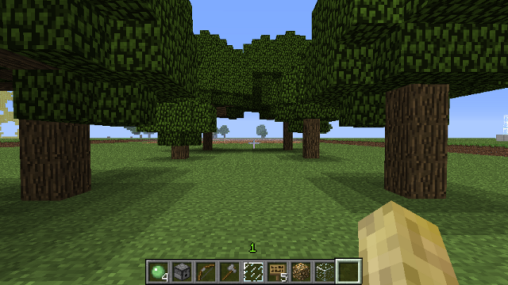

### Drone.arc() method

The arc() method can be used to create 1 or more 90 degree arcs in the
horizontal or vertical planes. This method is called by cylinder() and
cylinder0() and the sphere() and sphere0() methods.

#### Parameters

arc() takes a single parameter - an object with the following named properties...

 * radius - The radius of the arc.
 * blockType - The type of block to use - this is the block Id only (no meta). See [Data Values][dv].
 * meta - The metadata value. See [Data Values][dv].
 * orientation (default: 'horizontal' ) - the orientation of the arc - can be 'vertical' or 'horizontal'.
 * stack (default: 1 ) - the height or length of the arc (depending on the orientation - if orientation is horizontal then this parameter refers to the height, if vertical then it refers to the length ).
 * strokeWidth (default: 1 ) - the width of the stroke (how many blocks) - if drawing nested arcs it's usually a good idea to set strokeWidth to at least 2 so that there are no gaps between each arc. The arc method uses a [bresenham algorithm][bres] to plot points along the circumference.
 * fill - If true (or present) then the arc will be filled in.
 * quadrants (default: `{topleft:true,topright:true,bottomleft:true,bottomright:true}` - An object with 4 properties indicating which of the 4 quadrants of a circle to draw. If the quadrants property is absent then all 4 quadrants are drawn.

#### Examples

To draw a 1/4 circle (top right quadrant only) with a radius of 10 and
stroke width of 2 blocks ...

    arc({blockType: blocks.iron, 
         meta: 0, 
         radius: 10,
         strokeWidth: 2,
         quadrants: { topright: true },
         orientation: 'vertical', 
         stack: 1,
         fill: false
         } );

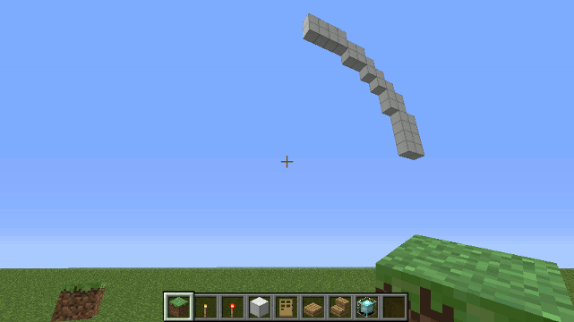

[bres]: http://en.wikipedia.org/wiki/Midpoint_circle_algorithm
[dv]: http://www.minecraftwiki.net/wiki/Data_values

### Drone.bed() method

Creates a bed. The foot of the bed will be at the drone's location and
the head of the bed will extend away from the drone.

#### Example
To create a bed at the in-game prompt, look at a block then type:

```javascript
/js bed()
```

Like most Drone methods, this returns the drone so it can be chained like so:

```javascript
this
  .fwd(3)
  .bed()
  .back(3)
```     
### Drone.blocktype() method

Creates the text out of blocks. Useful for large-scale in-game signs.

#### Parameters
 
 * message - The message to create - (use `\n` for newlines)
 * foregroundBlock (default: black wool) - The block to use for the foreground
 * backgroundBlock (default: none) - The block to use for the background

#### Example

To create a 2-line high message using glowstone...

    blocktype('Hello\nWorld', blocks.glowstone);

![blocktype example][imgbt1]

[imgbt1]: img/blocktype1.png

### Copy & Paste using Drone

A drone can be used to copy and paste areas of the game world.

#### Deprecated
As of January 10 2015 the copy-paste functions in Drone are no longer
supported. Copy/Paste is:

1. Difficult to do correctly in a way which works for both Minecraft 1.7 and 1.8 
   due to how blocks changed in 1.8
2. Not aligned with the purpose of ScriptCraft's Drone module which is to provide 
   a simple set of functions for scripting and in-game building.

### Drone.copy() method

Copies an area so it can be pasted elsewhere. The name can be used for
pasting the copied area elsewhere...

#### Parameters

 * name - the name to be given to the copied area (used by `paste`)
 * width - the width of the area to copy
 * height - the height of the area to copy
 * length - the length of the area (extending away from the drone) to copy

#### Example

    drone.copy('somethingCool',10,5,10 ).right(12 ).paste('somethingCool' );

### Drone.paste() method

Pastes a copied area to the current location.

#### Example

To copy a 10x5x10 area (using the drone's coordinates as the starting
point) into memory.  the copied area can be referenced using the name
'somethingCool'. The drone moves 12 blocks right then pastes the copy.

    drone.copy('somethingCool',10,5,10 )
         .right(12 )
         .paste('somethingCool' );

### Drone.cylinder() method

A convenience method for building cylinders. Building begins radius blocks to the right and forward.

#### Parameters

 * block - the block id - e.g. 6 for an oak sapling or '6:2' for a birch sapling. Alternatively you can use any one of the `blocks` values e.g. `blocks.sapling.birch`
 * radius 
 * height

#### Example

To create a cylinder of Iron 7 blocks in radius and 1 block high...

    cylinder(blocks.iron, 7 , 1);

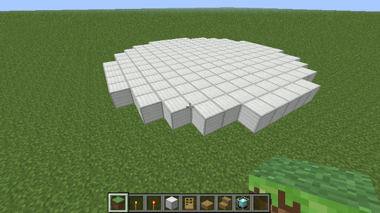

### Drone.cylinder0() method

A version of cylinder that hollows out the middle.

#### Example

To create a hollow cylinder of Iron 7 blocks in radius and 1 block high...

    cylinder0(blocks.iron, 7, 1);

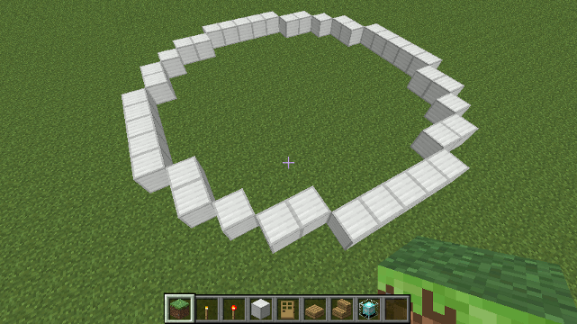

### Drone.door() method

create a door - if a parameter is supplied an Iron door is created otherwise a wooden door is created.

#### Parameters

 * doorType (optional - default wood) - If a parameter is provided then the door is Iron.

#### Example

To create a wooden door at the crosshairs/drone's location...

    var drone = new Drone(self);
    drone.door();

To create an iron door...

    drone.door( blocks.door_iron );

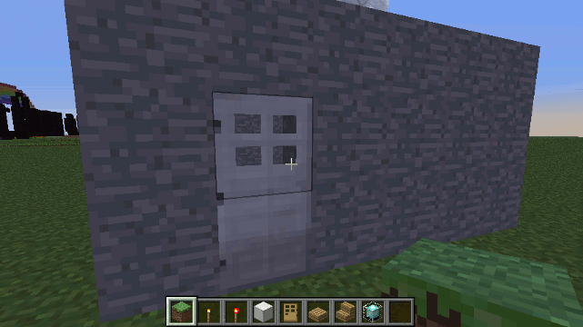

### Drone.door_iron() method

create an Iron door.

### Drone.door2() method

Create double doors (left and right side)

#### Parameters

 * doorType (optional - default wood) - If a parameter is provided then the door is Iron.

#### Example

To create double-doors at the cross-hairs/drone's location...

    drone.door2();

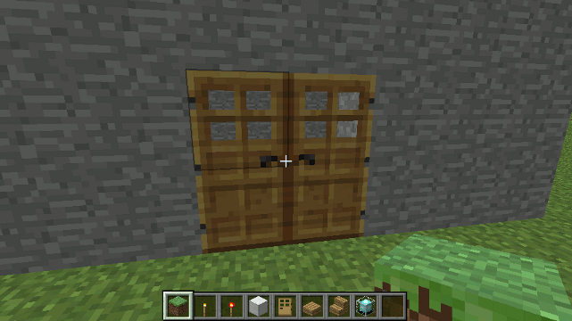

### Drone.door2_iron() method

Create double iron doors

### Drone.firework() method

Launches a firework at the drone's location.

#### Example

To launch a firework:

    var drone = new Drone(self);
    drone.firework();

### Drone.garden() method

places random flowers and long grass (similar to the effect of placing bonemeal on grass)

#### Parameters

 * width - the width of the garden
 * length - how far from the drone the garden extends

#### Example

To create a garden 10 blocks wide by 5 blocks long...

    garden(10,5);

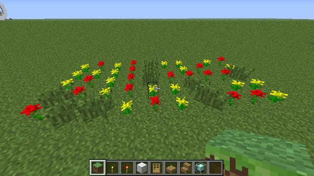

### Drone.ladder() method

Creates a ladder extending skyward.

#### Parameters

 * height (optional - default 1) 

#### Example

To create a ladder extending 10 blocks high:

    var drone = new Drone(self);
    drone.ladder(10)

At the in-game prompt, look at a block and then type:    

    /js ladder(10)

A ladder 10 blocks high will be created at the point you were looking at.

#### Since 
##### 3.0.3
### Drone Movement

Drones can move freely in minecraft's 3-D world. You control the
Drone's movement using any of the following methods..

 * up()
 * down()
 * left()
 * right()
 * fwd()
 * back()
 * turn()

... Each of these methods takes a single optional parameter
`numBlocks` - the number of blocks to move in the given direction. If
no parameter is given, the default is 1.

To change direction use the `turn()` method which also takes a single
optional parameter (numTurns) - the number of 90 degree turns to
make. Turns are always clock-wise. If the drone is facing north, then
drone.turn() will make the turn face east. If the drone is facing east
then drone.turn(2) will make the drone turn twice so that it is facing
west.

### Drone Positional Info

 * getLocation() - Returns a native Java Location object for the drone

### Drone Markers

Markers are useful when your Drone has to do a lot of work. You can
set a check-point and return to the check-point using the move()
method.  If your drone is about to undertake a lot of work -
e.g. building a road, skyscraper or forest you should set a
check-point before doing so if you want your drone to return to its
current location.

A 'start' checkpoint is automatically created when the Drone is first created.

Markers are created and returned to using the followng two methods...

 * chkpt - Saves the drone's current location so it can be returned to later.
 * move - moves the drone to a saved location. Alternatively you can provide a Java Location object or x,y,z and direction parameters.

#### Parameters

 * name - the name of the checkpoint to save or return to.

#### Example

    drone.chkpt('town-square');
    //
    // the drone can now go off on a long excursion
    //
    for ( i = 0; i< 100; i++) {  
        drone.fwd(12).box(6); 
    }
    //
    // return to the point before the excursion
    //
    drone.move('town-square');

### Drone.prism() method

Creates a prism. This is useful for roofs on houses.

#### Parameters

 * block - the block id - e.g. 6 for an oak sapling or '6:2' for a birch sapling. 
   Alternatively you can use any one of the `blocks` values e.g. `blocks.sapling.birch`
 * width - the width of the prism
 * length - the length of the prism (will be 2 time its height)

#### Example

    prism(blocks.oak,3,12);

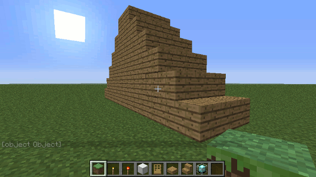

### Drone.prism0() method

A variation on `prism` which hollows out the inside of the prism. It
uses the same parameters as `prism`.

### Drone.rand() method

rand takes either an array (if each blockid has the same chance of occurring) or an object where each property is a blockid and the value is it's weight (an integer)

#### Example

place random blocks stone, mossy stone and cracked stone (each block has the same chance of being picked)

    rand( [blocks.brick.stone, blocks.brick.mossy, blocks.brick.cracked ],w,d,h) 

to place random blocks stone has a 50% chance of being picked, 

    var distribution = {};
    distribution[ blocks.brick.stone ] = 5;
    distribution[ blocks.brick.mossy ] = 3;
    distribution[ blocks.brick.cracked ] = 2;

    rand( distribution, width, height, depth) 

regular stone has a 50% chance, mossy stone has a 30% chance and cracked stone has just a 20% chance of being picked.

### Drone.wallsign() method

Creates a wall sign (A sign attached to a wall)

#### Parameters

 * message - can be a string or an array of strings

#### Example

    drone.wallsign(['Welcome','to','Scriptopia']);

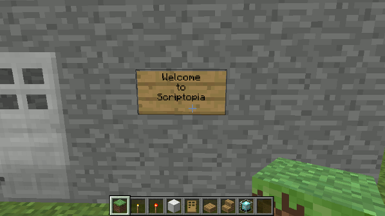

### Drone.signpost() method

Creates a free-standing signpost 

#### Parameters

 * message - can be a string or an array of strings

#### Example

    drone.signpost(['Hello','World']);

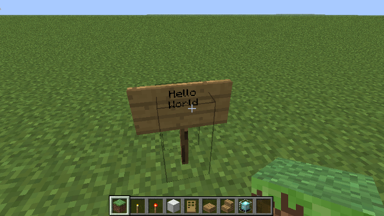

### Drone.sign() method

Deprecated: Use signpost() or wallsign() methods instead.

Signs must use block 63 (stand-alone signs) or 68 (signs on walls)

#### Parameters

 * message -  can be a string or an array of strings. 
 * block - can be 63 or 68

#### Example

To create a free-standing sign...

    drone.sign(["Hello","World"], blocks.sign_post);


... to create a wall mounted sign...

    drone.sign(["Welcome","to","Scriptopia"], blocks.sign );


### Drone.sphere() method

Creates a sphere.

#### Parameters
 
 * block - The block the sphere will be made of.
 * radius - The radius of the sphere.

#### Example

To create a sphere of Iron with a radius of 10 blocks...

    sphere( blocks.iron, 10);

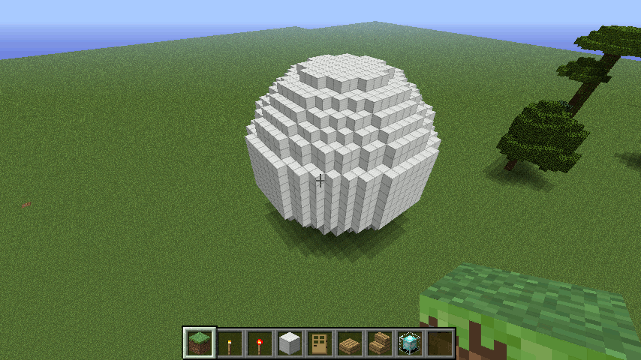

Spheres are time-consuming to make. You *can* make large spheres (250 radius) but expect the
server to be very busy for a couple of minutes while doing so.

### Drone.sphere0() method

Creates an empty sphere.

#### Parameters
 
 * block - The block the sphere will be made of.
 * radius - The radius of the sphere.

#### Example

To create a sphere of Iron with a radius of 10 blocks...

    sphere0( blocks.iron, 10);

Spheres are time-consuming to make. You *can* make large spheres (250 radius) but expect the
server to be very busy for a couple of minutes while doing so.

### Drone.hemisphere() method

Creates a hemisphere. Hemispheres can be either north or south.

#### Parameters

 * block - the block the hemisphere will be made of.
 * radius - the radius of the hemisphere
 * northSouth - whether the hemisphere is 'north' or 'south'

#### Example

To create a wood 'north' hemisphere with a radius of 7 blocks...

    hemisphere(blocks.oak, 7, 'north');

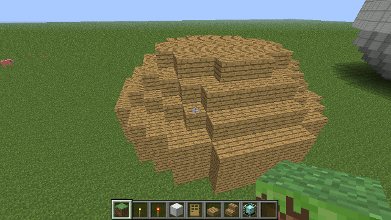

### Drone.hemisphere0() method

Creates a hollow hemisphere. Hemispheres can be either north or south.

#### Parameters

 * block - the block the hemisphere will be made of.
 * radius - the radius of the hemisphere
 * northSouth - whether the hemisphere is 'north' or 'south'

#### Example

To create a glass 'north' hemisphere with a radius of 20 blocks...

    hemisphere0(blocks.glass, 20, 'north');

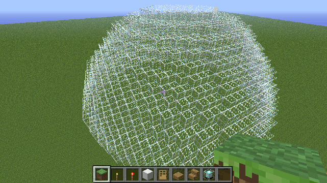

### Drone.stairs() function

The stairs() function will build a flight of stairs

#### Parameters

 * blockType - should be one of the following: 

   * blocks.stairs.oak
   * blocks.stairs.cobblestone
   * blocks.stairs.brick
   * blocks.stairs.stone
   * blocks.stairs.nether
   * blocks.stairs.sandstone
   * blocks.stairs.spruce
   * blocks.stairs.birch
   * blocks.stairs.jungle
   * blocks.stairs.quartz

 * width - The width of the staircase - default is 1
 * height - The height of the staircase - default is 1

#### Example

To build an oak staircase 3 blocks wide and 5 blocks tall:

    /js stairs(blocks.stairs.oak, 3, 5) 

Staircases do not have any blocks beneath them.

### Drone Trees methods

 * oak()
 * spruce()
 * birch()
 * jungle()

#### Example

To create 4 trees in a row, point the cross-hairs at the ground then type `/js ` and ...

    up( ).oak( ).right(8 ).spruce( ).right(8 ).birch( ).right(8 ).jungle( );

Trees won't always generate unless the conditions are right. You
should use the tree methods when the drone is directly above the
ground. Trees will usually grow if the drone's current location is
occupied by Air and is directly above an area of grass (That is why
the `up()` method is called first).

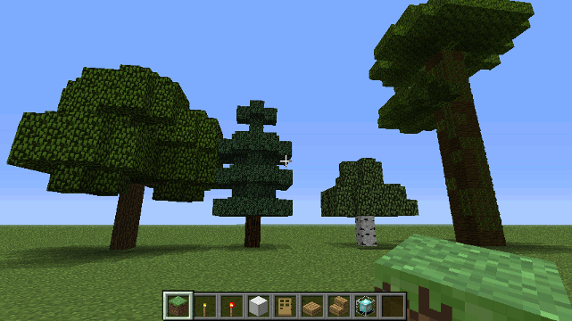

None of the tree methods require parameters. Tree methods will only be
successful if the tree is placed on grass in a setting where trees can
grow.

### Drone.castle() method

Creates a Castle. A castle is just a big wide fort with 4 taller forts at each corner. 
See also Drone.fort() method.

#### Parameters
 
 * side - How many blocks wide and long the castle will be (default: 24. Must be greater than 19)
 * height - How tall the castle will be (default: 10. Must be geater than 7)

#### Example

At the in-game prompt you can create a castle by looking at a block and typing:

```javascript
/js castle()
```

Alternatively you can create a new Drone object from a Player or Location object and call the castle() method.

```javascript
var d = new Drone(player);
d.castle();
```
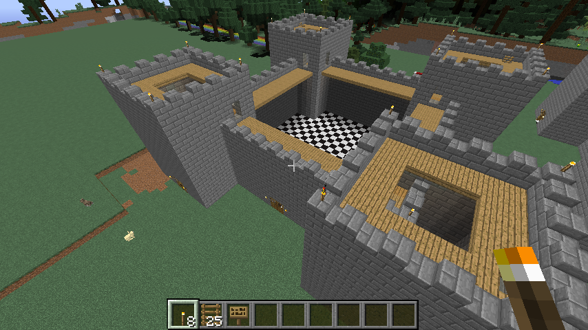

### Drone.chessboard() method

Creates a tile pattern of given block types and size

#### Parameters

 * whiteBlock - (optional: default blocks.wool.white)
 * blackBlock - (optional: default blocks.wool.black)
 * width - width of the chessboard
 * length - length of the chessboard

#### Example

At the in-game prompt you can create a chessboard by looking at a block and typing:

```javascript
/js chessboard()
```

Alternatively you can create a new Drone object from a Player or Location object and call the chessboard() method.

```javascript
var d = new Drone(player);
d.chessboard();
```
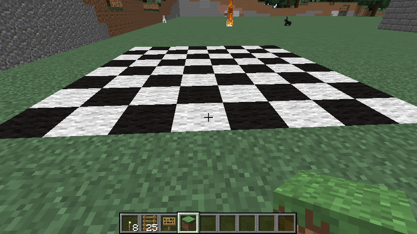

### Drone.cottage() method

Creates a simple but cosy dwelling.

#### Example

At the in-game prompt you can create a cottage by looking at a block and typing:

```javascript
/js cottage()
```

Alternatively you can create a new Drone object from a Player or Location object and call the cottage() method.

```javascript
var d = new Drone(player);
d.cottage();
```
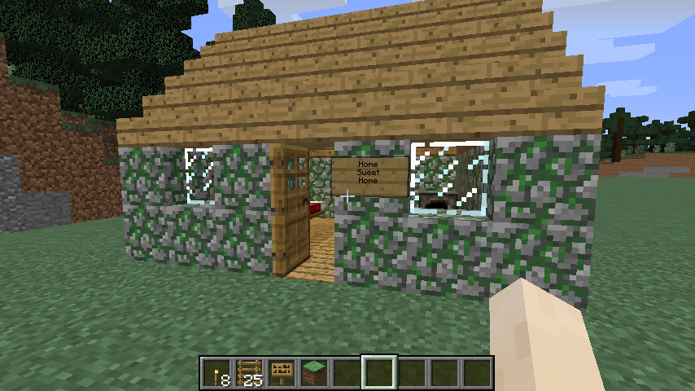

### Drone.cottage_road() method

Creates a tree-lined avenue with cottages on both sides.

#### Parameters
 
 * numberOfCottages: The number of cottages to build in total (optional: default 6)

#### Example

At the in-game prompt you can create a cottage road by looking at a block and typing:

```javascript
/js cottage_road()
```

Alternatively you can create a new Drone object from a Player or Location object and call the cottage_road() method.

```javascript
var d = new Drone(player);
d.cottage_road();
```
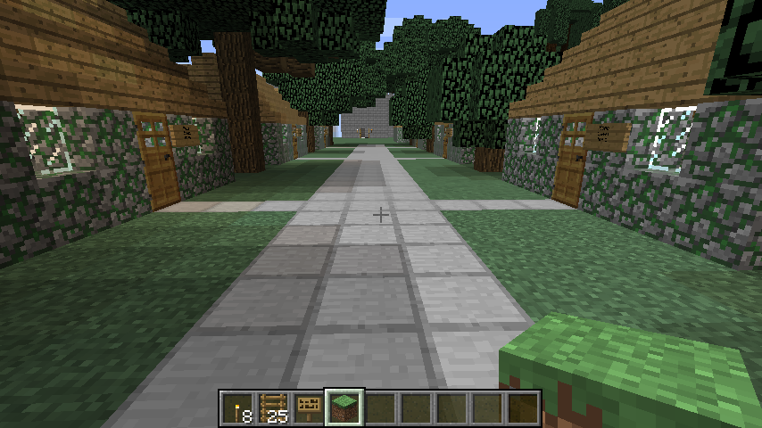

### Drone.dancefloor() method
Create an animated dance floor of colored tiles some of which emit light.
The tiles change color every second creating a strobe-lit dance-floor effect.
See it in action here [http://www.youtube.com/watch?v=UEooBt6NTFo][ytdance]

#### Parameters 

 * width - how wide the dancefloor should be (optional: default 5)
 * length - how long the dancefloor should be (optional: default 5)
 * duration - the time duration for which the lights should change (optional: default 30 seconds)

#### Example

At the in-game prompt you can create a dancefloor by looking at a block and typing:

```javascript
/js dancefloor()
```

Alternatively you can create a new Drone object from a Player or Location object and call the dancefloor() method.

```javascript
var d = new Drone(player);
d.dancefloor();
```

[ytdance]: http://www.youtube.com/watch?v=UEooBt6NTFo
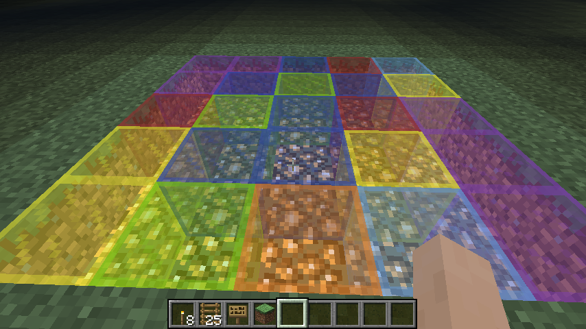
### Drone.fort() method

Constructs a medieval fort.

#### Parameters
 
 * side - How many blocks whide and long the fort will be (default: 18 . Must be greater than 9)
 * height - How tall the fort will be (default: 6 . Must be greater than 3)

#### Example

At the in-game prompt you can create a fort by looking at a block and typing:

```javascript
/js fort()
```

Alternatively you can create a new Drone object from a Player or Location object and call the fort() method.

```javascript
var d = new Drone(player);
d.fort();
```
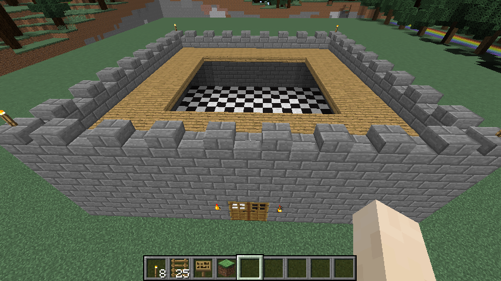

### Drone.hangtorch() method

Adds a hanging torch to a wall. This method will try to hang a torch
against a wall. It will traverse backwards until it finds a block
adjacent to air and hang the torch. If it can't find a block next to
air it will log a message in the server.

#### Example

At the in-game prompt you can create a hanging torch by looking at a
block and typing:

```javascript
/js hangtorch()
```

Alternatively you can create a new Drone object from a Player or
Location object and call the hangtorch() method.

```javascript
var d = new Drone(player);
d.hangtorch();
```

### Drone.lcdclock() method.

Constructs a large LCD Clock. The clock will display the current time of day.
The clock can be stopped by calling the stopLCD() method of the Drone which created the clock.

#### Parameters

 * foregroundBlock (Optional - default is blocks.glowstone)
 * backgroundBlock (Optional - default is blocks.wool.black)
 * borderBlock (Optional - a border around the LCD display - default none)

#### Example

At the in-game prompt you can create a LCD clock by looking at a block and typing:

```javascript
/js var clock = lcdclock()
/js clock.stopLCD()
```

Alternatively you can create a new Drone object from a Player or Location object and call the lcdclock() method.

```javascript
var d = new Drone(player);
d.lcdclock();
d.stopLCD();
```
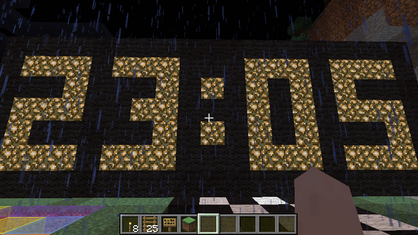
### Drone.logojs() method

Constructs a large Javascript Logo (black JS on Yellow background)
See: https://raw.github.com/voodootikigod/logo.js/master/js.png

#### Parameters

 * foregroundBlock (Optional - default is blocks.wool.gray)
 * backgroundBlock (Optional - default is blocks.gold)

### Drone.maze() method

Maze generation based on http://rosettacode.org/wiki/Maze_generation#JavaScript

#### Parameters

 * width (optional - default 10)
 * length (optional - default 10)

#### Example

At the in-game prompt you can create a maze by looking at a block and typing:

```javascript
/js maze()
```

Alternatively you can create a new Drone object from a Player or Location object and call the maze() method.

```javascript
var d = new Drone(player);
d.maze();
```
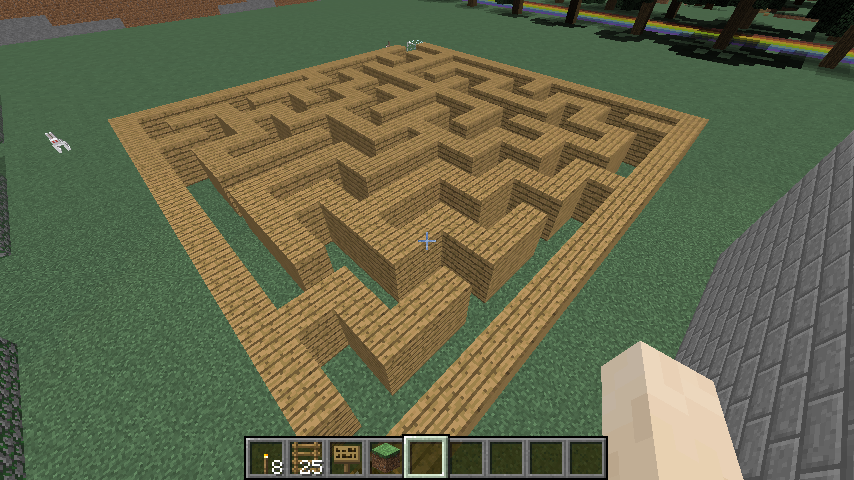

### Drone.rainbow() method

Creates a Rainbow.

#### Parameters

 * radius (optional - default:18) - The radius of the rainbow

#### Example

At the in-game prompt you can create a rainbow by looking at a block and typing:
```javascript
/js rainbow()
```

Alternatively you can create a new Drone object from a Player or Location object and call the rainbow() method.

```javascript    
var d = new Drone(player);
d.rainbow(30);
```

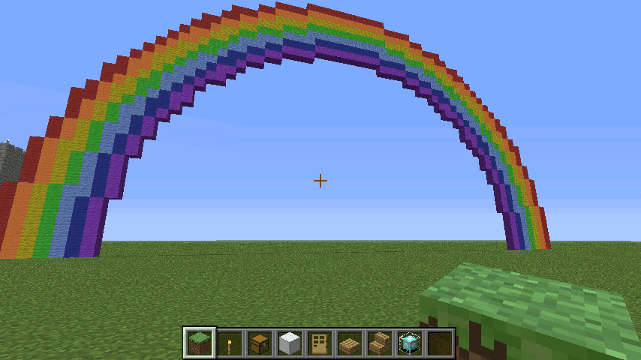

### Drone.spiral_stairs() method

Constructs a spiral staircase with slabs at each corner.

#### Parameters

 * stairBlock - The block to use for stairs, should be one of the following...
   - 'oak'
   - 'spruce'
   - 'birch'
   - 'jungle'
   - 'cobblestone'
   - 'brick'
   - 'stone'
   - 'nether'
   - 'sandstone'
   - 'quartz'
 * flights - The number of flights of stairs to build.

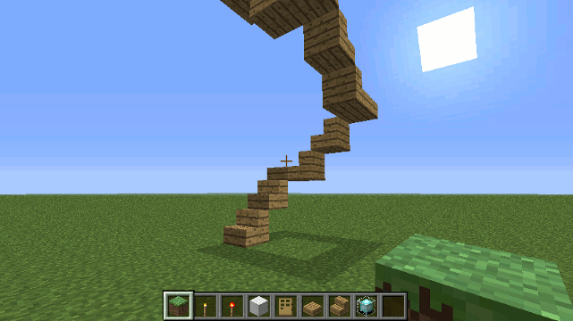

#### Example

To construct a spiral staircase 5 floors high made of oak...

    spiral_stairs('oak', 5);

### Drone.temple() method

Constructs a mayan temple.

#### Parameters
 
 * side - How many blocks wide and long the temple will be (default: 20)

#### Example

At the in-game prompt you can create a temple by looking at a block and typing:

```javascript
/js temple()
```

Alternatively you can create a new Drone object from a Player or Location object and call the temple() method.

```javascript
var d = new Drone(player);
d.temple();
```
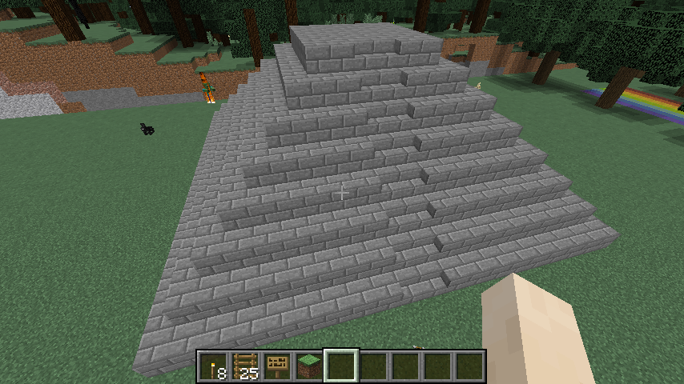

## The at Module

The at module provides a single function `at()` which can be used to schedule
repeating (or non-repeating) tasks to be done at a particular time. 

### at() function

The utils.at() function will perform a given task at a given time in the 
(minecraft) day.

#### Parameters

 * time24hr : The time in 24hr form - e.g. 9:30 in the morning is '09:30' while
   9:30 pm is '21:30', midnight is '00:00' and midday is '12:00'
 * callback : A javascript function which will be invoked at the given time.
 * worlds : (optional) An array of worlds. Each world has its own clock. If no array of worlds is specified, all the server's worlds are used.
 * repeat : (optional) true or false, default is true (repeat the task every day)

#### Example

To warn players when night is approaching:

```javascript
var utils = require('utils'),
    at = require('at');
function warning(){
  utils.players(function( player ) {
    echo( player, 'The night is dark and full of terrors!' );
  });
}
at('19:00', warning);
```
To run a task only once at the next given time:
```javascript
var utils = require('utils'),
    at = require('at');
function wakeup(){
  utils.players(function( player ) {
    echo( player, "Wake Up Folks!" );
  });
}
at('06:00', wakeup, null, false);
```

## Blocks Module

You hate having to lookup [Data Values][dv] when you use ScriptCraft's
Drone() functions. So do I.  So I created this blocks object which is
a helper object for use in construction.

### Examples

    box( blocks.oak ); // creates a single oak wood block
    box( blocks.sand, 3, 2, 1 ); // creates a block of sand 3 wide x 2 high x 1 long
    box( blocks.wool.green, 2 ); // creates a block of green wool 2 blocks wide

Color aliased properties that were a direct descendant of the blocks
object are no longer used to avoid confusion with carpet and stained
clay blocks. In addition, there's a convenience array `blocks.rainbow`
which is an array of the 7 colors of the rainbow (or closest
approximations).

The blocks module is globally exported by the Drone module.

## Fireworks Module

The fireworks module makes it easy to create fireworks using
ScriptCraft.  The module has a single function `firework` which takes
a `org.bukkit.Location` as its 1 and only parameter.

### Examples

The module also extends the `Drone` object adding a `firework` method
so that fireworks can be created as a part of a Drone chain. For
Example....

    /js firework()

... creates a single firework, while ....

    /js firework().fwd(3).times(5) 

... creates 5 fireworks in a row. Fireworks have also been added as a
possible option for the `arrow` module. To have a firework launch
where an arrow strikes...

    /js arrows.firework()

To call the fireworks.firework() function directly, you must provide a
location. For example...

    /js var fireworks = require('fireworks');
    /js fireworks.firework( self.location );

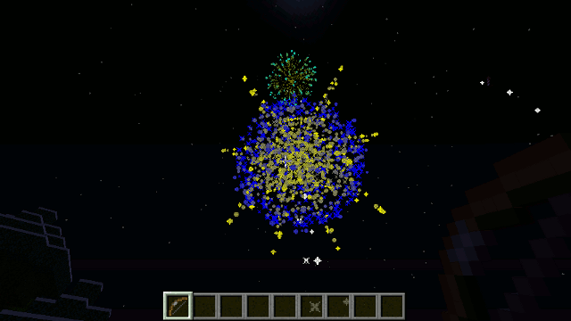

## Inventory Module
This module provides functions to add items to, remove items from and check the 
contents of a player or NPC's inventory. 

### Usage
The inventory module is best used in conjunction with the items module. See below for examples of usage.

```javascript
var inventory = require('inventory');
var items = require('items');
var utils = require('utils');

// gives every player a cookie and a baked potatoe
utils.players(function(player){
  inventory(player)
    .add( items.cookie(1) )
    .add( items.bakedPotato(1) )
});

// give a player 6 cookies then take away 4 of them

inventory(player)
  .add( items.cookie(6) )
  .remove ( items.cookie(4) )

// check if a player has any cookies

var hasCookies = inventory(player).contains( items.cookie(1) );

```
The inventory module exposes a single function which when passed a player or NPC will return an object with 3 methods:

* add : Adds items to the inventory (Expects parameters of type `net.canarymod.api.inventory.Item` - I strongly recommend using the `items` module for constructing items)
* remove : removes items from the inventory (Expects parameters of type `net.canarymod.api.inventory.Item` - I strongly recommend using the `items` module for constructing items)
* contains : checks to see if there is the specified type and amount of item in the inventory (Expects parameters of type `net.canarymod.api.inventory.Item` - I strongly recommend using the `items` module for constructing items)

## Classroom Plugin

The `classroom` object contains a couple of utility functions for use
in a classroom setting. The goal of these functions is to make it
easier for tutors to facilitate ScriptCraft for use by students in a
classroom environment. Although granting ScriptCraft access to
students on a shared server is potentially risky (Students can
potentially abuse it), it is slighlty less risky than granting
operator privileges to each student. (Enterprising students will
quickly realise how to grant themselves and others operator privileges
once they have access to ScriptCraft).

The goal of this module is not so much to enforce restrictions
(security or otherwise) but to make it easier for tutors to setup a
shared server so students can learn Javascript. When scripting is
turned on, every player who joins the server will have a dedicated
directory into which they can save scripts. All scripts in such
directories are automatically watched and loaded into a global
variable named after the player.

So for example, if player 'walterh' joins the server, a `walterh`
global variable is created. If a file `greet.js` with the following
content is dropped into the `scriptcraft/players/walterh`
directory...

```javascript
exports.hi = function( player ){
  echo( player, 'Hi ' + player.name);
};
```

... then it can be invoked like this: `/js walterh.hi( self )` . This
lets every player/student create their own functions without having
naming collisions.

It's strongly recommended that the
`scriptcraft/players/` directory is shared so that
others can connect to it and drop .js files into their student
directories. On Ubuntu, select the folder in Nautilus (the default
file browser) then right-click and choose *Sharing Options*, check the
*Share this folder* checkbox and the *Allow others to create and
delete files* and *Guest access* checkboxes. Click *Create Share*
button to close the sharing options dialog. Students can then access
the shared folder as follows...

 * Windows:   Open Explorer, Go to \\{serverAddress}\players\
 * Macintosh: Open Finder,   Go to smb://{serverAddress}/players/
 * Linux:     Open Nautilus, Go to smb://{serverAddress}/players/

... where {serverAddress} is the ip address of the server (this is
displayed to whoever invokes the classroom.allowScripting() function.)

### jsp classroom command
The `jsp classroom` command makes it easy for tutors to turn on or off
classroom mode. This command can only be used by server operators. To
turn on classroom mode (enable scripting for all players):

    jsp classroom on

To turn off classroom mode (disable scripting for all players):

    jsp classroom off

The `jsp classroom` command is provided as an easier way to turn on or
off classroom mode. This should be used in preference to the
classroom.allowScripting() function which is provided only for
programmatically enabling or disabling classroom mode.

### classroom.allowScripting() function

Allow or disallow anyone who connects to the server (or is already
connected) to use ScriptCraft. This function is preferable to granting 'ops' privileges 
to every student in a Minecraft classroom environment.

Whenever any file is added/edited or removed from any of the players/
directories the contents are automatically reloaded. This is to
facilitate quick turnaround time for students getting to grips with
Javascript.

#### Parameters

 * canScript : true or false

#### Example

To allow all players (and any players who connect to the server) to
use the `js` and `jsp` commands...

    /js classroom.allowScripting( true, self )

To disallow scripting (and prevent players who join the server from using the commands)...

    /js classroom.allowScripting( false, self )

Only ops users can run the classroom.allowScripting() function - this is so that students 
don't try to bar themselves and each other from scripting.

## Asynchronous Input Module

The `input` module provides a simple way to prompt players for input at the 
in-game prompt. In Javascript browser environments the `prompt()` function provides
a way to block execution and ask the user for input. Execution is blocked until the user
provides input using the modal dialog and clicks OK. Unfortunately Minecraft provides no 
equivalent modal dialog which can be used to gather player text input. The only way to gather text 
input from the player in Minecraft is to do so asynchronously. That is - a prompt message can be 
sent to the player but the player is not obliged to provide input immediately, nor does the program
execution block until the player does so.

So ScriptCraft has no `prompt()` implementation because `prompt()` is a synchronous function and 
Minecraft's API provides no equivalent functions or classes which can be used to implement this synchronously. 
The Minecraft API does however have a 'Conversation' API which allows for prompting of the player and asynchronously gathering text input from the player. 

This new `input()` function is best illustrated by example. The following code is for a number-guessing game:

```javascript
var input = require('input');
exports.numberguess = function(player){
  var randomNumber = Math.ceil(Math.random() * 10);
  input( player, 'Think of a number between 1 and 10 (q to quit)', function( guess, guesser, repeat ) {
    if ( guess == 'q'){
      return;
    }
    if ( +guess !== randomNumber ) { 
      if (+guess < randomNumber ) {
        echo( guesser, 'Too low - guess again');
      }
      if (+guess > randomNumber ) {
        echo( guesser, 'Too high - guess again');
      }
      repeat();
    } else {
      echo( guesser, 'You guessed correctly');
    }
  });
};
```

The `input()` function takes 3 parameters, the player, a prompt message and a callback which will be invoked when the player has entered some text at the in-game command prompt. 
The callback is bound to an object which has the following properties:

 * sender : The player who input the text
 * value : The value of the text which has been input.
 * message: The message prompt.
 * repeat: A function which when invoked will repeat the original prompt. (this is for flow control)

The callback function as well as being bound to an object with the above properties (so you can use this.value inside your callback to get the value which has just been input), can also take the following parameters (in exact order):

 * value
 * sender
 * repeat

The `value` parameter will be the same as `this.value`, the `repeat` parameter will be the same as `this.repeat` and so on.

## The recipes module

The Recipes module provides convenience functions for adding and removing recipes
from the game.

### Example
To add an EnderBow to the game (assumes there's an enchanted Item variable called enderBow)...

    var recipes = require('recipes');
    var items = require('items');
    ...
    var enderBowRecipe = recipes.create( {
      result: enderBow,
      ingredients: {
        E: items.enderPearl(1),
        S: items.stick(1),
        W: items.string(1)
      },
      shape: [ 'ESW',
               'SEW',
               'ESW' ]
    } );
    // add to server
    var addedRecipe = server.addRecipe( enderBowRecipe );
    // to remove...
    server.removeRemove( addedRecipe );

## Http Module

For handling http requests. Not to be confused with the more robust
and functional 'http' module bundled with Node.js.

### http.request() function

The http.request() function will fetch a web address asynchronously (on a
separate thread)and pass the URL's response to a callback function
which will be executed synchronously (on the main thread).  In this
way, http.request() can be used to fetch web content without blocking the
main thread of execution.

#### Parameters

 * request: The request details either a plain URL e.g. "http://scriptcraft.js/sample.json" or an object with the following properties...

   - url: The URL of the request.
   - method: Should be one of the standard HTTP methods, GET, POST, PUT, DELETE (defaults to GET).
   - params: A Javascript object with name-value pairs. This is for supplying parameters to the server.

 * callback: The function to be called when the Web request has completed. This function takes the following parameters...
   - responseCode: The numeric response code from the server. If the server did not respond with 200 OK then the response parameter will be undefined.
   - response: A string (if the response is of type text) or object containing the HTTP response body.

#### Example

The following example illustrates how to use http.request to make a request to a JSON web service and evaluate its response...

```javascript
var jsResponse;
var http = require('request');
http.request('http://scriptcraftjs.org/sample.json',function(responseCode, responseBody){
  jsResponse = JSON.parse( responseBody );
});
```
The following example illustrates a more complex use-case POSTing parameters to a CGI process on a server...

```javascript
var http = require('http');
http.request( {
    url: 'http://pixenate.com/pixenate/pxn8.pl',
    method: 'POST',
    params: {script: '[]'}
  },
  function( responseCode, responseBody ) {
    var jsObj = JSON.parse( responseBody );
  });
```

## sc-mqtt module

This module provides a simple way to communicate with devices (such as Arduino)
using the popular lightweight [MQTT protocol][mqtt].

### Usage

This module can only be used if the separate `sc-mqtt.jar` file is
present in the CraftBukkit classpath. To use this module, you should
...

 1. Download sc-mqtt.jar from <http://scriptcraftjs.org/download/extras/>
 2. Save the file to the same directory where craftbukkit.jar resides.
 3. Create a new batch file (windows-only) called
    craftbukkit-sc-mqtt.bat and edit it to include the following
    command...

    ```sh
    java -classpath sc-mqtt.jar;craftbukkit.jar org.bukkit.craftbukkit.Main
    ```

    If you're using Mac OS, create a new craftbukkit-sc-mqtt.command
    file and edit it (using TextWrangler or another text editor) ...

    ```sh
    java -classpath sc-mqtt.jar:craftbukkit.jar org.bukkit.craftbukkit.Main
    ```

 4. Execute the craftbukkit-sc-mqtt batch file / command file to start
    Craftbukkit. You can now begin using this module to send and receive
    messages to/from a Net-enabled Arduino or any other device which uses
    the [MQTT protocol][mqtt]
  
    ```javascript
    var mqtt = require('sc-mqtt');
    // create a new client
    var client = mqtt.client( 'tcp://localhost:1883', 'uniqueClientId' );
    // connect to the broker 
    client.connect( { keepAliveInterval: 15 } );
    //  publish a message to the broker
    client.publish( 'minecraft', 'loaded' );
    // subscribe to messages on 'arduino' topic 
    client.subscribe( 'arduino' );
    //  do something when an incoming message arrives...
    client.onMessageArrived( function( topic, message ) {
        console.log( 'Message arrived: topic=' + topic + ', message=' + message );
    });

    ```

The `sc-mqtt` module provides a very simple minimal wrapper around the
[Eclipse Paho MQTT Version 3 Client][pahodocs] java-based MQTT
library.

[pahodocs]: http://pic.dhe.ibm.com/infocenter/wmqv7/v7r5/index.jsp?topic=/com.ibm.mq.javadoc.doc/WMQMQxrClasses/org/eclipse/paho/client/mqttv3/package-summary.html
[mqtt]: http://mqtt.org/

## Signs Module

The Signs Module can be used by plugin authors to create interactive
signs - that is - signs which display a list of choices which can be
changed by interacting (right-clicking) with the sign.

### signs.menu() function

This function is used to construct a new interactive menu on top of an
existing sign in the game world.

#### Parameters

 * Label : A string which will be displayed in the topmost line of the
   sign. This label is not interactive.  
 * options : An array of strings which can be selected on the sign by 
   right-clicking/interacting.
 * callback : A function which will be called whenever a player
   interacts (changes selection) on a sign. This callback in turn
   takes as its parameter, an object with the following properties...

   * player : The player who interacted with the sign.
   * sign : The [org.bukkit.block.Sign][buksign] which the player interacted with.
   * text : The text for the currently selected option on the sign.
   * number : The index of the currently selected option on the sign.
 
 * selectedIndex : optional: A number (starting at 0) indicating which
   of the options should be selected by default. 0 is the default.

#### Returns
This function does not itself do much. It does however return a
function which when invoked with a given
[org.bukkit.block.Sign][buksign] object, will convert that sign into
an interactive sign.

#### Example: Create a sign which changes the time of day.

##### plugins/signs/time-of-day.js
   
```javascript 
var utils = require('utils'),
    signs = require('signs');

var onTimeChoice = function(event){
    var selectedIndex = event.number;
    // convert to Minecraft time 0 = Dawn, 6000 = midday, 12000 = dusk, 18000 = midnight
    var time = selectedIndex * 6000; 
    event.player.location.world.setTime(time);
};

// signs.menu returns a function which can be called for one or more signs in the game.
var convertToTimeMenu = signs.menu('Time of Day',
    ['Dawn', 'Midday', 'Dusk', 'Midnight'],
    onTimeChoice);
        
exports.time_sign = function( player ){
    var sign = signs.getTargetedBy(player);
    if ( !sign ) {
        throw new Error('You must look at a sign');
    } 
    convertToTimeMenu(sign);
};
```

To use the above function at the in-game prompt, look at an existing
sign and type...

    /js time_sign(self);

... and the sign you're looking at will become an interactive sign
which changes the time each time you interact (right-click) with it.

### signs.getTargetedBy() function

This function takes a [org.bukkit.entity.LivingEntity][bukle] as a
parameter and returns a [org.bukkit.block.Sign][buksign] object which
the entity has targeted. It is a utility function for use by plugin authors.

#### Example

```javascript 
var signs = require('signs'),
    utils = require('utils');
var player = utils.player('tom1234');
var sign = signs.getTargetedBy( player );
if ( !sign ) { 
    echo( player, 'Not looking at a sign');
}
```

[buksign]: https://hub.spigotmc.org/javadocs/bukkit/org/bukkit/block/Sign.html
[bukle]: https://hub.spigotmc.org/javadocs/bukkit/org/bukkit/entity/LivingEntity.html

## The slash Module

This module provides a single function which makes it easy to execute
minecraft commands via javascript.

### The slash() function

This function makes it easy to execute one or more minecraft commands.

#### Parameters

 * commands : A String or Array of strings - each string is a command to be executed.
 * sender: The player or server on whose behalf the commands should be executed.

#### Examples

Invoke the `/defaultgamemode creative` command (as server).

```javascript
var slash = require('slash');
slash('defaultgamemode creative', server);
```

Set the time of day to Midday and toggle downfall:

```javascript
var slash = require('slash');
slash([
  'time set 6000',
  'toggledownfall'
], server);
```

## Sounds Module

This module is a simple wrapper around the Bukkit Sound class and provides
a simpler way to play sounds. All of the org.bukkit.Sound Enum values are attached.

### Usage (Bukkit) :

    var sounds = require('sounds');
    sounds.play( bukkit.sound.VILLAGER_NO , self, 1, 0); // plays VILLAGER_NO sound at full volume and medium pitch
    sounds.play( bukkit.sound.VILLAGER_NO , self );       // same as previous statement

The play() function takes either a Location object or any object which has a location.
The volume parameter is in the range 0 to 1 and the pitch parameter is in the range 0 to 4.    

In addition, a play function is provided for each possible sound using the following rules:

1. The sound is converted from ALL_CAPS_UNDERSCORE to camelCase so for example there is a sounds.villagerNo() function which will play the VILLAGER_NO sound.
2. Each such function can take 3 parameters: location (which can be either an actual Location object or an object which has a location), volume and pitch
3. Or... each such function can be called without parameters meaning the sound will be played for all online players to hear.

    sounds.villagerNo(self, 1, 0); // plays VILLAGER_NO sound at full volume and medium pitch at invoker's location

    sounds.villagerNo(); // plays VILLAGER_NO sound for all players online.

These methods are provided for convenience to help beginners explore sounds using TAB completion.
String class extensions
-----------------------
The following chat-formatting methods are added to the javascript String class..

    * aqua()
    * black()
    * blue()
    * bold()
    * brightgreen()
    * darkaqua()
    * darkblue()
    * darkgray()
    * darkgreen()
    * purple()
    * darkpurple()
    * darkred()
    * gold()
    * gray()
    * green()
    * italic()
    * lightpurple()
    * indigo()
    * green()
    * red()
    * pink()
    * yellow()
    * white()
    * strike()
    * random()
    * magic()
    * underline()
    * reset()

Example
-------

    /js var boldGoldText = "Hello World".bold().gold();
    /js echo(self, boldGoldText );

<p style="color:gold;font-weight:bold">Hello World</p>    

## Teleport Module

This module provides a function to teleport entities (Players or NPCs). 

### Parameters

 * entity - The player or NPC to be teleported. If of type String, then a player with that name will be teleported.
 * destination - The location to which they should be teleported. If not of type Location but is a Player, Block or any
   object which has a `location` property then that works too. If of type String, then it's assumed that the destination is the player with that name.

### Example 

The following code will teleport each player back to their spawn position.

```javascript
var teleport = require('teleport'),
    utils = require('utils'),
    players = utils.players(), 
    i = 0;
for ( ; i < players.length; i++ ) {
  teleport( players[i], players[i].spawnPosition );
}
```

The following code will teleport 'tom' to 'jane's location.

```javascript
var teleport = require('teleport');
teleport('tom' , 'jane'); 
```
## Utilities Module

The `utils` module is a storehouse for various useful utility
functions which can be used by plugin and module authors. It contains
miscellaneous utility functions and classes to help with programming.

### utils.player() function

The utils.player() function will return a [Player][cmpl] object
with the given name. This function takes a single parameter
`playerName` which can be either a String or a [Player][cmpl] object -
if it's a Player object, then the same object is returned. If it's a
String, then it tries to find the player with that name.

#### Parameters

 * playerName : A String or Player object. If no parameter is provided
   then player() will try to return the `self` variable . It is 
   strongly recommended to provide a parameter.

#### Example

```javascript
var utils = require('utils');
var name = 'walterh';
var player = utils.player(name);
if ( player ) {
  echo(player, 'Got ' + name);
} else {
  console.log('No player named ' + name);
}
```

[bkpl]: http://jd.bukkit.org/dev/apidocs/org/bukkit/entity/Player.html
[cmpl]: https://ci.visualillusionsent.net/job/CanaryLib/javadoc/net/canarymod/api/entity/living/humanoid/Player.html
[cmloc]: https://ci.visualillusionsent.net/job/CanaryLib/javadoc/net/canarymod/api/world/position/Location.html 
[bkloc]: http://jd.bukkit.org/dev/apidocs/org/bukkit/Location.html

### utils.world( worldName ) function

Returns a World object matching the given name

### utils.blockAt( Location ) function

Returns the Block at the given location.

### utils.locationToJSON() function

utils.locationToJSON() returns a [Location][cmloc] object in JSON form...

    { world: 'world5',
      x: 56.9324,
      y: 103.9954,
      z: 43.1323,
      yaw: 0.0,
      pitch: 0.0
    }

This can be useful if you write a plugin that needs to store location data since bukkit's Location object is a Java object which cannot be serialized to JSON by default.

#### Parameters
 
 * location: An object of type [Location][cmloc]

#### Returns

A JSON object in the above form.
 
### utils.locationToString() function

The utils.locationToString() function returns a
[Location][cmloc] object in string form...

    '{"world":"world5",x:56.9324,y:103.9954,z:43.1323,yaw:0.0,pitch:0.0}'

... which can be useful if you write a plugin which uses Locations as
keys in a lookup table.

#### Example

```javascript    
var utils = require('utils');
...
var key = utils.locationToString(player.location);
lookupTable[key] = player.name;
```

### utils.locationFromJSON() function

This function reconstructs an [Location][cmloc] object from
a JSON representation. This is the counterpart to the
`locationToJSON()` function. It takes a JSON object of the form
returned by locationToJSON() and reconstructs and returns a bukkit
Location object.

### utils.getPlayerPos() function

This function returns the player's [Location][cmloc] (x, y, z, pitch
and yaw) for a named player.  If the "player" is in fact a
[BlockCommand][bkbcs] then the attached Block's location is returned.

#### Parameters

 * player : A [org.bukkit.command.CommandSender][bkbcs] (Player or BlockCommandSender) or player name (String).

#### Returns

A [Location][cmloc] object.

[bkbcs]: http://jd.bukkit.org/dev/apidocs/org/bukkit/command/BlockCommandSender.html
[bksndr]: http://jd.bukkit.org/dev/apidocs/index.html?org/bukkit/command/CommandSender.html
### utils.getMousePos() function

This function returns a [Location][cmloc] object (the
x,y,z) of the current block being targeted by the named player. This
is the location of the block the player is looking at (targeting).

#### Parameters

 * player : The player whose targeted location you wish to get.

#### Example

The following code will strike lightning at the location the player is looking at...

```javascript
var utils = require('utils');
var playerName = 'walterh';
var targetPos = utils.getMousePos(playerName);
if (targetPos){
  if (__plugin.canary){
    targetPos.world.makeLightningBolt(targetPos);
  }  
  if (__plugin.bukkit){ 
    targetPos.world.strikeLightning(targetPos);
  }
}
```

### utils.foreach() function

The utils.foreach() function is a utility function for iterating over
an array of objects (or a java.util.Collection of objects) and
processing each object in turn. Where utils.foreach() differs from
other similar functions found in javascript libraries, is that
utils.foreach can process the array immediately or can process it
*nicely* by processing one item at a time then delaying processing of
the next item for a given number of server ticks (there are 20 ticks
per second on the minecraft main thread).  This method relies on
Bukkit's [org.bukkit.scheduler][sched] package for scheduling
processing of arrays.

[sched]: http://jd.bukkit.org/beta/apidocs/org/bukkit/scheduler/package-summary.html

#### Parameters

 * array : The array to be processed - It can be a javascript array, a java array or java.util.Collection
 * callback : The function to be called to process each item in the
   array. The callback function should have the following signature
   `callback(item, index, object, array)`. That is the callback will
   be called with the following parameters....

   - item : The item in the array
   - index : The index at which the item can be found in the array.
   - object : Additional (optional) information passed into the foreach method.
   - array : The entire array.

 * context (optional) : An object which may be used by the callback.
 * delayInMilliseconds (optional, numeric) : If a delay is specified then the processing will be scheduled so that
   each item will be processed in turn with a delay between the completion of each
   item and the start of the next. This is recommended for any CPU-intensive process.
 * onDone (optional, function) : A function to be executed when all processing 
   is complete. This parameter is only used when the processing is delayed. (It's optional even if a 
   delay parameter is supplied).

If called with a delay parameter then foreach() will return
immediately after processing just the first item in the array (all
subsequent items are processed later). If your code relies on the
completion of the array processing, then provide an `onDone` parameter
and put the code there.

#### Example

The following example illustrates how to use foreach for immediate processing of an array...

```javascript
var utils = require('utils');
var players = utils.players();
utils.foreach (players, function( player ) { 
  echo( player , 'Hi ' + player);
});
```

... The `utils.foreach()` function can work with Arrays or any
Java-style collection. This is important because many objects in the
CanaryMod and Bukkit APIs use Java-style collections.
### utils.nicely() function

The utils.nicely() function is for performing background processing. utils.nicely() lets you
process with a specified delay between the completion of each `next()`
function and the start of the next `next()` function.
`utils.nicely()` is a recursive function - that is - it calls itself
(schedules itself actually) repeatedly until `hasNext` returns false.

#### Parameters

 * next : A function which will be called if processing is to be done. 
 * hasNext : A function which is called to determine if the `next`
   callback should be invoked. This should return a boolean value -
   true if the `next` function should be called (processing is not
   complete), false otherwise.
 * onDone : A function which is to be called when all processing is complete (hasNext returned false).
 * delayInMilliseconds : The delay between each call.

#### Example

See the source code to utils.foreach for an example of how utils.nicely is used.

### utils.time( world ) function

Returns the timeofday (in minecraft ticks) for the given world. This function is necessary because
canarymod and bukkit differ in how the timeofday is calculated. 

See http://minecraft.gamepedia.com/Day-night_cycle#Conversions

### utils.time24( world ) function

Returns the timeofday for the given world using 24 hour notation. (number of minutes)

See http://minecraft.gamepedia.com/Day-night_cycle#Conversions

#### Parameters

 * world : the name of the world or world object for which you want to get time

### utils.find() function

The utils.find() function will return a list of all files starting at
a given directory and recursiving trawling all sub-directories.

#### Parameters

 * dir : The starting path. Must be a string.
 * filter : (optional) A [FilenameFilter][fnfltr] object to return only files matching a given pattern.

[fnfltr]: http://docs.oracle.com/javase/6/docs/api/java/io/FilenameFilter.html

#### Example

```javascript
var utils = require('utils');
var jsFiles = utils.find('./', function(dir,name){
    return name.match(/\.js$/);
});  
```
### utils.serverAddress() function

The utils.serverAddress() function returns the IP(v4) address of the server.

```javascript
var utils = require('utils');
var serverAddress = utils.serverAddress();
console.log(serverAddress);
```
### utils.array() function

Converts Java collection objects to type Javascript array so they can avail of
all of Javascript's Array goodness.
 
#### Example

    var utils = require('utils');
    var worlds = utils.array(server.worldManager.getAllWorlds());
    
### utils.players() function

This function returns a javascript array of all online players on the
server.  You can optionally provide a function which will be invoked
with each player as a parameter.  For example, to give each player the
ability to shoot arrows which launch fireworks:

```javascript
require('utils').players( arrows.firework )
```

Any players with a bow will be able to launch fireworks by shooting.

### utils.playerNames() function

This function returns a javascript array of player names (as javascript strings)

### utils.stat() function

This function returns a numeric value for a given player statistic.

#### Parameters

 * Player - The player object (optional - if only the statistic name parameter is provided then the statistic object is returned)
 * Statistic - A string whose value should be one of the following (CanaryMod) 
   * ANIMALSBRED 
   * BOATONECM 
   * CLIMBONECM 
   * CROUCHONECM 
   * DAMAGEDEALT 
   * DAMAGETAKEN 
   * DEATHS 
   * DRIVEONECM 
   * DROP 
   * FALLONECM 
   * FISHCAUGHT 
   * FLYONECM 
   * HORSEONECM 
   * JUMP 
   * JUNKFISHED 
   * LEAVEGAME 
   * MINECARTONECM 
   * MOBKILLS 
   * PIGONECM 
   * PLAYERKILLS 
   * PLAYONEMINUTE 
   * SPRINTONECM 
   * SWIMONECM 
   * TALKEDTOVILLAGER 
   * TIMESINCEDEATH 
   * TRADEDWITHVILLAGER 
   * TREASUREFISHED 
   * WALKONECM 

See [CanaryMod's Statistic][cmstat] class for an up-to-date list of possible stat values

[cmstat]: https://ci.visualillusionsent.net/job/CanaryLib/javadoc/net/canarymod/api/statistics/Statistics.html

#### Example 1 Getting stats for a player

    var utils = require('utils');
    var jumpCount = utils.stat( player, 'jump');

#### Example 2 Getting the JUMP statistic object (which can be used elsewhere)

    var utils = require('utils');
    var JUMPSTAT = utils.stat('jump');
    var jumpCount = player.getStat( JUMPSTAT ); // canary-specific code

This function also contains values for each possible stat so you can get at stats like this...

    var utils = require('utils');
    var JUMPSTAT = utils.stat.JUMP; // Accessing the value
    var jumpCount = player.getStat ( JUMPSTAT ); // canary-specific code
## The watcher Module

This module exposes functions for watching for changes to files or directories.

### watcher.watchFile() function

Watches for changes to the given file or directory and calls the function provided
when the file changes.

#### Parameters
 
 * File - the file to watch (can be a file or directory)
 * Callback - The callback to invoke when the file has changed. The callback takes the 
   changed file as a parameter.

#### Example

```javascript
var watcher = require('watcher');
watcher.watchFile( 'test.txt', function( file ) { 
  console.log( file + ' has changed');
});
```
### watcher.watchDir() function

Watches for changes to the given directory and calls the function provided
when the directory changes. It works by calling watchFile/watchDir for each
file/subdirectory.

#### Parameters
 
 * Dir - the file to watch (can be a file or directory)
 * Callback - The callback to invoke when the directory has changed. 
              The callback takes the changed file as a parameter. 
              For each change inside the directory the callback will also 
              be called.

#### Example

```javascript
var watcher = require('watcher');
watcher.watchDir( 'players/_ial', function( dir ) { 
  console.log( dir + ' has changed');
});
```
### watcher.unwatchFile() function

Removes a file from the watch list.

#### Example
```javascript
var watcher = require('watcher');
watcher.unwatchFile('test.txt');
```

### watcher.unwatchDir() function

Removes a directory from the watch list and all files inside the directory
are also "unwatched"

#### Example
```javascript
var watcher = require('watcher');
watcher.unwatchDir ('players/_ial');
```
Would cause also 
```javascript
watcher.unwatchFile (file);
```
for each file inside directory (and unwatchDir for each directory inside it)

## Example Plugin #1 - A simple extension to Minecraft.

A simple minecraft plugin. The most basic module.

### Usage: 

At the in-game prompt type ...
  
    /js hello(self)

... and a message `Hello {player-name}` will appear (where
  {player-name} is replaced by your own name).
  
This example demonstrates the basics of adding new functionality which
is only usable by server operators or users with the
scriptcraft.evaluate permission. By default, only ops are granted this
permission.
  
The `hello` function below is only usable by players with the scriptcraft.evaluate 
permission since it relies on the `/js` command to execute.

    exports.hello = function(player){
        echo( player, 'Hello ' + player.name);
    };

## Example Plugin #2 - Making extensions available for all players.

A simple minecraft plugin. Commands for other players.

### Usage: 

At the in-game prompt type ...
  
    /jsp hello

... and a message `Hello {player-name}` will appear (where {player-name} is 
replaced by your own name).
  
This example demonstrates the basics of adding new functionality
which is usable all players or those with the scriptcraft.proxy
permission.  By default, all players are granted this permission.
  
This differs from example 1 in that a new 'jsp ' command extension
is defined. Since all players can use the `jsp` command, all players
can use the new extension. Unlike the previous example, the `jsp hello` 
command does not evaluate javascript code so this command is much more secure.

    command('hello', function (parameters, player) {
        echo( player, 'Hello ' + player.name);
    });

## Example Plugin #3 - Limiting use of commands to operators only.

A simple minecraft plugin. Commands for operators only.

### Usage: 

At the in-game prompt type ...
  
    /jsp op-hello

... and a message `Hello {player-name}` will appear (where {player-name} is 
replaced by your own name).
  
This example demonstrates the basics of adding new functionality
which is usable all players or those with the scriptcraft.proxy
permission. By default, all players are granted this permission. In
this command though, the function checks to see if the player is an
operator and if they aren't will return immediately.
 
This differs from example 2 in that the function will only print a
message for operators.

    command('op-hello', function (parameters, player) {
        if ( !isOp(player) ){
          echo( player, 'Only operators can do this.');
          return;
        }
        echo( player, 'Hello ' + player.name);
    });
## Example Plugin #4 - Using parameters in commands.

A simple minecraft plugin. Handling parameters.

### Usage: 

At the in-game prompt type ...
  
    /jsp hello-params Hi
    /jsp hello-params Saludos 
    /jsp hello-params Greetings

... and a message `Hi {player-name}` or `Saludos {player-name}` etc
will appear (where {player-name} is replaced by your own name).
  
This example demonstrates adding and using parameters in commands.
  
This differs from example 3 in that the greeting can be changed from
a fixed 'Hello ' to anything you like by passing a parameter.

    command( 'hello-params', function ( parameters, player ) {
      var salutation = parameters[0] ;
      echo( player, salutation + ' ' + player.name );
    });

## Example Plugin #5 - Re-use - Using your own and others modules.

A simple minecraft plugin. Using Modules.

### Usage: 

At the in-game prompt type ...
  
    /jsp hello-module

... and a message `Hello {player-name}` will appear (where {player-name} is 
replaced by your own name).
  
This example demonstrates the use of modules. In
example-1-hello-module.js we created a new javascript module. In
this example, we use that module...

 * We load the module using the `require()` function. Because this
   module and the module we require are n the same directory, we
   specify `'./example-1-hello-module'` as the path (when loading a
   module from the same directory, `./` at the start of the path
   indicates that the file should be searched for in the same
   directory.

 * We assign the loaded module to a variable (`greetings`) and then
   use the module's `hello` method to display the message. 

Source Code...

    var greetings = require('./example-1-hello-module');
    command( 'hello-module', function( parameters, player ) {
      greetings.hello( player );
    });

## Example Plugin #6 - Re-use - Using 'utils' to get Player objects.

A simple minecraft plugin. Finding players by name.

### Usage: 

At the in-game prompt type ...
  
    /jsp hello-byname {player-name}

... substituting {player-name} with the name of a player currently
online and a message `Hello ...` will be sent to the named
player.
  
This example builds on example-5 and also introduces a new concept -
use of shared modules. That is : modules which are not specific to
any one plugin or set of plugins but which can be used by all
plugins. Shared modules should be placed in the
`scriptcraft/modules` directory.
  
 * The utils module is used. Because the 'utils' module is
   located in the modules folder we don't need to specify an exact
   path, just 'utils' will do. 
 
 * The `utils.player()` function is used to obtain a player object
   matching the player name. Once a player object is obtained, a
   message is sent to that player.

Source Code ...

    var utils = require('utils');
    var greetings = require('./example-1-hello-module');

    command( 'hello-byname', function( parameters, sender ) {
      var playerName = parameters[0];
      var recipient = utils.player( playerName );
      if ( recipient ) {
        greetings.hello( recipient );
      } else {
        echo( sender, 'Player ' + playerName + ' not found.' );
      }
    });

## Example Plugin #7 - Listening for events, Greet players when they join the game.

A simple event-driven minecraft plugin. How to handle Events.

This example demonstrates event-driven programming. The code below
will display the version of ScriptCraft every time an operator joins
the game. This module is notable from previous modules for the
following reasons...

 1. It does not export any functions or variables. That's fine. Not
    all modules need export stuff. Code in this module will be
    executed when the module is first loaded. Because it is in the
    `/scriptcraft/plugins` directory, it will be loaded automatically
    when the server starts up.

 2. It uses ScriptCraft's `events` module to add a new *Event
    Handler*. An *Event Handler* is a function that gets
    called whenever a particular *event* happens in the game. The
    function defined below will only be executed whenever a player
    joins the game. This style of program is sometimes refered to as
    *Event-Driven Programming*.

Adding new *Event Handlers* in ScriptCraft is relatively easy. Use one
of the `events` module's functions to add a new event handler. The
events module has many functions - one for each type of event. Each
function takes a single parameter:

 * The event handling function (also sometimes refered to as a
   'callback'). In ScriptCraft, this function takes a single
   parameter, an event object. All of the information about the event
   is in the event object.

In the example below, if a player joins the server and is an operator,
then the ScriptCraft plugin information will be displayed to that
player.

```javascript
function onJoin( event ){
  if ( isOp(event.player) ) {
    echo( event.player, 'Welcome to ' + __plugin );
  }
}
events.connection( onJoin );
```
First the onJoin() function is defined, this is our event handler -
the function we wish to be called every time some new player joins the
game. Then we hook up - or register - that function using the
events.connection() function. The events.connection function is the
function responsible for adding new *connection* event handlers - that
is - functions which should be invoked when there's a new *connection*
event in the game. A new *connection* event is fired whenever a player
joins the game. There are many other types of events you can handle in
Minecraft. You can see [a full list of events here][cmEvtList].

[cmEvtList]: #events-helper-module-canary-version
## Arrows Plugin

The arrows mod adds fancy arrows to the game. Arrows which ... 

 * Launch fireworks.
 * Explode on impact. 
 * Force Lightning to strike where they land.
 * Teleport the player to the landing spot.
 * Spawn Trees at the landing spot.

### Usage: 

  * `/js arrows.firework(self)` - A firework launches where the the arrow lands.
  * `/js arrows.lightning(self)` - lightning strikes where the arrow lands.
  * `/js arrows.teleport(self)` - makes player teleport to where arrow has landed.
  * `/js arrows.flourish(self)` - makes a tree grow where the arrow lands.
  * `/js arrows.explosive(self)` - makes arrows explode.
  * `/js arrows.normal(self)` sets arrow type to normal.
  * `/js arrows.sign(self)` turns a targeted sign into an Arrows menu

All of the above functions can take an optional player object or name
as a parameter. For example: `/js arrows.explosive('player23')` makes
player23's arrows explosive.
 
## Spawn Plugin

Allows in-game operators to easily spawn creatures at current location.

### Usage

    /jsp spawn cow
    /jsp spawn sheep
    /jsp spawn wolf

This command supports TAB completion so to see a list of possible
entitities, type `/jsp spawn ' at the in-game command prompt, then
press TAB. Visit
<https://hub.spigotmc.org/javadocs/bukkit/org/bukkit/entity/EntityType.html> (CanaryMod)
or <http://docs.visualillusionsent.net/CanaryLib/1.0.0/net/canarymod/api/entity/EntityType.html> (Bukkit)

for a list of possible entities (creatures) which can be spawned.

## alias Plugin

The alias module lets players and server admins create their own
per-player or global custom in-game command aliases.

### Examples

To set a command alias which is only visible to the current player
(per-player alias)...

    /jsp alias set cw = time set {1} ; weather {2}

... Creates a new custom command only usable by the player who set
it called `cw` (short for set Clock and Weather) which when invoked...

    /cw 4000 sun

... will perform the following commands...

    /time set 4000
    /weather sun

Aliases can use paramters as above. On the right hand side of the `=`, the 
`{1}` refers to the first parameter provided with the `cw` alias, `{2}`
refers to the second parameter and so on. So `cw 4000 sun` is converted to 
`time set 4000` and `weather sun`. 

To set a global command alias usable by all (only operators can create
such an alias)...

    /jsp alias global stormy = time 18000; weather storm

To remove an alias ...

    /jsp alias remove cw

... removes the 'cw' alias from the appropriate alias map.

To get a list of aliases currently defined...

    /jsp alias list

To get help on the `jsp alias` command:

    /jsp alias help

Aliases can be used at the in-game prompt by players or in the server
console.  Aliases will not be able to avail of command autocompletion
(pressing the TAB key will have no effect).

## Commando Plugin

### Description

commando is a plugin which can be used to add completely new commands
to Minecraft.  Normally ScriptCraft only allows for provision of new
commands as extensions to the jsp command. For example, to create a
new simple command for use by all players...

    /js command('hi', function(args,player){ echo( player, 'Hi ' + player.name); });
  
... then players can use this command by typing...

    /jsp hi

... A couple of ScriptCraft users have asked for the ability to take
this a step further and allow the global command namespace to be
populated so that when a developer creates a new command using the
'command' function, then the command is added to the global command
namespace so that players can use it simply like this...

    /hi

... There are good reasons why ScriptCraft's core `command()` function
does not do this. Polluting the global namespace with commands would
make ScriptCraft a bad citizen in that Plugins should be able to work
together in the same server and - as much as possible - not step on
each others' toes. The CraftBukkit team have very good reasons for
forcing Plugins to declare their commands in the plugin.yml
configuration file. It makes approving plugins easier and ensures that
craftbukkit plugins behave well together. While it is possible to
override other plugins' commands, the CraftBukkit team do not
recommend this. However, as ScriptCraft users have suggested, it
should be at the discretion of server administrators as to when
overriding or adding new commands to the global namespace is good.

So this is where `commando()` comes in. It uses the exact same
signature as the core `command()` function but will also make the
command accessible without the `jsp` prefix so instead of having to
type `/jsp hi` for the above command example, players simply type
`/hi` . This functionality is provided as a plugin rather than as part
of the ScriptCraft core.

### Example hi-command.js

    var commando = require('../commando');
    commando('hi', function(args,player){
       echo( player, 'Hi ' + player.name);
    });

...Displays a greeting to any player who issues the `/hi` command.

### Example - timeofday-command.js 

    var times = {Dawn: 0, Midday: 6000, Dusk: 12000, Midnight:18000};
    commando('timeofday', function(params,player){
           player.location.world.setTime(times[params[0]]);
       },
       ['Dawn','Midday','Dusk','Midnight']);

... changes the time of day using a new `/timeofday` command (options are Dawn, Midday, Dusk, Midnight)

### Caveats

Since commands registered using commando are really just appendages to
the `/jsp` command and are not actually registered globally (it just
looks like that to the player), you won't be able to avail of tab
completion for the command itself or its parameters (unless you go the
traditional route of adding the `jsp` prefix). This plugin uses the
[PlayerCommandPreprocessEvent][pcppevt] which allows plugins to
intercepts all commands and inject their own commands instead. If
anyone reading this knows of a better way to programmatically add new
global commands for a plugin, please let me know.

[pcppevt]: http://jd.bukkit.org/dev/apidocs/org/bukkit/event/player/PlayerCommandPreprocessEvent.html

## homes Plugin

The homes plugin lets players set a location as home and return to the
location, invite other players to their home and also visit other
player's homes.

This module is a good example of how to create a javascript-based
minecraft mod which provides...

 * A programmatic interface (API) and 
 * A command extension which uses that API to provide new functionality for players.

The module uses the `plugin()` function to specify an object and
methods, and the `command()` function to expose functionality to
players through a new `jsp home` command. This module also
demonstrates how to enable autocompletion for custom commands (to see
this in action, at the in-game prompt or server console prompt type
`jsp home ` then press the TAB key - you should see a list of further
possible options).

The `jsp home` command has the following options...

### Basic options

 * `/jsp home set` Will set your current location as your
   'home' location to which you can return at any time using the ...

 * `/jsp home` ..command will return you to your home, if you have set one.

 * `/jsp home {player}` Will take you to the home of {player} (where 
   {player} is the name of the player whose home you wish to visit.

 * `/jsp home delete` Deletes your home location from the location
   database. This does not actually remove the home from the world or
   change the world in any way. This command is completely
   non-destructive and cannot be used for griefing. No blocks will be
   destroyed by this command.

### Social options
The following options allow players to open their homes to all or some
players, invite players to their home and see a list of homes they can
visit.

 * `/jsp home list` Lists home which you can visit.
 * `/jsp home ilist` Lists players who can visit your home.
 * `/jsp home invite {player}` Invites the named player to your home.
 * `/jsp home uninvite {player}` Uninvites (revokes invitation) the named player to your home.
 * `/jsp home public` Opens your home to all players (all players can visit your home).
 * `/jsp home private` Makes your home private (no longer visitable by all).

### Administration options
The following administration options can only be used by server operators...

 * `/jsp home listall` List all of the homes
 * `/jsp home clear {player}` Removes the player's home
   location. Again, this command does not destroy any structures in
   the world, it simply removes the location from the database. No
   blocks are destroyed by this command.

## NumberGuess mini-game: 

### Description
This is a very simple number guessing game. Minecraft will ask you to
guess a number between 1 and 10 and you will tell you if you're too
hight or too low when you guess wrong. The purpose of this mini-game
code is to demonstrate use of Bukkit's Conversation API.

### Example
    
    /js Game_NumberGuess.start(self)

Once the game begins, guess a number by typing the `/` character
followed by a number between 1 and 10.

## Cow Clicker Mini-Game

### How to Play

At the in-game prompt type `jsp cowclicker` to start or stop
playing. Right-Click on Cows to score points. No points for killing
cows (hint: use the same keyboard keys you'd use for opening doors).

Every time you click a cow your score increases by 1 point. Your score
is displayed in a side-bar along the right edge of of the screen.

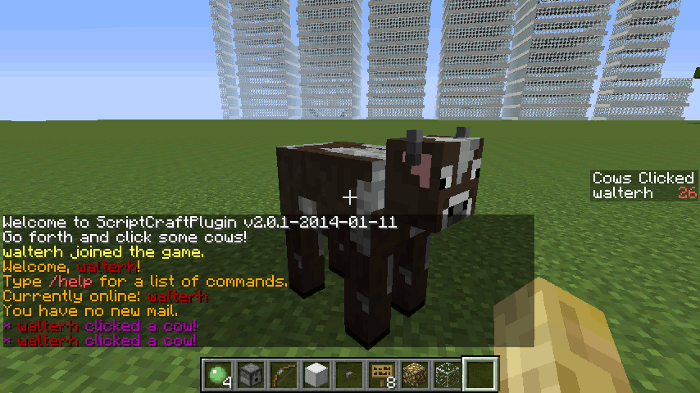

### Rules

 * You can join and leave the Cow Clicker game at any time by typing
   `/jsp cowclicker` at the in-game prompt.

 * Once you leave the game, your score is reset to zero.

 * When you disconnect from the server, your score will be reset to zero.

### Gameplay Mechanics

This is meant as a trivially simple use of the [Bukkit Scoreboard
API][bukscore]. There are many things you'll want to consider when constructing
your own mini-game...

 * Is the game itself a long-lived game - that is - should players and
   scores be persisted (stored) between server restarts?  

 * What should happen when a player quits the server - should this also be
   understood as quitting the mini-game?

 * What should happen when a player who was previously playing the
   mini-game, joins the server - should they automatically resume the
   mini-game?

[bukscore]: http://jd.bukkit.org/beta/apidocs/org/bukkit/scoreboard/package-summary.html

/*********************
## Items module
The Items module provides a suite of functions - one for each possible item.
See https://ci.visualillusionsent.net/job/CanaryLib/javadoc/net/canarymod/api/inventory/ItemType.html for a list of possible items

### Usage

    items.book(); // returns net.canarymod.api.inventory.ItemType.Book
    items.book(2); // returns a new net.canarymod.api.inventory.Item object with an amount 2 (2 books)
    items.book( itemType ); // compares itemType parameter to ItemType.Book or an Item of type book

The following functions are provided:

 * acaciaDoor()
 * acaciaFence()
 * acaciaFenceGate()
 * acaciaLeaves()
 * acaciaLog()
 * acaciaSapling()
 * acaciaStairs()
 * acaciaWood()
 * acaciaWoodSlab()
 * activatorRail()
 * allium()
 * andesite()
 * anvil()
 * apple()
 * armorStand()
 * arrow()
 * azureBluet()
 * bakedPotato()
 * banner()
 * beacon()
 * bed()
 * bedrock()
 * birchDoor()
 * birchFence()
 * birchFenceGate()
 * birchLeaves()
 * birchLog()
 * birchSapling()
 * birchWood()
 * birchWoodSlab()
 * birchWoodStairs()
 * blackCarpet()
 * blackGlass()
 * blackGlassPane()
 * blackStainedClay()
 * blazePowder()
 * blazeRod()
 * blocksRecord()
 * blueCarpet()
 * blueGlass()
 * blueGlassPane()
 * blueOrchid()
 * blueStainedClay()
 * boat()
 * bone()
 * bonemeal()
 * book()
 * bookAndQuill()
 * bookshelf()
 * bottleOEnchanting()
 * bow()
 * bowl()
 * bread()
 * brewingStand()
 * brickBlock()
 * brickSlab()
 * brickStairs()
 * brownCarpet()
 * brownGlass()
 * brownGlassPane()
 * brownMushroom()
 * brownStainedClay()
 * bucket()
 * burningFurnace()
 * cactus()
 * cactusGreen()
 * cake()
 * carrot()
 * carrotOnAStick()
 * carrots()
 * cauldron()
 * chainmailBoots()
 * chainmailChestplate()
 * chainmailHelmet()
 * chainmailLeggings()
 * charcoal()
 * chest()
 * chirpRecord()
 * clay()
 * clayBall()
 * clayBrick()
 * clownFish()
 * coal()
 * coalBlock()
 * coalOre()
 * coarseDirt()
 * cobble()
 * cobbleSilverFishBlock()
 * cobbleSlab()
 * cobbleStairs()
 * cobblestoneWall()
 * cocoaBeans()
 * cocoaPlant()
 * commandBlock()
 * compass()
 * cookedChicken()
 * cookedClownFish()
 * cookedFish()
 * cookedMutton()
 * cookedPufferFish()
 * cookedRabbit()
 * cookedSalmon()
 * cookie()
 * crackedSilverFishBlock()
 * crackedStoneBrick()
 * creeperHead()
 * cyanCarpet()
 * cyanDye()
 * cyanGlass()
 * cyanGlassPane()
 * cyanStainedClay()
 * dandelionYellow()
 * darkOakDoor()
 * darkOakFence()
 * darkOakFenceGate()
 * darkOakLeaves()
 * darkOakLog()
 * darkOakSapling()
 * darkOakStairs()
 * darkOakWood()
 * darkOakWoodSlab()
 * daylightSensor()
 * deadBush()
 * detectorRail()
 * diamond()
 * diamondAxe()
 * diamondBlock()
 * diamondBoots()
 * diamondChestplate()
 * diamondHelmet()
 * diamondHoe()
 * diamondHorseArmor()
 * diamondLeggings()
 * diamondOre()
 * diamondPickaxe()
 * diamondSpade()
 * diamondSword()
 * diorite()
 * dirt()
 * dispenser()
 * doubleAcaciaWoodSlab()
 * doubleBirchWoodSlab()
 * doubleBrickBlockSlab()
 * doubleCobbleSlab()
 * doubleDarkOakWoodSlab()
 * doubleGrass()
 * doubleJungleWoodSlab()
 * doubleNetherBrickSlab()
 * doubleOakWoodSlab()
 * doubleOrnateStoneSlab()
 * doubleQuartzSlab()
 * doubleRedSandstoneSlab()
 * doubleSandStoneTrimSlab()
 * doubleSandstoneSlab()
 * doubleSpruceWoodSlab()
 * doubleStoneBricksSlab()
 * doubleStoneSlab()
 * doubleWoodSlab()
 * dropper()
 * egg()
 * elevenRecord()
 * emerald()
 * emeraldBlock()
 * emeraldOre()
 * emptyMap()
 * enchantedBook()
 * enchantmentTable()
 * endPortal()
 * endPortalFrame()
 * endStone()
 * enderChest()
 * enderDragonEgg()
 * enderPearl()
 * eyeofEnder()
 * farRecord()
 * feather()
 * fence()
 * fenceGate()
 * fermentedSpiderEye()
 * fireBlock()
 * fireCharge()
 * fireworkRocket()
 * fireworkStar()
 * fishingRod()
 * flint()
 * flintAndSteel()
 * flowerPot()
 * furnace()
 * ghastTear()
 * glass()
 * glassBottle()
 * glassPane()
 * glisteringMelon()
 * glowStone()
 * glowstoneDust()
 * goldAxe()
 * goldBlock()
 * goldBoots()
 * goldChestplate()
 * goldHelmet()
 * goldHoe()
 * goldHorseArmor()
 * goldIngot()
 * goldLeggings()
 * goldNugget()
 * goldOre()
 * goldPickaxe()
 * goldRecord()
 * goldSpade()
 * goldSword()
 * goldenApple()
 * goldenCarrot()
 * granite()
 * grass()
 * gravel()
 * grayCarpet()
 * grayDye()
 * grayGlass()
 * grayGlassPane()
 * grayStainedClay()
 * greenCarpet()
 * greenGlass()
 * greenGlassPane()
 * greenRecord()
 * greenStainedClay()
 * grilledPork()
 * gunpowder()
 * hardenedClay()
 * hayBale()
 * heavyWeightedPressurePlate()
 * hopper()
 * hugeBrownMushroom()
 * hugeRedMushroom()
 * humanHead()
 * ice()
 * inkSack()
 * ironAxe()
 * ironBars()
 * ironBlock()
 * ironBoots()
 * ironChestplate()
 * ironDoor()
 * ironHelmet()
 * ironHoe()
 * ironHorseArmor()
 * ironIngot()
 * ironLeggings()
 * ironOre()
 * ironPickaxe()
 * ironSpade()
 * ironSword()
 * itemFrame()
 * jackOLantern()
 * jukebox()
 * jungleDoor()
 * jungleFence()
 * jungleFenceGate()
 * jungleLeaves()
 * jungleLog()
 * jungleSapling()
 * jungleWood()
 * jungleWoodSlab()
 * jungleWoodStairs()
 * ladder()
 * lapisBlock()
 * lapisLazuli()
 * lapislazuliOre()
 * largeFern()
 * lava()
 * lavaBucket()
 * lavaFlowing()
 * lead()
 * leather()
 * leatherBoots()
 * leatherChestplate()
 * leatherHelmet()
 * leatherLeggings()
 * lever()
 * lightBlueCarpet()
 * lightBlueDye()
 * lightBlueGlass()
 * lightBlueGlassPane()
 * lightBlueStainedClay()
 * lightGrayCarpet()
 * lightGrayDye()
 * lightGrayGlass()
 * lightGrayGlassPane()
 * lightGrayStainedClay()
 * lightWeightedPressurePlate()
 * lilac()
 * lilypad()
 * limeCarpet()
 * limeDye()
 * limeGlass()
 * limeGlassPane()
 * limeStainedClay()
 * magentaCarpet()
 * magentaDye()
 * magentaGlass()
 * magentaGlassPane()
 * magentaStainedClay()
 * magmaCream()
 * mallRecord()
 * map()
 * mellohiRecord()
 * melon()
 * melonSeeds()
 * melonSlice()
 * milkBucket()
 * minecart()
 * minecartCommandBlock()
 * minecartHopper()
 * minecartTNT()
 * mobSpawner()
 * mossyBrickSilverFishBlock()
 * mossyCobble()
 * mossyCobbleWall()
 * mossyStoneBrick()
 * mushroomSoup()
 * mycelium()
 * nameTag()
 * netherBrick()
 * netherBrickFence()
 * netherBrickStairs()
 * netherBricks()
 * netherBricksSlab()
 * netherQuartz()
 * netherQuartzOre()
 * netherStar()
 * netherWart()
 * netherrack()
 * noteBlock()
 * oakLeaves()
 * oakLog()
 * oakSapling()
 * oakWood()
 * oakWoodSlab()
 * obsidian()
 * orangeCarpet()
 * orangeDye()
 * orangeGlass()
 * orangeGlassPane()
 * orangeStainedClay()
 * orangeTulip()
 * ornateQuartzBlock()
 * ornateSilverFishBlock()
 * ornateStoneBrick()
 * ornateStoneSlab()
 * oxeyeDaisy()
 * packedIce()
 * painting()
 * paper()
 * peony()
 * pineLeaves()
 * pineLog()
 * pineWoodStairs()
 * pinkCarpet()
 * pinkDye()
 * pinkGlass()
 * pinkGlassPane()
 * pinkStainedClay()
 * pinkTulip()
 * piston()
 * podzol()
 * poisonousPotato()
 * polishedAndesite()
 * polishedDiorite()
 * polishedGranite()
 * poppy()
 * pork()
 * portal()
 * potato()
 * potatoes()
 * potion()
 * poweredMinecart()
 * poweredRail()
 * prismarineCrystals()
 * prismarineShard()
 * pufferFish()
 * pumpkin()
 * pumpkinPie()
 * pumpkinSeeds()
 * purpleCarpet()
 * purpleDye()
 * purpleGlass()
 * purpleGlassPane()
 * purpleStainedClay()
 * quartzBlock()
 * quartzPillarCap()
 * quartzPillarHorizontal()
 * quartzPillarVertical()
 * quartzSlab()
 * quartzStairs()
 * rabbitFoot()
 * rabbitHide()
 * rabbitStew()
 * rail()
 * rawBeef()
 * rawChicken()
 * rawFish()
 * rawMutton()
 * rawRabbit()
 * rawSalmon()
 * redCarpet()
 * redGlass()
 * redGlassPane()
 * redMushroom()
 * redSandstone()
 * redSandstoneBlank()
 * redSandstoneOrnate()
 * redSandstoneSlab()
 * redSandstoneStairs()
 * redStainedClay()
 * redStone()
 * redTulip()
 * redstoneBlock()
 * redstoneComparator()
 * redstoneLampOff()
 * redstoneOre()
 * redstoneRepeater()
 * redstoneTorchOn()
 * reed()
 * roseBush()
 * roseRed()
 * rottenFlesh()
 * saddle()
 * sand()
 * sandStoneTrimSlab()
 * sandstone()
 * sandstoneBlank()
 * sandstoneOrnate()
 * sandstoneSlab()
 * sandstoneStairs()
 * seeds()
 * shears()
 * shrub()
 * sign()
 * skeletonHead()
 * slimeBall()
 * snow()
 * snowBall()
 * snowBlock()
 * soil()
 * soulSand()
 * spawnEgg()
 * spiderEye()
 * spiderWeb()
 * sponge()
 * spruceDoor()
 * spruceFence()
 * spruceFenceGate()
 * spruceSapling()
 * spruceWood()
 * spruceWoodSlab()
 * stalRecord()
 * steak()
 * stick()
 * stickyPiston()
 * stone()
 * stoneAxe()
 * stoneBrick()
 * stoneBrickSilverFishBlock()
 * stoneBrickStairs()
 * stoneBricksSlab()
 * stoneButton()
 * stoneHoe()
 * stonePickaxe()
 * stonePlate()
 * stoneSilverFishBlock()
 * stoneSlab()
 * stoneSpade()
 * stoneSword()
 * storageMinecart()
 * stradRecord()
 * string()
 * sugar()
 * sunflower()
 * tallFern()
 * tallGrass()
 * tnt()
 * torch()
 * trapdoor()
 * trappedChest()
 * tripwireHook()
 * vines()
 * waitRecord()
 * wardRecord()
 * watch()
 * water()
 * waterBucket()
 * waterFlowing()
 * wheat()
 * whiteCarpet()
 * whiteGlass()
 * whiteGlassPane()
 * whiteStainedClay()
 * whiteTulip()
 * witherSkeletonHead()
 * woodAxe()
 * woodDoor()
 * woodHoe()
 * woodPickaxe()
 * woodPlate()
 * woodSlab()
 * woodSpade()
 * woodSword()
 * woodenButton()
 * woodenStairs()
 * woolBlack()
 * woolBlue()
 * woolBrown()
 * woolCyan()
 * woolDarkGreen()
 * woolGray()
 * woolLightBlue()
 * woolLightGray()
 * woolLightGreen()
 * woolMagenta()
 * woolOrange()
 * woolPink()
 * woolPurple()
 * woolRed()
 * woolWhite()
 * woolYellow()
 * workbench()
 * writtenBook()
 * yellowCarpet()
 * yellowFlower()
 * yellowGlass()
 * yellowGlassPane()
 * yellowStainedClay()
 * zombieHead()

***/
